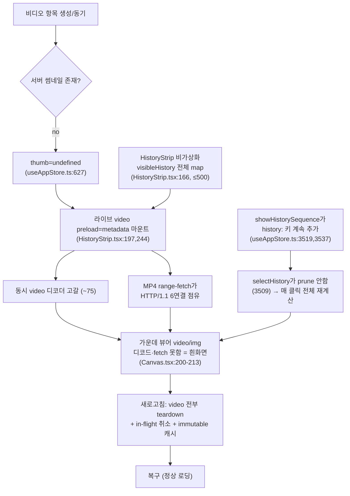

# Gallery Hang (Reload-Recoverable) — Runtime Accumulation RCA

> Status: **INVESTIGATION ONLY (no code changed)** · 2026-06-03 14:10
> Reporter: Jun · Investigator: Boss(Bocchi) + 3 parallel read-only sub-agents
> Companion to `00_investigation.md`. Trigger: yesterday's (2026-06-02) "add video" + "gallery performance optimization" work.

## TL;DR (한 줄 요약)

**비디오를 추가하고 갤러리가 많아진 뒤**, 썸네일을 눌러 포커스를 바꾸면 **가끔 가운데 뷰어가 hang(흰화면)** 되고, **`localhost:3333`을 새로고침하면 다시 멀쩡히 로딩**되는 증상.

`00_investigation.md`의 Defect A/B/C는 "특정 항목이 항상 흰화면"인 **결정적(deterministic)** 결함이었다. 이 문서는 사용자의 새 단서(**"새로고침하면 복구"**)가 가리키는 **누적성(accumulative) 런타임 문제**를 다룬다. "새로고침하면 복구"는 거의 항상 **세션 동안 쌓이다가 페이지 리로드로 리셋되는 클라이언트측 리소스/상태 누수**를 의미한다.

3개 독립 서브에이전트가 수렴한 단일 메커니즘:

> **`HistoryStrip`이 가상화 없이 최대 500개 항목을 전부 마운트(증폭기)** 하는데, 그 중 **썸네일이 아직 없는 비디오 항목마다 실제 `<video preload="metadata">` 엘리먼트가 라이브로 마운트(핵심)** 된다. 비디오 수가 늘수록 **브라우저 동시 비디오 디코더/엘리먼트 한도(~75)와 HTTP/1.1 동시연결 한도(~6)가 고갈** → 새 미디어(가운데 뷰어 `<video>`)가 디코드/fetch를 못 하고 hang. **새로고침하면 모든 `<video>`·in-flight 요청이 teardown되고 `/generated`는 immutable 캐시에서 로드** → 복구.

---

## 1. 증상 & 사용자 단서 (Symptom)

> "비디오 추가하고 갤러리 성능 최적화하고, 가끔씩 hang 걸리고, 새롭게 localhost:3333 가면 로딩이 또 잘되는 문제."

| 단서 | 함의 |
|------|------|
| **비디오 추가 후** 발생 | 라이브 `<video>` 엘리먼트가 새로 도입됨 (`1e761b6`) → 디코더 자원 압박 |
| **갤러리 많을 때만** | 비가상화 스트립이 항목 수에 비례해 `<video>`/연결/재계산 폭증 |
| **가끔(sometimes) hang** | 디코더/연결 한도는 누적 임계값 — 매번이 아니라 쌓였을 때만 터짐 |
| **새로고침하면 복구** | 클라이언트측 누적(디코더·연결·store 상태)이 리로드로 전부 리셋됨. **서버측 원인 배제 신호** |

## 2. 관련 커밋 (어제, 2026-06-02)

| commit | time | 내용 | 본 건과의 관계 |
|--------|------|------|----------------|
| `1e761b6` | 20:57 | image/**video thumbnails** + history sidebar cards | **핵심.** 라이브 `<video>` 썸네일 폴백 최초 도입 |
| `16686ae` | 21:35 | preserve **video thumbnail fallbacks** in history UI | `<video>` 폴백 경로 강화 |
| `93ee406` | 21:50 | preserve video metadata in sequence history | 시퀀스에도 비디오 카드 |
| `fadb49f` | 21:35 | centralize recursive thumbnail backfill | 서버 백필(조사 결과 **무죄** — §4.6) |
| `7b22418` | 14:14 | audit findings — **sequence memory leak**, render purity | `multimodeSequences` 누수 **부분** 수정 (§4.4) |
| `3b9836c` | 01:12 | memory leak reapers + global error handlers | **전부 서버측** → 브라우저 리로드와 무관 |

> 참고: `HISTORY_LIMIT = 500` 자체는 이전부터 존재. 어제 바뀐 건 "그 500개 안에 **라이브 `<video>`가 섞이기 시작**"한 것.

---

## 3. 핵심 메커니즘 한눈에



---

## 4. 근본 원인 분석

### Defect D — `HistoryStrip` 비가상화: ≤500개 항목 전부 동시 마운트 (증폭기·확정)

`ui/src/components/HistoryStrip.tsx:166`
```tsx
{visibleHistory.map((item) => {   // 윈도잉/가상화/슬라이스 없음 — 전부 렌더
```
- 히스토리 보존 상한 `useAppStore.ts:592` `const HISTORY_LIMIT = 500;` (`retainHistoryItems` `:713-715`). 페이지 누적으로 수백 개가 **동시에 DOM에 마운트**됨.
- **대조:** 사이드바는 `ui/src/lib/history/sidebarHistory.ts:12` `SIDEBAR_HISTORY_RENDER_LIMIT = 72`로 캡, 모달 그리드(`GalleryDateGrid.tsx`)는 `@tanstack/react-virtual`로 가상화. **오직 스트립만 캡/가상화가 없다.**
- `HistoryStrip`은 `history`, `currentImage`, `inFlight`, `multimodeSequences`를 모두 구독(`HistoryStrip.tsx:83-89`)하므로, 썸네일 클릭(=`currentImage` 변경)마다 500개 전체 + `uniqueGalleryItems`/`completedSequences` 재계산(`:93-129`)이 **동기로** 돈다.
- 이것 자체가 원인이라기보단, 아래 D·E·G를 **항목 수에 비례해 증폭**시키는 배수기. "많을 때만"의 직접 근거.

### Defect E — 썸네일 없는 비디오마다 라이브 `<video preload="metadata">` (핵심·확정)

`ui/src/store/useAppStore.ts:623-627`
```ts
// For videos, never fall back to the raw url — an  can't render.
// Leaving thumb undefined lets the UI fall back to a real <video> element.
thumb: it.thumb ?? (isVideo ? undefined : it.url),
```
`ui/src/components/HistoryStrip.tsx:241-245` (그리고 `:194-198` 시퀀스 자식)
```tsx
{item.thumb ? (
  
) : (
  <video src={item.url || item.image} muted playsInline preload="metadata" />  // ← 라이브 비디오
)}
```
같은 폴백: `GalleryImageTile.tsx:48-54`, `SidebarHistoryImageCard.tsx:54`, `SidebarHistorySequenceCard.tsx:53`.

- 서버 썸네일(`lib/videoThumb.ts`)이 **아직 없는** 비디오(= 방금 생성했거나 백필 전)는 전부 **실제 `<video>` 엘리먼트**로 렌더된다. `<video>`엔 `loading="lazy"`가 **적용 안 되고**, `preload="metadata"`가 마운트 즉시 **연결을 열어 MP4 헤더를 range-fetch**한다.
- 비가상화 스트립(Defect D) 안에서 썸네일 없는 비디오가 N개면 → **N개의 라이브 비디오 디코더 + N개의 MP4 fetch가 동시에** 뜬다.
- **Chrome은 페이지당 동시 미디어 엘리먼트/비디오 디코더 수에 하드 한도(~75개, 활성 디코더는 더 적음)가 있다.** 고갈되면 **새 `<video>` 생성·디코드가 조용히 멈춘다** → 가운데 뷰어(`Canvas.tsx:202`의 `<video>`)가 paint를 못 함 = 흰화면.
- **"비디오 추가 후"** 단서와 정확히 일치: `1e761b6` 이전엔 `<video>` 썸네일이 없었다.

> ⚠️ 부차 결함: `useAppStore.ts:4635`의 방금-생성 경로는 `compressImage`(=`` 기반, `ui/src/lib/image.ts:15-30`)로 썸네일을 만든다. `.mp4`를 `new Image()`에 넣으면 `onerror`→원본 url로 resolve(`image.ts:28`)되어, 비디오인데 `thumb=<mp4 url>`인 **깨진 ``**가 될 수 있다(디코드 실패, 단 `<video>`는 아님).

### Defect F — HTTP/1.1 6연결 고갈 + 포커스 이미지에 우선순위·중단 없음 (확정 결함 + hang 직접 원인)

- 썸네일·비디오·포커스 풀이미지가 **전부 같은 오리진 `/generated/...`** 를 공유. 서버는 **plain Express(HTTP/1.1), HTTP/2 아님** — `server.ts:182-185`의 `express.static`, `:376` `listenWithPortFallback`(`app.listen`, `node:net`, http2 없음). → 브라우저 **오리진당 ~6 연결** 한도가 썸네일+비디오+포커스 트래픽에 공유 적용.
- 포커스 ``(`Canvas.tsx:229-242`)에 **`fetchpriority="high"` 없음** → 썸네일/비디오 홍수가 6슬롯을 점유하면 포커스 이미지 GET이 **뒤에 큐잉(Queued/Stalled)**.
- **`AbortController`가 Canvas/HistoryStrip 어디에도 없음** → 썸네일을 빠르게 갈아탈 때 **버려진 fetch가 취소되지 않고 슬롯을 계속 점유**. 새 포커스 fetch는 영원히 대기.
- 포커스 변경은 `Canvas.tsx:204/231` `key={imageKey}`로 **``/`<video>` 리마운트 → 매번 새 네트워크 fetch**. `onLoad/onError`/로딩표시도 없어(`00_investigation.md` Defect C) 큐잉된 fetch가 **영구 흰화면**으로 노출.

### Defect G — `multimodeSequences`의 `history:` 키 누수 (확정·7b22418 부분수정)

`ui/src/store/useAppStore.ts:3519, 3537-3548` — 컬렉션을 열 때마다 키 추가:
```ts
const previewId = `history:${sequenceId}`;
...
nextSequences[previewId] = { ..., images: items, ... };  // 시퀀스 전체 이미지 배열을 store에 보관
```
`selectHistory`(다른 썸네일 클릭)는 **포인터만 null**, 삭제 안 함 — `useAppStore.ts:3509`
```ts
multimodePreviewFlightId: isWithinGrid ? previewId : null,   // delete 없음
```
- `history:` 키 삭제는 **휴지통(`trashHistorySequence`, `:3638-3639`)에서만**. 따라서 세션 중 연 모든 시퀀스가 **각자의 전체 `images: GenerateItem[]`를 영구 보관**.
- **7b22418의 누수 수정은 부분적**: `useAppStore.ts:3963-3965`는 라이브 생성(`flightId`)만 `delete`한다.
```ts
const nextSequences = { ...state.multimodeSequences };
if (isCleanFinish && nextPreview !== flightId) {
  delete nextSequences[flightId];   // ← flightId만. history:<id> 형제 키는 안 지움
}
```
- `HistoryStrip`이 `multimodeSequences`를 구독(`HistoryStrip.tsx:89`)하므로, 이 맵이 비대해질수록 **썸네일 클릭마다 재계산 비용↑** → Defect D와 곱해져 메인스레드 jank → hang처럼 보임. 리로드 시 store는 `{}`로 초기화(`useAppStore.ts:1406`)되어 복구.

### 가속기 — 가운데 뷰어 `<video>` 명시적 teardown 부재

`ui/src/components/Canvas.tsx:200-213`
```tsx
<video className="result-img" key={imageKey ?? undefined} src={imageSrc}
       controls autoPlay loop playsInline ... />   // pause(); src=''; load() 없음
```
- 포커스 변경 시 `key`로 리마운트되지만, 이전 `<video>`를 명시적으로 `pause(); src=''; load()` 하지 않아 GC 전까지 디코더를 붙잡음. 빠른 연속 클릭 시 **autoplay 디코더를 GC보다 빠르게 생성/방치** → Defect E의 디코더 고갈을 **가속**.

### §4.6 서버 백필은 무죄 (확정·배제)

`lib/thumbBackfill.ts:23-56`의 재귀 `walk`는 **`maxDepth=2`로 제한 + 직렬(`for`문 안 `await`)**. `Promise.all` 병렬 팬아웃 없음 → 동시 ffmpeg(`lib/videoThumb.ts:20`, 15s 타임아웃)/sharp(`lib/imageThumb.ts:19`)는 **최대 1개**. **서버 시작 시 1회 fire-and-forget**(`server.ts:398-410`) + 명시적 `POST /api/history/backfill-thumbnails`에서만. 타이머 루프 아님, `/api/history` 요청마다 도는 것도 아님(`getHistoryIndex`는 3s TTL 캐시 + single-flight, 썸네일 파일 `stat`만). `lib/inflight.ts`/`3b9836c` reaper는 **생성-잡 레지스트리(서버측)** 라 브라우저 리로드와 무관. → 서버 백필은 hang의 원인이 아니다.

---

## 5. "왜 새로고침하면 복구되나" (Reload-Recovery 표)

| 후보 원인 | 리로드로 리셋? | "hang→새로고침 복구"와 일치? |
|-----------|:--:|---|
| **E. 라이브 `<video>` 디코더 고갈** | **예** — 모든 미디어 엘리먼트 파괴/재생성 | **높음.** "비디오 추가 후" 단서와 직결 |
| **F. HTTP/1.1 6연결 큐잉** | **예** — in-flight 전부 취소, `/generated` immutable 캐시(`server.ts:184`)에서 재로드 | **높음.** "많을 때" 설명 |
| **G. `multimodeSequences` 누수→재계산 jank** | **예** — store `{}` 초기화(`useAppStore.ts:1406`) | **높음.** 클릭마다 누적, 리로드로 0 |
| D. 비가상화 ≤500 마운트 | **부분** — 리로드해도 항목 수는 같음 | 단독으론 약함. E/F/G의 **배수기** |
| 가속기. 뷰어 `<video>` teardown 부재 | 예 | 중간 — E를 가속 |
| 서버 백필/reaper(`3b9836c`) | **아니오** — 서버 프로세스 | **불일치** → 원인 배제 |
| blob URL | N/A (이미 revoke됨) | 누수 아님 (§7) |

**핵심:** "새로고침하면 복구"는 **클라이언트측 누적**(디코더·연결·store)만 설명 가능하다. 서버측 후보는 전부 탈락.

---

## 6. 재현 & 계측 (주범 확정용 — 코드 수정 없이 DevTools)

1. **디코더 고갈(E):** 썸네일 없는 비디오를 많이 만든 뒤(또는 백필 전), 스트립을 스크롤하며 임의 항목 연속 클릭. `chrome://media-internals`에서 player 인스턴스가 안 줄고 쌓이는지, "Nodes/Media" 카운트가 한계 근처인지 관찰. 한계 도달 시 가운데 `<video>`가 안 뜨는지.
2. **연결 큐잉(F):** DevTools Network → 큰 갤러리에서 썸네일 클릭 → `/generated/<focused>` 요청의 Timing에서 **Queued/Stalled** 시간이 긴지, 활성 요청이 ~6에 붙어있는지. 빠르게 여러 번 클릭 후 이전 요청들이 `(canceled)` 안 되고 진행중인지(=AbortController 부재 증명), 리로드 후 `(canceled)`로 바뀌는지.
3. **store 누수(G):** 여러 컬렉션을 연 뒤 React DevTools/Memory에서 `multimodeSequences` 키 수가 단조 증가하는지. 썸네일 클릭 시 메인스레드 long task(Performance)가 항목 수에 비례하는지.

---

## 7. 제안 수정안 (다음 단계 — 아직 적용 안 함)

> 사용자 지시 "더 조사해봐 / 일단". 아래는 **검토용 후보**이며 본 세션에서 코드 변경 없음.

| # | 대상 | 후보 수정 |
|---|------|-----------|
| 1 | **E (핵심)** | 썸네일 없는 비디오 타일에 라이브 `<video>` 대신 **`poster`/정적 placeholder** 또는 **클라 first-frame 썸네일**(`ui/src/lib/videoMedia.ts:64` `extractFirstFrame` 활용 — ``기반 `compressImage`는 비디오 프레임 불가). 보이는 타일만 `<video>`로 lazy 승격. |
| 2 | **D** | `HistoryStrip`도 사이드바(72)/모달처럼 **가상화 또는 렌더 캡**. |
| 3 | **E/F** | 비디오 타일 `preload="metadata"` → **`preload="none"`** (클릭/호버 시 승격). |
| 4 | **F** | 포커스 ``/`<video>`에 **`fetchpriority="high"`**, 포커스 전환 시 **`AbortController`로 이전 fetch 취소**, `/generated`를 HTTP/2로 서빙 검토. |
| 5 | **가속기** | 뷰어 `<video>` 언마운트 시 `pause(); src=''; load()` teardown. |
| 6 | **G** | `selectHistory`에서 그리드 이탈 시 orphan `history:` 키 prune, 또는 7b22418 정리 로직을 `history:` 키까지 확장. |
| 7 | (00 Defect C) | 메인 뷰어 `onLoad`/`onError`/skeleton — hang/실패를 사용자에게 노출(증상 완화). |

> 우선순위: **1(E) → 2(D) → 4(F)** 가 "비디오 추가 후 + 많을 때 + 새로고침 복구" 증상의 뿌리를 가장 직접 제거. 5·6·7은 보강.

---

## 8. 영향 파일·라인 레퍼런스

| 파일 | 라인 | 핵심 |
|------|------|------|
| `/Users/jun/Developer/new/700_projects/ima2-gen/ui/src/components/HistoryStrip.tsx` | **166** | `visibleHistory.map` — 비가상화 전체 마운트 (D) |
| 〃 | **197, 244** | 썸네일 없는 비디오 → `<video preload="metadata">` (E) |
| 〃 | 83-89, 93-129 | `multimodeSequences` 구독 + 클릭마다 전체 재계산 |
| 〃 | 90, 185/206/232/253 | `thumbRefs` 키 누수(경미) |
| `/Users/jun/Developer/new/700_projects/ima2-gen/ui/src/store/useAppStore.ts` | **623-627** | 비디오 `thumb=undefined` → 라이브 `<video>` 폴백 (E) |
| 〃 | 592, 713-715 | `HISTORY_LIMIT=500` 보존 상한 |
| 〃 | **3519, 3537-3548** | `history:` 키 생성(전체 images 보관) (G) |
| 〃 | **3509** | `selectHistory` 포인터만 null, prune 없음 (G) |
| 〃 | 3963-3965 | 7b22418 수정 — `flightId`만 삭제(부분) (G) |
| 〃 | 1406 | store `{}` 초기화 = 리로드 복구 근거 |
| 〃 | 4635 | 방금-생성 비디오에 ``기반 compressImage(깨진 thumb 위험) |
| `/Users/jun/Developer/new/700_projects/ima2-gen/ui/src/components/Canvas.tsx` | **200-213** | 메인 뷰어 `<video autoPlay loop>` teardown 없음 (가속기) |
| 〃 | 229-242 | 포커스 `` — `fetchpriority`/AbortController/onError 없음 (F) |
| `/Users/jun/Developer/new/700_projects/ima2-gen/server.ts` | **182-185** | `/generated` `express.static` immutable 캐시 (리로드 복구) |
| 〃 | 376 | plain HTTP/1.1 `app.listen` (HTTP/2 아님) (F) |
| `/Users/jun/Developer/new/700_projects/ima2-gen/ui/src/lib/history/sidebarHistory.ts` | 12 | 사이드바 72캡(스트립엔 없는 대조) |
| `/Users/jun/Developer/new/700_projects/ima2-gen/lib/thumbBackfill.ts` | 23-56 | 직렬·maxDepth 2 — 서버 백필 **무죄**(§4.6) |
| `/Users/jun/Developer/new/700_projects/ima2-gen/ui/src/lib/videoMedia.ts` | 64 | `extractFirstFrame`(수정안 1의 클라 썸네일 수단) |

## 9. 테스트 영향 (참고)

수정 시 회귀 케이스 추가 권장: `tests/multimode-ui-contract.test.js`, `tests/gallery-viewer-navigation-contract.test.js`, `tests/history-strip-duplicate-contract.test.js`, `tests/thumb-backfill.test.ts`. 특히 (E) "썸네일 없는 비디오 타일이 라이브 `<video>`가 아니라 placeholder/poster를 쓴다", (G) "그리드 이탈 시 `multimodeSequences` orphan 키가 정리된다"는 계약 테스트로 고정.

---

*이 문서는 조사·기록 전용입니다. 코드 수정은 별도 승인 후 진행합니다. `00_investigation.md`(결정적 결함 A/B/C)와 짝을 이루는 누적성 hang(D/E/F/G) 분석입니다.*
