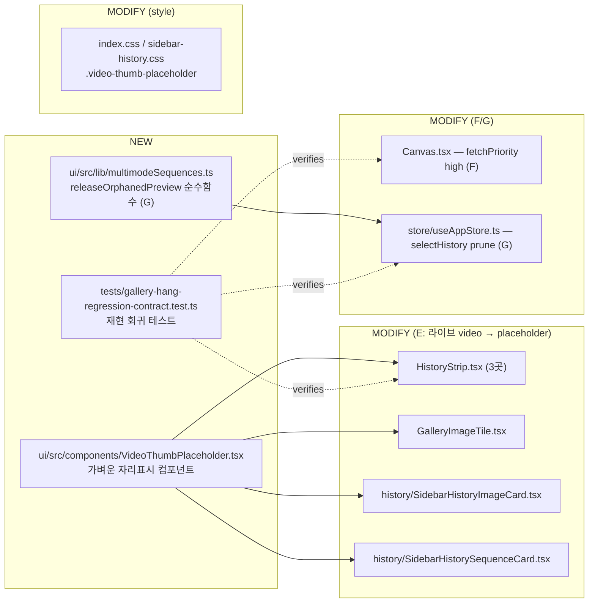

# Gallery Hang Fix — Phase 1 Implementation Plan

> Status: **PLAN (PABCD: P)** · 2026-06-03 14:55 · Goal f79f049b-ffb
> Source RCA: `00_investigation.md` (deterministic A/B/C) + `01_runtime-accumulation-hang.md` (accumulative D/E/F/G)
> Scope: fix the **reload-recoverable hang** root causes with minimal, verifiable changes + reproducible regression tests.

## Part 1 — 쉬운 설명 (non-dev)

갤러리에 비디오가 많아지면 가끔 가운데 화면이 하얗게 멈추고, 새로고침하면 다시 되는 문제를 고칩니다. **진짜 원인은 "썸네일이 아직 없는 비디오마다 진짜 동영상 플레이어를 화면에 깔아두는 것"**이라, 비디오가 쌓이면 브라우저의 동영상 처리 한도가 바닥나 새 그림이 안 뜨는 거예요. 그래서 ① 썸네일 없는 비디오는 **동영상 플레이어 대신 가벼운 자리표시(placeholder)** 로 바꾸고(핵심), ② 지금 보는 이미지를 **우선 로딩**하게 하고(보강), ③ 갤러리를 옮겨다닐 때 **안 쓰는 시퀀스 데이터가 메모리에 쌓이던 누수**를 정리합니다. 새로고침해야만 풀리던 게 새로고침 없이도 안 쌓이게 됩니다.

전면 가상화(D)와 메인뷰어 onError 안전망(00-C)은 이번 범위에서 빼고, **A(감사) 단계에서 "E/F/G만으로 hang이 실제로 잡히는지" 아주 빡세게 검증**한 뒤 필요하면 확장합니다.

### 파일 변경 맵



devlog 경로: `/Users/jun/Developer/new/700_projects/ima2-gen/devlog/_plan/260603_gallery-focus-white-screen-rca/10_fix-plan.md`

---

## Part 2 — Diff-level 정밀 계획

### 결함 → 수정 매핑 (이번 범위)

| RCA | 수정 | 효과 | 검증 |
|-----|------|------|------|
| **E** (핵심) | 썸네일 없는 비디오 6곳 → 라이브 `<video>` 제거, 정적 placeholder | 동시 비디오 디코더/엘리먼트 고갈 제거 = hang 근본 차단; MP4 range-fetch 6연결 점유도 제거 | 소스 contract (6곳 `preload="metadata"` 부재 + placeholder 존재) |
| **F** (보강) | 포커스 ``/`<video>`에 `fetchPriority="high"` | 포커스 미디어가 잔여 요청보다 우선 | 소스 contract |
| **G** (누수+테스트) | `selectHistory` 그리드 이탈 시 orphan `history:` 키 prune (순수함수 추출) | `multimodeSequences` 무한 증가 차단 → 클릭당 재계산 비용 안정 | **순수함수 단위 테스트(실동작 재현)** |
| D / 00-C | **이번 범위 제외** | — | A 단계에서 필요성 검증 |

---

### NEW 1 — `ui/src/components/VideoThumbPlaceholder.tsx`

라이브 `<video>`를 대체하는, 네트워크/디코더를 전혀 쓰지 않는 정적 자리표시. 위치별 레이아웃 클래스를 `className`으로 주입받아 기존 크기/모양 유지.

```tsx
type VideoThumbPlaceholderProps = {
  className?: string;
};

/**
 * Static stand-in for a video whose server thumbnail is not ready yet.
 * Renders NO <video> element — avoids concurrent media-element/decoder
 * exhaustion (RCA 01 Defect E) and the MP4 range-fetch that <video
 * preload="metadata"> triggers. Replaced by an  once item.thumb exists.
 */
export function VideoThumbPlaceholder({ className }: VideoThumbPlaceholderProps) {
  return (
    <span
      className={["video-thumb-placeholder", className].filter(Boolean).join(" ")}
      aria-hidden="true"
    />
  );
}
```

### NEW 2 — `ui/src/lib/multimodeSequences.ts` (G 순수함수)

DOM/store 의존 없는 순수 모듈 → node:test에서 직접 import해 실동작 검증 가능. 타입은 type-only import.

```ts
import type { MultimodeSequenceState } from "../types"; // type-only, no runtime dep

const HISTORY_PREVIEW_PREFIX = "history:";

/**
 * When navigation leaves a browsed-history sequence grid, drop its preview
 * entry so multimodeSequences does not grow unboundedly across a session
 * (RCA 01 Defect G; completes the partial 7b22418 fix which only deleted the
 * live flightId). Live-generation flights (non "history:" keys) are never
 * touched — they may still be generating.
 */
export function releaseOrphanedPreview(
  sequences: Record<string, MultimodeSequenceState>,
  previousPreviewId: string | null,
  staysInGrid: boolean,
): Record<string, MultimodeSequenceState> {
  if (!previousPreviewId || staysInGrid) return sequences;
  if (!previousPreviewId.startsWith(HISTORY_PREVIEW_PREFIX)) return sequences;
  if (!(previousPreviewId in sequences)) return sequences;
  const next = { ...sequences };
  delete next[previousPreviewId];
  return next;
}
```
> 사전확인: `MultimodeSequenceState`가 `ui/src/types.ts`에 export되는지 A에서 검증(아니면 store에서 type re-export). 런타임 import 0개 보장.

---

### MODIFY 1 — `ui/src/components/HistoryStrip.tsx` (3곳 + import)

**import 추가** (line 11 이후):
```tsx
import { VideoThumbPlaceholder } from "./VideoThumbPlaceholder";
```

**(a) CollectionThumb 미니, line 57-66 — before→after**
```tsx
// before
const isVid = !img.thumb && (isVideoUrl(img.url) || isVideoUrl(img.image));
return isVid ? (
  <video key={i} className="collection-mini" src={img.url || img.image} muted playsInline preload="metadata" />
) : (
  
);
// after
const isVid = !img.thumb && (isVideoUrl(img.url) || isVideoUrl(img.image));
return isVid ? (
  <VideoThumbPlaceholder key={i} className="collection-mini collection-mini--video" />
) : (
  
);
```

**(b) 시퀀스 자식, line 194-198**
```tsx
// before
{seqItem.thumb ? (
  
) : (
  <video src={seqItem.url || seqItem.image} muted playsInline preload="metadata" />
)}
// after
{seqItem.thumb ? (
  
) : (
  <VideoThumbPlaceholder className="history-thumb__video-fill" />
)}
```

**(c) 최상위 비디오, line 241-245** — (b)와 동일 패턴(`item`)으로 교체.

> 결과: HistoryStrip 내 `preload="metadata"` 0개. `▶` play-badge는 형제로 유지되어 비디오 표식 보존.

### MODIFY 2 — `ui/src/components/GalleryImageTile.tsx` (line 47-55)
```tsx
// after (import { VideoThumbPlaceholder } 추가)
{item.thumb ? (
  
) : (
  <VideoThumbPlaceholder className="gallery__tile-video gallery__tile-video--placeholder" />
)}
```

### MODIFY 3 — `ui/src/components/history/SidebarHistoryImageCard.tsx` (line 51-55)
```tsx
// after
{item.thumb ? (
  
) : (
  <VideoThumbPlaceholder className="sidebar-history__video-fill" />
)}
```

### MODIFY 4 — `ui/src/components/history/SidebarHistorySequenceCard.tsx` (line 46-55)
```tsx
// after
if (item && isVideoItem(item) && !item.thumb) {
  return <VideoThumbPlaceholder key={getGalleryItemKey(item)} className="sidebar-history__sequence-cell" />;
}
```

### MODIFY 5 — `ui/src/components/Canvas.tsx` (F: line 202, 229)
```tsx
// 포커스 <video> (line 202~)
<video className="result-img" key={imageKey ?? undefined} src={imageSrc}
       controls autoPlay loop playsInline
       // @ts-expect-error: fetchPriority is valid DOM attr (React 19 camelCase)
       fetchPriority="high" ... />
// 포커스  (line 229~)

```
> A에서 확인: 현재 React 버전이 `fetchPriority` prop을 그대로 받는지(React 19=받음). 받으면 `@ts-expect-error` 불필요. img는 확실, video는 best-effort.

### MODIFY 6 — `ui/src/store/useAppStore.ts` (G: selectHistory, line 3487-3512)
```ts
// import 추가 (파일 상단 lib import 영역)
import { releaseOrphanedPreview } from "../lib/multimodeSequences";

// selectHistory 내부 — previewId/isWithinGrid 이미 계산됨(3501-3505)
selectHistory: (item) => {
  // ...기존 target/composerPatch/previewId/activeSeq/isWithinGrid 계산 유지...
  const staysInGrid = Boolean(isWithinGrid);
  set((state) => ({
    currentImage: target,
    unseenGeneratedCount: 0,
    multimodePreviewFlightId: staysInGrid ? previewId : null,
    multimodeSequences: releaseOrphanedPreview(state.multimodeSequences, previewId, staysInGrid),
    ...composerPatch,
  }));
},
```
> `previewId` = `get().multimodePreviewFlightId`(이전 미리보기). 그리드에 남으면 보존, 이탈하면 `history:` 키만 prune, 라이브 flight 키는 불변.

### MODIFY 7 — CSS (`ui/src/index.css` + `ui/src/styles/sidebar-history.css`)
공통 placeholder 스타일 1블록 추가(off-black 배경 + 미세한 필름 그라데이션, 애니메이션 없음):
```css
.video-thumb-placeholder {
  display: block;
  width: 100%;
  height: 100%;
  background:
    linear-gradient(135deg, #141414 0%, #1c1c1c 100%);
  border-radius: inherit;
}
```
위치별 클래스(`collection-mini--video`, `history-thumb__video-fill`, `gallery__tile-video--placeholder`, `sidebar-history__video-fill`, `sidebar-history__sequence-cell`)는 기존 `<video>` 자리의 크기/object-fit만 승계(필요한 곳만 추가). 기존 `▶` 배지 CSS는 그대로.

---

### NEW 3 — `tests/gallery-hang-regression-contract.test.ts` (재현 회귀)

```ts
import { test } from "node:test";
import assert from "node:assert/strict";
import { readFileSync } from "node:fs";
import { fileURLToPath } from "node:url";
import { dirname, join } from "node:path";
import { releaseOrphanedPreview } from "../ui/src/lib/multimodeSequences.ts";

const root = join(dirname(fileURLToPath(import.meta.url)), "..");
const read = (p) => readFileSync(join(root, p), "utf8");
const seq = (id) => ({ sequenceId: id, requestId: id, requested: 1, returned: 1, images: [], partials: [], status: "complete" });

// (G) 실동작 재현 — 순수함수
test("releaseOrphanedPreview drops orphaned history: preview when leaving grid", () => {
  const before = { "history:abc": seq("abc"), "flight-1": seq("f1") };
  const after = releaseOrphanedPreview(before, "history:abc", false);
  assert.equal("history:abc" in after, false, "orphaned history preview must be pruned");
  assert.equal("flight-1" in after, true, "live flight must be preserved");
});
test("releaseOrphanedPreview keeps preview when staying in grid", () => {
  const before = { "history:abc": seq("abc") };
  assert.deepEqual(releaseOrphanedPreview(before, "history:abc", true), before);
});
test("releaseOrphanedPreview never touches live (non-history) flights", () => {
  const before = { "flight-1": seq("f1") };
  assert.deepEqual(releaseOrphanedPreview(before, "flight-1", false), before);
});

// (E) 소스 contract — 라이브 video 폴백 박멸 + placeholder 채택
for (const f of [
  "ui/src/components/HistoryStrip.tsx",
  "ui/src/components/GalleryImageTile.tsx",
  "ui/src/components/history/SidebarHistoryImageCard.tsx",
  "ui/src/components/history/SidebarHistorySequenceCard.tsx",
]) {
  test(`${f} renders no live <video preload> thumbnail fallback`, () => {
    const src = read(f);
    assert.doesNotMatch(src, /preload="metadata"/, `${f} must not mount live <video> thumbnails`);
    assert.match(src, /VideoThumbPlaceholder/, `${f} must use the static placeholder`);
  });
}

// (F) 소스 contract — 포커스 미디어 우선순위
test("Canvas focused media requests high fetch priority", () => {
  const src = read("ui/src/components/Canvas.tsx");
  assert.match(src, /fetchPriority="high"/);
});

// (G) 소스 contract — selectHistory가 prune 헬퍼를 호출
test("selectHistory wires releaseOrphanedPreview", () => {
  const src = read("ui/src/store/useAppStore.ts");
  assert.match(src, /releaseOrphanedPreview\(/);
});
```
> 러너: `node scripts/run-tests.mjs` (`--import tsx --test`). `.ts` import + type-only 의존이라 node에서 안전. **수정 전: E/F/G 테스트 실패 → 수정 후: 전부 통과**.

---

## 검증 순서 (C 단계 예정)
1. `node scripts/run-tests.mjs` (신규 테스트 포함 전체 통과)
2. `npm run typecheck` (`tsc --noEmit -p tsconfig.json`)
3. `npm run typecheck:tests`
4. `cd ui && npm run build` (Vite 빌드)
5. (선택) 수동 계측: localhost:3333에서 비디오 다수 상태로 연속 클릭 시 `<video>` 엘리먼트 수가 포커스 1개로 유지되는지(DevTools).

## 비즈니스 로직 질문
- 없음. 순수 성능/누수 버그픽스이며 사용자 데이터·과금·생성 로직 불변. placeholder는 서버 썸네일 생성 후 자동으로 ``로 전환(기존 동작 유지).

## A 단계에서 빡세게 검증할 항목 (사용자 강조)
1. **E만으로 hang이 실제 차단되나** — 라이브 `<video>` 제거가 디코더+연결 두 고갈을 모두 끊는지, 남은 `` 썸네일/풀이미지 폴백은 `loading="lazy"`로 충분한지.
2. **6곳 누락 없나** — `preload="metadata"`/`<video ... src=` 폴백이 더 있는지 전수.
3. **순수함수 추출이 store를 안 깨나** — `previewId`/`isWithinGrid` 시맨틱, 라이브 flight 보존, `MultimodeSequenceState` export 위치.
4. **테스트가 진짜 결함을 재현하나** — 수정 전 실패가 보장되는지(특히 G 순수함수, E doesNotMatch).
5. **D(가상화)/00-C(onError) 없이도 충분한가** — 아니면 최소 추가 범위 권고.
6. 통합 리스크 — placeholder가 기존 ▶ badge/레이아웃/object-fit과 충돌하는지, CSS 누락 위치.

---

## A 감사 결과 반영 (Revised · 2026-06-03 15:10 · 니지카 감사 verdict=FAIL, canFixHang=true)

빡센 감사가 짚은 blocker 4건 + WARN을 반영해 계획을 수정한다.

1. **[blocker] 타입 import 오류 해소 → 제네릭화.** `MultimodeSequenceState`는 `ui/src/types.ts`가 아니라 `useAppStore.ts:898`에 export됨. 순수 모듈이 거대 store를 import하면 안 되므로 **NEW2를 제네릭으로** 바꿔 타입 의존 자체를 제거:
   ```ts
   const HISTORY_PREVIEW_PREFIX = "history:";
   export function releaseOrphanedPreview<T>(
     sequences: Record<string, T>,
     previousPreviewId: string | null,
     staysInGrid: boolean,
   ): Record<string, T> {
     if (!previousPreviewId || staysInGrid) return sequences;
     if (!previousPreviewId.startsWith(HISTORY_PREVIEW_PREFIX)) return sequences;
     if (!(previousPreviewId in sequences)) return sequences;
     const next = { ...sequences };
     delete next[previousPreviewId];
     return next;
   }
   ```
   → 런타임 의존 0개, node:test import 안전, 타입체크 통과. 키만 조작하므로 동작 동일.

2. **[blocker] G 불완전 → `showHistorySequence`에도 prune 적용.** `showHistorySequence`(useAppStore.ts:3514-3548)는 새 `history:` 키를 추가만 하고 직전 orphan을 정리하지 않아 컬렉션 연속 오픈 시 누수 잔존. 새 previewId 세팅 전에 이전 것을 정리:
   ```ts
   // showHistorySequence 내부, set 시점
   set((state) => ({
     ...,
     multimodePreviewFlightId: previewId,
     multimodeSequences: {
       ...releaseOrphanedPreview(state.multimodeSequences, state.multimodePreviewFlightId, false),
       [previewId]: { ...새 시퀀스 },
     },
   }));
   ```
   → selectHistory(이탈) + showHistorySequence(전환) 양쪽 커버.

3. **[blocker] CSS 갭 → 기존 셀렉터에 placeholder 병합.** 신규 클래스(`history-thumb__video-fill` 등)는 코드에 없고, 기존 `.history-thumb--video img,video` / `.sidebar-history__thumb img,video` / `.sidebar-history__sequence-grid img,video`(index.css:3263-3268,2681-2685; sidebar-history.css:136-144,210-211)가 placeholder를 안 잡음. → **placeholder를 기존 `<video>`가 있던 같은 부모/클래스 컨텍스트에 두고**, 해당 CSS 셀렉터를 `img, video, .video-thumb-placeholder`로 확장. placeholder엔 위치별 신규 클래스를 강요하지 않음(공통 `.video-thumb-placeholder`만). B에서 실제 셀렉터를 읽고 정확히 병합.

4. **[WARN→포함] E 누수구멍 → `addHistory` 비디오 thumb 스킵.** `addHistory`(useAppStore.ts:4635) `compressImage`가 비디오 mp4를 ``로 로드 실패→원본 url을 thumb로 resolve할 수 있어, thumb truthy로 placeholder를 우회하고 깨진 `` lazy 요청 발생. → addHistory에서 `isVideoItem(item)`이면 `compressImage` 호출/`thumb` 세팅을 스킵(undefined 유지) → placeholder 경로 보장. (서버 백필이 진짜 thumb 만들면 그때 `` 전환)

5. **[item6] F 확정 + 구현 보정.** `fetchPriority`는 React `ImgHTMLAttributes`에만 있고 `VideoHTMLAttributes`엔 없어(ui 빌드 시 TS2322로 확인됨) **포커스 ``에만 적용**. 포커스 `<video>`는 디코더 1개라 썸네일 flood와 경합하지 않아 영향 미미. `` 교체는 브라우저가 이전 요청을 자동 취소하므로 AbortController는 부적합 → 제외. 비디오 타일 placeholder화로 연결경합의 비디오분은 이미 제거됨.

6. **[item7] D(가상화)는 후속.** 500개 비가상화(HistoryStrip.tsx:166)는 배수기로 잔존하나 회귀위험이 커 이번 범위 제외. hang 차단의 핵심은 E이며 감사관도 `canFixHang=true`로 확인. 추후 별도 phase(20_)로 72캡/가상화 검토.

### Revised 파일 변경 목록
- NEW: `ui/src/components/VideoThumbPlaceholder.tsx`, `ui/src/lib/multimodeSequences.ts`(제네릭), `tests/gallery-hang-regression-contract.test.ts`
- MODIFY(E): HistoryStrip.tsx(3), GalleryImageTile.tsx, SidebarHistoryImageCard.tsx, SidebarHistorySequenceCard.tsx
- MODIFY(E누수): useAppStore.ts `addHistory`(비디오 thumb 스킵)
- MODIFY(F): Canvas.tsx(`fetchPriority="high"`, @ts-expect-error 없음)
- MODIFY(G): useAppStore.ts `selectHistory` + `showHistorySequence`(prune)
- MODIFY(style): index.css / sidebar-history.css(셀렉터에 `.video-thumb-placeholder` 병합)

### 재현 테스트 보강 (item5)
- G 순수함수 단위테스트(실동작) + `showHistorySequence`/`selectHistory`가 `releaseOrphanedPreview` 호출하는 소스 contract. E/F 소스 contract. selectHistory 인자순서 오류는 순수함수 단위테스트가 동작으로 방어.

---
*PABCD A 완료(빡센 감사 1회, FAIL→계획 수정). goal-mode self-advance. 다음: `cli-jaw orchestrate B` + 구현, 구현 후 verify dispatch로 blocker 해소·hang 패치 재검증.*
