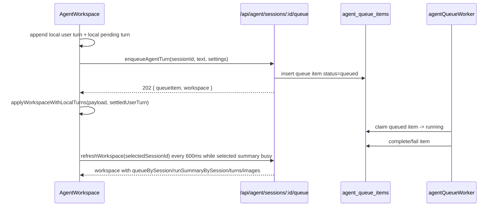

# 00 Current State

## Files Inspected

| Area | Files |
|---|---|
| Agent workspace shell | `ui/src/components/agent/AgentWorkspace.tsx` |
| Chat rendering | `ui/src/components/agent/AgentMessageList.tsx`, `AgentRunGroup.tsx`, `AgentToolGroup.tsx`, `AgentChatPane.tsx` |
| Session status UI | `AgentSessionSpinner.tsx`, `AgentSessionList.tsx`, `AgentSessionRail.tsx`, `AgentStatusBadge.tsx` |
| Queue UI | `AgentQueuePanel.tsx`, `AgentQueueRow.tsx` |
| Frontend API/types | `ui/src/lib/agentApi.ts`, `ui/src/components/agent/agentTypes.ts` |
| Server queue/session | `lib/agentQueueStore.ts`, `lib/agentQueueWorker.ts`, `lib/agentStore.ts`, `routes/agent.ts` |
| Tests | `tests/agent-mode-frontend-contract.test.js`, `tests/agent-mode-right-sidebar-contract.test.js`, `tests/agent-mode-ux-feedback-contract.test.ts`, `tests/agent-mode-queue-contract.test.ts` |

## Current Data Flow

## State Sources

| UI Concept | Current Source | Durability | Issue |
|---|---|---:|---|
| Immediate pending bubble | local `localPendingTurn()` in `AgentWorkspace.tsx` | browser-memory only | Lost on full payload replace, reload, or component remount |
| Header generating status | `pendingTurnsRef.current > 0` OR selected `runSummary` busy | mixed | Can show generating while chat pending bubble is gone |
| Session list spinner | `runSummaryBySession[session.id]` | server-backed | More durable than chat pending, but not enough for chat content |
| Right queue panel | `queueBySession[selectedSessionId]` | server-backed | Shows queue rows but not integrated with chat narrative |
| Tool rows inside chat | persisted `agent_turns` role=`tool` | server-backed | Only appears once runtime records tool turn |
| Assistant final/error | persisted `agent_turns` role=`assistant` | server-backed | Exists after planner/runtime writes it |
| Stage copy | rewrites local pending text with `pendingQueued/pendingPlanning/pendingGenerating` | local pending required | If local pending is gone, stage copy is gone |

## Important Current Code Facts

- `AgentWorkspace.tsx` is exactly 500 lines and owns too many responsibilities: session loading, local optimistic turns, queue polling, generated image mirroring, settings mutation, drawer/sheet state, and send flow.
- `refreshWorkspace()` uses `applyWorkspaceWithLocalTurns(loaded, new Set())`, preserving local pending turns during polling.
- `loadWorkspace(preferredId)` uses `applyWorkspace(loaded)`, replacing the workspace and losing local pending turns.
- `selectSession(id)` calls `loadWorkspace(id)`.
- `pendingStageText` is computed only if `turns.filter(isLocalPendingTurn)` returns at least one turn.
- `getAgentWorkspacePayload()` already returns `queueBySession` and `runSummaryBySession` for every session, so the server has enough durable information to rebuild a progress indicator.

## Existing Strengths

- Server queue is durable in SQLite (`agent_queue_items`).
- Queue status summary is projected for every session, not only selected session.
- Session list and rail already render `AgentSessionSpinner` from `runSummaryBySession`.
- Worker records error turns for failed queue paths unless runtime already recorded one.
- Recent `AgentRunGroup` work grouped tool turns and assistant text in one visual block.

## Existing Blind Spot

The chat pane does not have a durable progress view for an in-flight queue item. It only has persisted turns plus ephemeral local pending turns. This is why queue state can be alive while the chat block looks idle after session switching.

