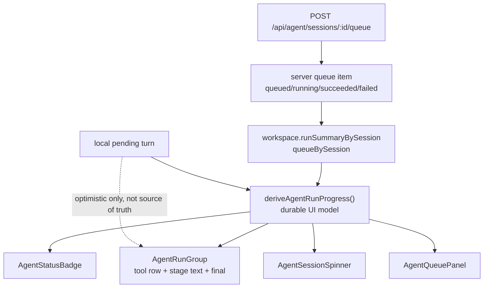

# Agent Session Progress RCA And Patch Plan

- Date: 2026-06-11
- Goal: Agent Mode 세션 전환 시 스피너/진행 표시가 사라지는 문제와 전반 Agent UX 상태 모델을 코드 기준으로 분석하고, 바로 패치 가능한 개선계획을 남긴다.
- Class: C3 (frontend state ownership + durable queue contract + UX state model + tests)
- Scope: 문서화와 패치 설계. 코드 패치는 후속 B 패치에서 실행 가능하도록 파일별 변경 계획까지 작성한다.

## User Symptom

> 다른 세션을 눌렀다가 돌아와도 스피너나 이런데 없어져.

추가 UX 맥락:
- Agent run은 한 블럭 안에 tool spinner, 중간 텍스트, 최종 텍스트가 흐르는 형태여야 한다.
- 생성 중 사용자는 현재 run이 살아 있는지, queued/planning/tool-running/final 중 어디인지 세션을 바꿔도 계속 확인할 수 있어야 한다.
- Agent 모드는 일반 채팅 에이전트처럼 텍스트 응답과 도구 실행이 한 흐름으로 보여야 한다.

## Document Map

| File | Purpose |
|---|---|
| `00_current-state.md` | 현재 코드 구조와 상태 데이터 소스 지도 |
| `01_root-cause.md` | 세션 전환 시 pending/spinner 소실의 직접 원인과 구조 원인 |
| `02_dev-skill-gap-audit.md` | dev/frontend/uiux/testing/architecture 기준 문제 목록 |
| `10_patch-plan.md` | 바로 패치 가능한 파일별 구현 계획 |
| `11_test-plan.md` | 회귀 테스트와 시각 검증 계획 |

## Executive Summary

현재 Agent UI는 durable queue 상태와 local optimistic pending turn을 동시에 쓰지만, 둘의 소유권이 분리되어 있지 않다. `refreshWorkspace()`는 local pending을 보존하지만 `selectSession()`이 호출하는 `loadWorkspace(id)`는 서버 payload로 전체 replace를 수행한다. 그래서 사용자가 다른 세션을 눌렀다가 돌아오면, 서버에는 queue summary가 살아 있어도 채팅 내부의 streaming pending turn은 사라진다. 패치 방향은 queue item을 기준으로 "durable run progress view model"을 만들고, local pending은 즉시 반응용 overlay로만 제한하는 것이다.

## Recommended Patch Shape

## Acceptance Criteria

- A running/queued Agent generation remains visibly active after switching to another session and back.
- Chat pane shows a progress block even when the original local pending turn was lost or never existed in this browser instance.
- Header badge, session list spinner, right queue panel, and chat run block all derive from the same durable run status.
- Existing optimistic pending still appears instantly after send, but cannot be the only source of visible progress.
- Executable helper tests cover session-switch recovery and no longer only assert that local pending exists through source-string contracts.
- Rendered browser smoke verifies no broken layout, overlap, or blank run block.

## Audit Corrections Applied

- `deriveAgentRunProgress()` is specified as an `AgentTurn[]` display helper, not a separate renderer view-model.
- Active queue item selection is explicit: first running item, otherwise first queued item.
- Synthetic progress is appended as the active tail for display, not inserted by chronological `createdAt`.
- `agentLocalTurns.ts` extraction is required because `AgentWorkspace.tsx` is already 500 lines and the helper needs a shared `isLocalPendingTurn()`.
- Targeted behavior tests use `node --import tsx --test` when importing TypeScript helper code.
- Cancel/retry full workspace replacements are documented as safe only after durable queue-derived chat progress is in place.
