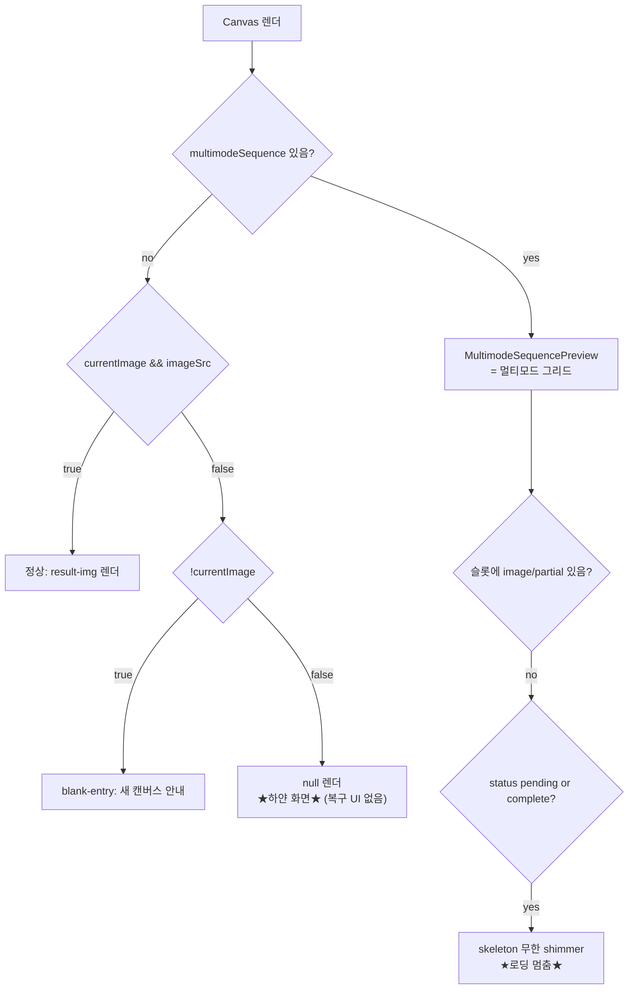

# Gallery Focus → White Screen (No Load) — Root Cause Investigation

> Status: **INVESTIGATION ONLY (no code changed)** · 2026-06-03
> Reporter: Jun · Investigator: Boss(Bocchi)
> Trigger commits: yesterday's gallery work (2026-06-02)

## TL;DR (한 줄 요약)

갤러리가 많을 때 썸네일을 눌러 포커스 이미지를 바꾸면 가운데 뷰어가 **하얀 화면으로 멈추고 로딩이 안 되는** 증상.
어제 들어간 skeleton/썸네일 작업(`5ba208c`, `1e761b6`, `fadb49f`)이 **갤러리 스트립과 멀티모드 그리드에는 로딩 표시를 추가했지만, 정작 가운데 메인 뷰어(`Canvas.tsx`)에는 로딩/onLoad/onError 처리를 하나도 추가하지 않음**. 그 결과:

- **(A) 확정** `Canvas.tsx`에 `currentImage`는 있는데 `imageSrc`가 비면 `null`을 렌더 → 영구 하얀 화면 (복구 UI 없음).
- **(B) 확정·계획 이탈** `MultimodeSequencePreview.tsx:90`이 계획서의 `partial` 대신 `complete`로 구현됨 → "완료됐는데 빈 슬롯"에 **무한 shimmer**.
- **(C) 확정 결함 + 추정 트리거** 메인 뷰어 ``는 포커스 변경 시 `key` 리마운트로 교체되는데 onLoad 페이드/스켈레톤/onError가 전혀 없음. 갤러리가 많을수록 썸네일 동시 요청·캐시 압박으로 풀해상도 fetch/decode가 지연/실패 → **하얀 공백 + 무표시**.

---

## 1. 증상 (Symptom)

> "갤러리가 많은 상태에서 갤러리 눌러서 이미지 포커스 바꿀 때 하얀 화면에서 로딩 안 되는 경우가 발생."

- 갤러리(생성 히스토리) 개수가 **많을 때만** 재현된다고 보고됨.
- 썸네일 클릭 → 가운데 뷰어의 포커스 이미지가 바뀌어야 하는데 → 하얀 화면.
- "로딩 안 됨" = 로딩 인디케이터도 없고 결국 이미지도 안 뜸 (또는 한참 뒤에 뜸).

## 2. 관련 커밋 (어제, 2026-06-02)

| commit | time | 내용 | 본 건과의 관계 |
|--------|------|------|----------------|
| `5ba208c` | 13:25 | gallery skeleton shimmer + F5 fix (#93) | **핵심.** 스트립/그리드에만 skeleton 추가, 메인 뷰어 누락 |
| `1e761b6` | 20:57 | image/video thumbnails + history sidebar cards | 썸네일 동시 요청 급증 → 연결/캐시 압박(트리거 C) |
| `fadb49f` | 21:35 | centralize recursive thumbnail backfill | 〃 |
| `16686ae` | 21:35 | preserve video thumbnail fallbacks | 부수적 |

## 3. 렌더 결정 트리 (Canvas 가운데 뷰어)

`ui/src/components/Canvas.tsx:180-317`



- `H` 경로(line 317의 `: null`)와 `K` 경로(line 90)가 "하얀 화면/로딩 멈춤"의 두 실체.

---

## 4. 근본 원인 분석

### Defect A — Canvas의 `null` 폴백 + 빈 url 소스 (확정)

**증거**

`ui/src/components/Canvas.tsx:50-55`
```ts
function getClassicImageSrc(image: GenerateItem): string {
  const src = image.url ?? image.image;
  if (!image.canvasVersion || !image.canvasMergedAt || src.startsWith("data:")) return src;
  ...
}
```
`ui/src/components/Canvas.tsx:165`, `180-182`, `301`, `317`
```tsx
const imageSrc = currentImage ? getClassicImageSrc(currentImage) : null;
...
{multimodeSequence ? (<MultimodeSequencePreview />)
  : currentImage && imageSrc ? ( /* 정상 렌더 */ )
  : !currentImage ? ( /* blank-entry */ )
  : null}            // ← currentImage는 truthy인데 imageSrc가 falsy → null = 하얀 화면
```

- `currentImage`가 세팅됐는데 `imageSrc`(= `url ?? image`)가 빈 문자열/undefined면 **어떤 폴백도 없이 `null`** → 가운데가 영구히 비어 하얀 화면. 스피너·재시도·에러 메시지 전부 없음.
- 추가 리스크: `src`가 `undefined`인데 `canvasVersion && canvasMergedAt`가 truthy면 `src.startsWith(...)`에서 **TypeError**가 나 렌더가 throw됨(별도 크래시 경로).

**언제 url이 비는가 (확정 경로)**
`lib/historyList.ts:46-48`은 일반 이미지에 항상 `url`을 채움. 단, 카드뉴스 세트는:
`lib/historyList.ts:146-148`
```ts
url: first?.imageFilename
  ? `/generated/cardnews/.../${...}`
  : "",            // ← 첫 이미지가 아직 없으면 url 빈 문자열
```
→ 이미지 없는 카드뉴스 세트를 포커스로 잡으면 `imageSrc=""` → Defect A 발동.
(`mapHistoryItem`은 `image: it.url, url: it.url`로 둘 다 같은 값을 넣으므로 — `useAppStore.ts:616-617` — 한쪽이 비면 둘 다 빔.)

> ⚠️ 카드뉴스는 "많을 때만"의 직접 원인은 아님. 빈-url 폴백 부재 자체가 구조적 결함이라 기록.

---

### Defect B — 멀티모드 슬롯 skeleton 조건이 계획과 다르게 구현됨 (확정·계획 이탈)

**계획서 의도** — `devlog/_plan/260602_gallery-skeleton-shimmer-f5fix/00_plan.md:87`
```tsx
{sequence.status === "pending" || sequence.status === "partial" ? (
  <div className="multimode-sequence__skeleton" />
) : ( /* empty/error 텍스트 */ )}
```

**실제 구현** — `ui/src/components/MultimodeSequencePreview.tsx:86-104`
```tsx
{image ? ()
  : partial ? ()
  : sequence.status === "pending" || sequence.status === "complete" ? (   // ← partial이어야 할 자리에 complete
      <div className="multimode-sequence__skeleton" />
    )
  : ( /* empty/error/canceled/partial 텍스트 */ )}
```

- 슬롯 수 = `Array.from({ length: sequence.requested })` (`MultimodeSequencePreview.tsx:36`).
- **`status === "complete"`인데 빈 슬롯**이 있으면 → 그 슬롯은 **무한 shimmer**(멈춘 로딩). 계획대로 `partial`이었다면 "반환 안 됨" 텍스트가 떴을 것.

**"complete인데 빈 슬롯"이 실제로 가능한가 → 가능 (확정)**
라이브 멀티모드 완료 처리 — `ui/src/store/useAppStore.ts:3899-3918`
```ts
[flightId]: {
  requested: res.requested,      // 예: 4 (원래 요청 수)
  returned: images.length,       // 예: 3 (모더레이션 등으로 1장 누락)
  images,                        // length 3
  status: res.status,            // 서버가 "complete"로 줄 수 있음
}
```
→ `requested=4, returned=3, status="complete"`, 슬롯 3개만 채워지고 4번째 슬롯은 image/partial 없음 → 무한 shimmer.

**뉘앙스:** 같은 시퀀스를 나중에 스트립 컬렉션 카드로 **다시 열면**(`showHistorySequence`, `useAppStore.ts:3525-3530`) 상태를 로컬에서 `returned >= requested ? complete : partial`로 재계산 → `3 >= 4` 거짓 → `partial` → 텍스트로 표시되어 **자가 치유**됨. 즉 Defect B는 **생성 직후 라이브 그리드**에서 두드러지고, 재오픈하면 사라지는 간헐성을 가짐("sometimes"와 부합).

---

### Defect C — 메인 뷰어에 로딩/onLoad/onError 부재 (확정 결함) + "많을 때" 트리거 (추정)

**증거** — `ui/src/components/Canvas.tsx:229-242`
```tsx

```
- `imageKey`(`Canvas.tsx:78-80`)는 `filename/url + canvasMergedAt` 기반 → **포커스 변경 시 항상 새 key** → React가 기존 ``를 언마운트하고 새로 마운트. 교체 순간 가운데가 비고, 새 이미지는 fetch+decode가 끝나야 보임.
- 그 공백 구간을 덮을 **skeleton/스피너/페이드인이 메인 뷰어엔 없음**. `index.css`의 skeleton 클래스(`.history-thumb--skeleton`, `.multimode-sequence__skeleton` 등)는 전부 스트립/그리드용이고 `.result-img`엔 적용 안 됨.
- `onError`도 없어서 fetch가 404/리셋되면 **무한 하얀 화면** (복구·재시도 없음).

**왜 "갤러리가 많을 때" 악화되나 (추정, 근거 있음)**
1. **HTTP 연결 경합:** 어제 추가된 썸네일(`1e761b6`/`fadb49f`)로 스트립이 `/generated/...thumb.jpg`를 대량 동시 요청. 브라우저 동일 오리진 동시 연결 한도(HTTP/1.1 ~6) 안에서 풀해상도 포커스 이미지 fetch가 썸네일 뒤로 **큐잉** → 하얀 공백이 길어짐.
2. **이미지 캐시 축출:** 갤러리가 많으면 디코드된 이미지 캐시가 축출돼 포커스 바꿀 때마다 재fetch/재decode → 공백 재현.
3. **빈-url/전송 실패 확률 증가:** 항목이 많을수록 카드뉴스 빈 세트(Defect A)·일시적 전송 실패(onError 부재)에 부딪힐 확률↑.

> C의 "결함"(로딩/onError 부재)은 코드로 확정. "많을 때 트리거"(연결 경합/캐시 축출)는 런타임 계측으로 확증 필요 — 아래 §6 참조.

---

## 5. "왜 많을 때만 터지나" 종합

| 메커니즘 | 많을 때 효과 | 확정도 |
|----------|--------------|--------|
| 메인 뷰어 로딩/스켈레톤 부재 (C) | 본질 결함. 항상 존재하지만 로드가 빠르면 안 보임 | 결함=확정 |
| 썸네일 동시 요청 경합 (C-1) | 항목↑ → 동시 요청↑ → 포커스 fetch 큐잉↑ | 추정 |
| 이미지 캐시 축출 (C-2) | 항목↑ → 캐시 압박↑ → 매번 재fetch | 추정 |
| complete+빈 슬롯 무한 shimmer (B) | 멀티모드 배치↑ → 누락 슬롯 만날 확률↑ | 확정 |
| 빈-url 카드뉴스 null 폴백 (A) | 항목↑ → 빈 세트 만날 확률↑ | 확정 |

핵심: **로드가 느려지거나 실패하는 "조건"은 많을 때 늘지만, 그걸 가려줄 "안전망(로딩 UI·onError·폴백)"이 메인 뷰어에 전혀 없다**는 게 진짜 뿌리.

---

## 6. 재현 & 계측 (어느 게 주범인지 확정용)

**재현 시나리오**
1. 히스토리 항목을 충분히 많이(수백 개) 둔 상태에서, 스트립을 빠르게 스크롤해 썸네일이 로딩되는 동안 임의 항목을 연속 클릭 → 가운데 하얀 공백 지속 여부 관찰.
2. 멀티모드 4장 생성에서 1장이 모더레이션으로 누락되게 유도 → 라이브 그리드 4번째 슬롯이 영구 shimmer인지 확인 (Defect B).
3. 이미지 없는 카드뉴스 세트를 포커스로 클릭 → 가운데 완전 백지인지 확인 (Defect A).

**계측 포인트 (코드 수정 없이 DevTools로)**
- Network 탭: 포커스 변경 시 `/generated/<focused>`가 **Queued/Stalled** 상태로 대기하는지, `(failed)`/`canceled`인지.
- `Canvas.tsx` 메인 ``에 임시로 `onLoad`/`onError` 콘솔 로그를 붙여 onError 발생 여부·로드 지연(ms) 측정 (확증 후 제거).
- Performance: 동시 디코드/레이아웃으로 포커스 이미지 paint가 밀리는지.

---

## 7. 제안 수정안 (다음 단계 — 아직 적용 안 함)

> 사용자 지시 "일단 문서화". 아래는 **검토용 후보**이며 본 세션에서 코드 변경 없음.

1. **Defect A 폴백 추가** — `Canvas.tsx`의 `: null` 자리에 "이미지를 불러올 수 없음 / 다시 시도" 폴백 블록. `getClassicImageSrc`에서 `src`가 빈 값이면 안전 처리(throw 방지).
2. **Defect B 조건 교정** — `MultimodeSequencePreview.tsx:90`을 계획대로 `pending || partial`로 변경(혹은 "빈 슬롯이면서 complete"는 누락 텍스트로). 회귀 방지로 `multimode-ui-contract.test.js`에 케이스 추가.
3. **Defect C 안전망** — 메인 `result-img`에 `onLoad` 페이드인 + 로딩 중 skeleton/blur placeholder(썸네일이 있으면 `thumb`를 저해상 placeholder로 먼저 표시) + `onError` 재시도/메시지. 가능하면 `loading` 상태로 흰 공백을 덮기.
4. **연결 경합 완화(선택)** — 스트립 썸네일에 `loading="lazy"`/`fetchpriority` 조정, 포커스 이미지엔 `fetchpriority="high"`.

---

## 8. 영향 파일·라인 레퍼런스

| 파일 | 라인 | 핵심 |
|------|------|------|
| `/Users/jun/Developer/new/700_projects/ima2-gen/ui/src/components/Canvas.tsx` | 50-55 | `getClassicImageSrc` (빈 url시 빈 반환/throw 위험) |
| 〃 | 78-80 | `imageKey` — 포커스 변경 시 리마운트 키 |
| 〃 | 165, 180-182, 301, **317** | 렌더 분기 + **`: null` 하얀 화면 폴백** |
| 〃 | 229-242 | 메인 `` — onLoad/onError/로딩 **전무**, `decoding="async"` |
| `/Users/jun/Developer/new/700_projects/ima2-gen/ui/src/components/MultimodeSequencePreview.tsx` | 36-40 | 슬롯 = `requested` 개 |
| 〃 | **90** | `pending \|\| complete` (계획은 `partial`) → 무한 shimmer |
| `/Users/jun/Developer/new/700_projects/ima2-gen/ui/src/store/useAppStore.ts` | 612-668 | `mapHistoryItem` (`image=url=it.url`) |
| 〃 | 3487-3512 | `selectHistory` (포커스 타깃 결정) |
| 〃 | 3514-3550 | `showHistorySequence` (재오픈 시 status 재계산 → 자가치유) |
| 〃 | 3899-3918 | 라이브 멀티모드 완료 `status: res.status` (complete+누락 가능) |
| `/Users/jun/Developer/new/700_projects/ima2-gen/ui/src/lib/galleryShortcuts.ts` | 26-45 | `getVisibleGalleryItems` / `resolveVisibleShortcutCurrent` |
| `/Users/jun/Developer/new/700_projects/ima2-gen/lib/historyList.ts` | 46-48 | 일반 이미지 url 항상 채움 |
| 〃 | 146-148 | 카드뉴스 빈 세트 `url: ""` |
| `/Users/jun/Developer/new/700_projects/ima2-gen/devlog/_plan/260602_gallery-skeleton-shimmer-f5fix/00_plan.md` | 87 | 계획 의도(`partial`) vs 구현(`complete`) |

## 9. 테스트 영향 (참고)

관련 계약 테스트: `tests/multimode-ui-contract.test.js`, `tests/gallery-viewer-navigation-contract.test.js`, `tests/gallery-navigation-ux-contract.test.js`, `tests/history-strip-duplicate-contract.test.js`. Defect B/C 수정 시 여기에 회귀 케이스를 추가하는 것이 적절.

---

*이 문서는 조사·기록 전용입니다. 코드 수정은 별도 승인 후 진행합니다.*
