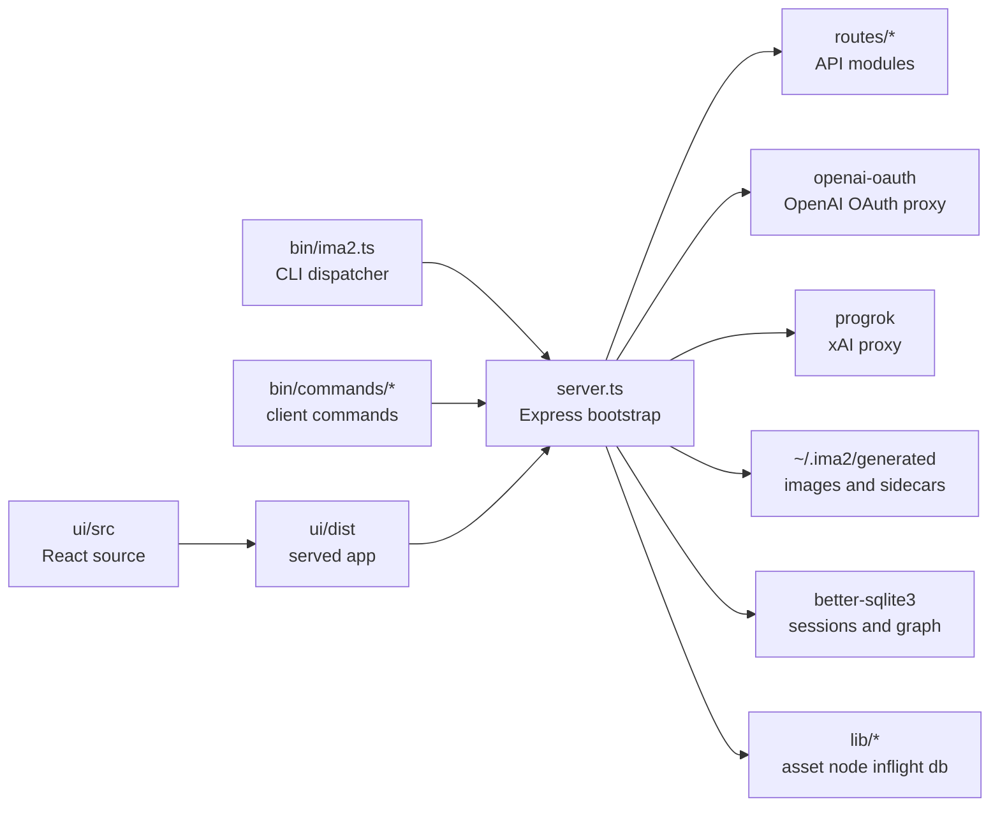

# ima2-gen Structure Hub

`ima2-gen` is a combined image-generation CLI and web UI. Users start the local server with `ima2 serve`, then generate or edit images through either the browser UI or CLI commands. This folder documents that runtime path as a small architecture reference set.

This hub matters because the codebase has several active centers of gravity. `server.ts` (with paired runtime `server.js`) bootstraps the app and delegates most API surfaces to `routes/*`, including `capabilities`, `generate`, `edit`, `multimode`, `nodes`, `sessions`, `history`, `imageImport`, `health`, `storage`, `metadata`, `annotations`, `canvasVersions`, `comfy`, `prompts`, `promptImport`, the always-on `agent` (Agent Mode) and `promptBuilder` surfaces, and the dev-gated `cardNews`. `lib/*` owns storage, OAuth, Grok/progrok provider plumbing, logging, sessions, inflight state, migration helpers, image metadata embed/restore, prompt library SQLite, reference compression, ComfyUI bridge helpers, canvas version store, system-trash soft-delete, PNG-info parsing, card-news planner/template stores, and the Agent Mode runtime/queue/store (`lib/agent*.ts`). `bin/` owns the CLI automation surface, with near-complete parity with the server API (#45) — Agent Mode is the notable server + web-UI surface with no CLI command, while prompt builder is available as `ima2 prompt build`. `ui/src/` owns the React UI, the React Flow node mode, Canvas Mode (split under `ui/src/components/canvas-mode/`), the Agent Mode workspace (`ui/src/components/agent/`), mobile shell, the prompt library panel, and the dev-only card-news workspace. Without a structure guide, even a small API change can make it unclear whether CLI, UI, tests, or devlog docs also need to move.

Snapshot note, 2026-04-30: TypeScript migration is functionally complete and merged to `main` (archived under `devlog/_fin/260429_typescript-migration`). Route, lib, server, config, and bin source files are now `*.ts`; paired `*.js` files coexist as committed build/runtime artifacts (see `tsconfig.build.json`, `tsconfig.bin.json`, and `prepack`). Treat the `.ts` files as source of truth and only edit the `.js` paths through the build, never by hand.

Snapshot note, 2026-05-06: shipped to `ima2-gen@1.1.10`. The strict-mode + test-infra follow-up (#50, commit 7367333) split `lib/oauthProxy.ts` into a `lib/oauthProxy/*` subtree (`generators`, `streams`, `prompts`, `references`, `runtime`, `errors`, `types`, `index`) and added `lib/runtimeContext.ts`, `lib/responsesImageAdapter.ts`, `lib/providerOptions.ts`, `lib/errInfo.ts`. Non-migration feature work since 2026-04-30 added prompt safety intent policy injection (`lib/promptSafetyPolicy.ts`, commit 5b8045a), API-key provider Responses parity for generate/edit/multimode/node (commit b8205fe + #49 plan), masked-edit feature flag groundwork (`config.oauth.maskedEditEnabled` / `IMA2_OAUTH_MASKED_EDIT_ENABLED`, #31, commit c7e75c0), gallery default-to-current-session with All Images toggle (#42, commit bbf9b08), a centralized localStorage key registry (`ui/src/store/persistenceRegistry.ts`, #43, commit 246696d), settings/canvas state persistence hardening (commit 5e3aed3), bottom-right error toast stacking (commit 78cb6d4), node concurrent-generate dedupe (commit 73f228e), node action-bar wrap on narrow cards (commit ef1e60f), reasoning-effort disable for image-only models (commit 18b9123), and mobile settings/compose UX polish (commits ad78853, c812598).

Snapshot note, 2026-05-11: local working tree includes the post-#60 multimode incremental progress work and the #61 CLI parity implementation. `gen`, `edit`, `multimode`, and `node generate` now expose request-level provider and web-search flags; `multimode` also exposes references and prompt mode, `ps`/`inflight` help names multimode jobs, and `ls --favorites` uses server-side favorites filtering.

Snapshot note, 2026-05-30: current release is `ima2-gen@1.1.15`. Since the 1.1.10 snapshot the runtime added **Agent Mode** — a conversational image workspace with sessions, turns, a durable per-session queue, compact/manifest, slash commands and `/question` (`routes/agent.ts` + `lib/agent*.ts`, UI under `ui/src/components/agent/`; server + web-UI only, no CLI), the agent-facing `GET /api/capabilities` discovery endpoint (#62), and the `POST /api/prompt-builder/chat` assistant (`routes/promptBuilder.ts`, CLI wrapper `ima2 prompt build`). The Grok provider path now bundles progrok, supports Classic/Node/Agent through search + `grok-4.3` planning + xAI Images API, exposes `ima2 grok` helpers, and ships video generation/edit/extension/frame/analyze routes with branch-local last-frame continuation metadata. Recent product work also includes Prompt Studio regression fixes (#75), long-prompt preview (#77), prompt autofill perf (#78), per-image metadata persistence (#79), and the batch comparison matrix (#80). This refresh re-grounds the structure docs against current code rather than the README.

Snapshot note, 2026-06-27: current release is `ima2-gen@2.0.4`. Since the 2.0.1 snapshot: npm **OIDC trusted publishing** via `.github/workflows/publish.yml` (`latest` on GitHub Release, `preview` dist-tag on `preview` branch push); **generation request log** (`GET /api/generation-requests`, #95, UI dev panel); **result metadata inspector** (#108); **OAuth size directive** with explicit LANDSCAPE/PORTRAIT/SQUARE orientation; **preview publish workflow consolidation** (registered workflow filename matters for npm trusted publisher). Provider/key surfaces (`/api/keys/*`, `/api/quota`, Switch Account `/api/auth/switch`) remain web-UI-first with partial CLI parity.

Snapshot note, 2026-06-28: WP6 docs code-grounding — `npm run docs:refresh-line-counts` keeps `[[01-file-function-map]]` lib/bin/route counts current; `tests/api-docs-contract.test.js` and `tests/cli-feature-parity-contract.test.js` guard `docs/API.md` and `docs/CLI.md` against route/CLI drift.

Snapshot note, 2026-06-08: current release is `ima2-gen@2.0.1`. Since the 1.1.15 snapshot: **SSE multiplexing** — the web UI now uses a single `GET /api/events` persistent SSE connection (backed by `lib/eventBus.ts` ring buffer + `routes/events.ts`). Generation routes accept `{ async: true, requestId }` and respond `202`, emitting progress through the event bus. CLI backward compatibility preserved via dual-emit. The store was split from monolithic `useAppStore` into focused `store*Impl.ts` modules. **Gemini API provider** added (`provider: "gemini-api"`, Vertex AI support). **Switch Account** device-code OAuth re-auth. **Video model picker** (V/V1.5). **Grok billing quota bar**. See `CHANGELOG.md` for the complete list.

Start here when onboarding. Read the system overview, then open `[[01-file-function-map]]` for concrete file locations. Use `[[02-command-reference]]` for CLI work, `[[03-server-api]]` for server changes, `[[04-frontend-architecture]]` and `[[05-node-mode]]` for UI work, `[[06-infra-operations]]` for build/auth/runtime operations, and `[[07-devlog-map]]` for roadmap and archive interpretation.

This documentation is based on local code and local devlog files, not external web research. Version numbers, endpoints, and line counts are snapshots of the current working tree. Update the relevant docs whenever the code changes.

---

## System Overview

The runtime path is intentionally direct. CLI commands and the browser call `/api/*` endpoints registered by `server.js` and implemented in `routes/*`. The server sends image requests through the local OAuth proxy, saves image files under the configured generated directory, usually `~/.ima2/generated`, and persists graph sessions through SQLite. Node mode wraps the same image-generation capability in a graph workflow.

## Reading Order

| Order | Document | Why to read it |
|---:|---|---|
| 1 | `[[00-structure-hub]]` | Understand the system flow and document map. |
| 2 | `[[01-file-function-map]]` | Locate files, line counts, and module responsibilities. |
| 3 | `[[02-command-reference]]` | Understand `ima2` commands and server discovery. |
| 4 | `[[03-server-api]]` | Understand REST contracts, response shapes, and errors. |
| 5 | `[[04-frontend-architecture]]` | Understand React UI, Zustand state, and component layout. |
| 6 | `[[05-node-mode]]` | Understand graph canvas, node generation, and session persistence. |
| 7 | `[[06-infra-operations]]` | Understand auth, config, build, test, and runtime data. |
| 8 | `[[07-devlog-map]]` | Understand roadmap, completed work, and planning docs. |

## Document Map

| Document | Scope | Update when |
|---|---|---|
| `00-structure-hub.md` | Entry point, doc relationships, QA flow | A doc is added, removed, renamed, or re-scoped. |
| `01-file-function-map.md` | File tree, line counts, responsibilities, tests | Files move, large modules split, or line counts change. |
| `02-command-reference.md` | CLI commands, options, server discovery, exit codes | `bin/ima2.ts`, `bin/commands/*`, or `bin/lib/*` changes. |
| `03-server-api.md` | `/api/*` endpoints and request/response contracts | `server.ts`, route modules, store helpers, or API tests change. |
| `04-frontend-architecture.md` | React UI, components, store, i18n | `ui/src/*`, `ui/package.json`, or CSS changes. |
| `05-node-mode.md` | Graph UI, node API, sessions, pending states | `NodeCanvas`, `ImageNode`, `/api/node/*`, or session logic changes. |
| `06-infra-operations.md` | Auth, OAuth proxy, config, build/test/release | `package.json`, scripts, env, CI, or runtime storage changes. |
| `07-devlog-map.md` | `_plan`, `_fin`, `_spikes`, roadmap interpretation | Devlog folders move or the active roadmap changes. |

## Cross References

| Document | Should also check |
|---|---|
| `01-file-function-map` | `03-server-api`, `04-frontend-architecture`, `06-infra-operations` |
| `02-command-reference` | `03-server-api`, `06-infra-operations` |
| `03-server-api` | `02-command-reference`, `05-node-mode`, `06-infra-operations` |
| `04-frontend-architecture` | `03-server-api`, `05-node-mode` |
| `05-node-mode` | `03-server-api`, `04-frontend-architecture`, `07-devlog-map` |
| `06-infra-operations` | `01-file-function-map`, `02-command-reference` |
| `07-devlog-map` | `00-structure-hub`, `05-node-mode`, `06-infra-operations` |

## Sync Checklist

- [x] Create the structure docs folder and record its purpose in `AGENTS.md`.
- [x] Mirror the `cli-jaw/devlog/structure` hub pattern as a smaller set.
- [x] Document the current CLI, API, UI, node-mode, infra, and devlog surfaces.
- [x] `server.js` is split into route modules; keep `01`, `03`, and `06` synchronized with route ownership.
- [ ] If a CLI command is added, update `02`, `03`, and `06` together.
- [ ] If React component or store shape changes, update `04` and `05` together.

## Change Log

- 2026-04-23: Created the initial `image_gen/structure` hub and eight-document reference set.
- 2026-04-23: Translated the structure docs from Korean to English.
- 2026-04-25: Updated the hub after route decomposition, home-directory storage migration, and 0.09 closeout audit.
- 2026-04-26: Refreshed the docs around CLI parity, runtime port fallback, and public classic/node product scope.
- 2026-04-28: Updated hub for image metadata embed/restore, prompt library, dev-only card-news workspace, expanded route surface (`metadata`, `prompts`, `cardNews`), and `ima2-gen@1.1.5`.
- 2026-04-30: Refreshed all eight docs after the TypeScript migration closeout, CLI feature-parity #45 (`feat(cli): full feature parity with server API`), Canvas Mode workspace split (`refactor(ui): split canvas mode workspace`), Canvas dual-mask cleanup, OS-trash soft-delete, blank-canvas/escape close hardening, and `ima2-gen@1.1.8`. Re-aligned line counts, route inventory, and CLI command list to the working tree.
- 2026-05-06: Refreshed structure docs and README for `ima2-gen@1.1.10`. Logged: `lib/oauthProxy.ts` split into `lib/oauthProxy/*` plus new `lib/runtimeContext.ts` / `lib/responsesImageAdapter.ts` / `lib/providerOptions.ts` / `lib/errInfo.ts` / `lib/promptSafetyPolicy.ts`; API-key provider Responses parity for generate/edit/multimode/node (#49); masked-edit feature flag (`IMA2_OAUTH_MASKED_EDIT_ENABLED`, #31) and the new `apiProvider.*` env block (`IMA2_API_IMAGE_MODEL_DEFAULT`, `IMA2_API_REASONING_EFFORT`, `IMA2_API_IMAGE_SIZE`, `IMA2_API_ALLOW_WEB_SEARCH`); gallery default-to-current-session with All Images toggle (#42); centralized `persistenceRegistry` for `ima2.*` localStorage keys (#43); error toast stacking; node concurrent-generate dedupe lock; mobile settings/compose UX polish; and the new `typecheck:tests` and `test:inventory` quality gates.
- 2026-05-10: Refreshed CLI/API structure docs after #61 audit. Verified request-level web-search CLI mapping, documented API-provider global web-search gate behavior, updated multimode/inflight/history API descriptions, and recorded open CLI parity gaps.
- 2026-05-11: Updated structure docs for #61 implementation: provider overrides, multimode refs/mode, multimode inflight help, server-side favorites listing, and CLI parity tests. `edit --mask` remains deferred to #31.
- 2026-05-30: Re-grounded the structure set against current code at `ima2-gen@1.1.14` (not the README). Documented Agent Mode (`/api/agent/*`, `routes/agent.ts`, `lib/agent*.ts`, `ui/src/components/agent/`), the `GET /api/capabilities` endpoint (#62), and `POST /api/prompt-builder/chat`; corrected the route inventory and line counts in `[[01-file-function-map]]` and `[[03-server-api]]`; and bumped the infra version snapshot in `[[06-infra-operations]]`.
- 2026-06-01: Updated the structure set for the shipped Grok video runtime: `ima2 video continue`, video edit/extend/frame/analyze, `videoContinuity` sidecar metadata, and branch-local last-frame continuation replace the older image-only/no-video wording.

Previous document: none

Next document: `[[01-file-function-map]]`
