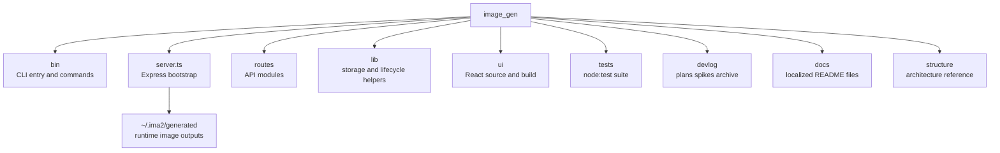

# File And Function Map

This document is a fast map of the current `ima2-gen` file layout. Use it to understand which files own which responsibilities before making changes.

The map matters because the repository looks small, but runtime responsibility is split across several areas. `server.js` is now a small bootstrap file, API ownership lives in `routes/*`, and runtime helpers live in `lib/*`. The CLI is split into `bin/commands/*`, and the UI is split across `ui/src/components/*`, `ui/src/lib/*`, and `ui/src/store/useAppStore.ts`. Reading responsibilities and line counts together helps reveal both impact radius and refactor targets.

Snapshot note, 2026-05-11: TypeScript migration is closed (#24). Source files for `server`, `config`, `routes/*`, `lib/*`, and `bin/*` are all `*.ts`. Paired `*.js` files are committed runtime artifacts produced by `tsc -p tsconfig.build.json` (server/lib/routes), `tsc -p tsconfig.bin.json` (CLI), and `prepack`; do not edit them by hand. Line counts in this document refer to the `.ts` source unless otherwise noted. CLI parity #61 added provider overrides, multimode refs/mode, multimode inflight help, server-side favorites listing, and source-contract tests.

Before adding a feature, choose the surface first. For CLI work, read `bin/` and `[[02-command-reference]]`. For API work, read `server.ts`, `routes/*.ts`, `lib/*.ts`, and `[[03-server-api]]`. For UI work, read `ui/src/` and `[[04-frontend-architecture]]`. For graph workflow work, also read `[[05-node-mode]]`.

---

## Top-Level Tree



## Core File Line Counts

### Current Route Source Layout

```text
routes/
  annotations.ts        GET/PUT/DELETE /api/annotations/:filename
  canvasVersions.ts     POST/PUT /api/canvas-versions
  comfy.ts              POST /api/comfy/export-image
  edit.ts               POST /api/edit
  generate.ts           POST /api/generate
  multimode.ts          POST /api/generate/multimode
  nodes.ts              POST /api/node/generate, GET /api/node/:nodeId
  sessions.ts           /api/sessions* + graph + style-sheet
  history.ts            /api/history* + favorite/delete/restore/permanent
  imageImport.ts        POST /api/history/import-local
  health.ts             providers/health/oauth/inflight/billing
  storage.ts            storage status/open generated dir
  metadata.ts           POST /api/metadata/read
  prompts.ts            prompt CRUD/folders/import/export
  promptImport.ts       curated/discovery/folder/preview/commit import routes
  cardNews.ts           dev-gated /api/cardnews/*
  index.ts              route registration hub
```

| File | Lines | Responsibility |
|---|---:|---|
| `server.ts` | 255 | Express bootstrap, middleware wiring, OAuth startup, runtime advertisement, port fallback, route registration, static serving |
| `config.ts` | 333 | Centralized runtime config (env > `~/.ima2/config.json` > defaults), prompt import/index caps, web-search/reasoning-effort defaults, API-provider defaults, and backward-compatible flat re-exports |
| `routes/index.ts` | 38 | Route registration hub: health, storage, metadata, history, imageImport, sessions, edit, nodes, multimode, generate, annotations, canvasVersions, comfy, prompts, prompt import, and (when `features.cardNews`) cardNews |
| `routes/generate.ts` | 363 | Classic generation API, model validation, reference validation, provider/web-search/reasoning-effort plumbing, cancellation, upstream validation pass-through, sidecar save |
| `routes/edit.ts` | 281 | Edit API, mask validation, cancellation, OAuth/API edit response save, provider/web-search/reasoning-effort plumbing |
| `routes/multimode.ts` | 438 | `POST /api/generate/multimode` SSE orchestrator: multimode inflight state, incremental final-image save/send, partial timeout, cancellation, provider/web-search/reasoning-effort plumbing |
| `routes/nodes.ts` | 523 | Node generation API, explicit context/search policy, SSE partial/error streaming, child references, safe retry diagnostics, cancellation, node sidecar save, node fetch |
| `routes/sessions.ts` | 317 | SQLite-backed session list/load/save/rename/delete, style-sheet get/put/enable/extract, graph save |
| `routes/history.ts` | 221 | History list, cursor pagination, favorites-only filtering, grouped gallery, soft delete (OS trash), restore, gallery favorite toggle, permanent delete |
| `routes/imageImport.ts` | 35 | `POST /api/history/import-local` raw image upload (PNG/JPEG/WebP) — Phase 10 drop-import for Canvas |
| `routes/health.ts` | 118 | Providers, health, OAuth status, inflight list/cancel for classic/node/multimode jobs, billing |
| `routes/storage.ts` | 39 | Gallery storage status and generated-folder open action |
| `routes/metadata.ts` | 71 | `/api/metadata/read` for embedded XMP image metadata extraction |
| `routes/annotations.ts` | 95 | `GET/PUT/DELETE /api/annotations/:filename` for canvas annotation overlays |
| `routes/canvasVersions.ts` | 64 | `POST/PUT /api/canvas-versions` for canvas version snapshots |
| `routes/comfy.ts` | 39 | `POST /api/comfy/export-image` ComfyUI bridge export |
| `routes/prompts.ts` | 379 | Prompt library CRUD, favorites, import/export, and folder management |
| `routes/promptImport.ts` | 354 | Prompt library preview/commit import API plus PR2 curated search, PR3 GitHub folder browse/preview, and PR4 discovery review endpoints |
| `routes/cardNews.ts` | 183 | Dev-gated card-news templates, sets, drafts, jobs, regenerate, export (only registered when `config.features.cardNews`) |
| `bin/ima2.ts` | 444 | CLI setup, serve, status, doctor, open, reset, command dispatch (`serve --dev` enables verbose diagnostics) |
| `bin/commands/gen.ts` | 214 | CLI image-generation client with references, provider override, model, mode, moderation, web-search, reasoning-effort, session, timeout recovery, and output-dir options |
| `bin/commands/edit.ts` | 150 | CLI image-edit client with provider override, model, mode, moderation, web-search, reasoning-effort, session, timeout recovery, and output options |
| `bin/commands/multimode.ts` | 196 | CLI multimode SSE client with provider override, references, prompt mode, incremental image save, timeout recovery, web-search, reasoning-effort, and session options |
| `bin/commands/node.ts` | 166 | CLI node-mode generate/show client with references, provider override, parent node, web-search, reasoning-effort, and SSE support |
| `bin/commands/session.ts` | n/a | CLI session list/load/save/rename/delete client |
| `bin/commands/history.ts` | 146 | CLI history mutation client for favorite/import/restore/delete/permanent actions |
| `bin/commands/prompt.ts` | n/a | CLI prompt library list/show/save/delete/import/export client |
| `bin/commands/annotate.ts` | n/a | CLI annotation read/write/delete client |
| `bin/commands/canvas-versions.ts` | n/a | CLI canvas version list/save client |
| `bin/commands/metadata.ts` | n/a | CLI image metadata read client |
| `bin/commands/comfy.ts` | n/a | CLI ComfyUI bridge export client |
| `bin/commands/cardnews.ts` | n/a | CLI dev-gated card-news client |
| `bin/commands/config.ts` | n/a | CLI config get/set client |
| `bin/commands/inflight.ts` | n/a | CLI inflight list/cancel client |
| `bin/commands/storage.ts` | n/a | CLI storage status/open client |
| `bin/commands/billing.ts` | n/a | CLI billing/usage client |
| `bin/commands/providers.ts` | n/a | CLI providers status client |
| `bin/commands/oauth.ts` | n/a | CLI OAuth status client |
| `bin/commands/cancel.ts` | 45 | Inflight cancel client |
| `bin/commands/ls.ts` | 64 | History list client (legacy alias); supports session and server-side favorites filtering via `favoritesOnly=1` |
| `bin/commands/ps.ts` | 81 | Inflight job list client, including optional terminal job snapshots; accepts arbitrary `kind` and documents `classic|node|multimode` |
| `bin/commands/show.ts` | 48 | Single history item display/reveal client |
| `bin/commands/ping.ts` | 28 | Server health probe client |
| `bin/lib/client.ts` | 100 | Server discovery, HTTP request wrapper, response normalization |
| `bin/lib/platform.ts` | 97 | Browser-open and binary-resolution helpers |
| `bin/lib/args.ts` | 73 | Dependency-free argv parser |
| `bin/lib/files.ts` | 39 | Data URI file conversion and output naming |
| `bin/lib/output.ts` | 58 | Terminal output, JSON, exit-code mapping |
| `bin/lib/error-hints.ts` | 23 | CLI error hint formatting |
| `bin/lib/star-prompt.ts` | 97 | CLI GitHub star prompt helper |
| `bin/lib/storage-doctor.ts` | 38 | CLI storage doctor formatting |
| `bin/lib/sse.ts` | 73 | CLI SSE response stream helper |
| `bin/lib/browser-id.ts` | 16 | CLI browser-id header helper |
| `lib/sessionStore.ts` | 272 | SQLite session and graph persistence, graph parent normalization, style-sheet helpers, session-title lookup |
| `lib/styleSheet.ts` | 128 | Session style-sheet extraction and prefix composition |
| `lib/assetLifecycle.ts` | 123 | Soft delete (OS trash via `trash` dep), restore, node asset-missing marking |
| `lib/systemTrash.ts` | 20 | Cross-platform OS-trash helper wrapping the `trash` dependency |
| `lib/db.ts` | 166 | SQLite bootstrap and migrations: sessions, nodes, edges, inflight, prompts, prompt folders, canvas versions |
| `lib/nodeStore.ts` | 81 | Node image and metadata load/save |
| `lib/inflight.ts` | 281 | SQLite-backed active job registry for classic/node/multimode, abort controllers, cancel state, and short-lived terminal job snapshots |
| `lib/logger.ts` | 150 | Safe structured logging, redaction, level filtering, and test sink helpers |
| `lib/requestLogger.ts` | 48 | API-only request lifecycle logging and sanitized request ID middleware |
| `lib/codexDetect.ts` | 69 | Codex OAuth session detection helper |
| `lib/errorClassify.ts` | 100 | Upstream/OAuth error classifier for stable error codes, including provider validation errors |
| `lib/generationErrors.ts` | 121 | Generation error normalization, retry classification, status mapping |
| `lib/historyList.ts` | 168 | History reconstruction from generated assets, sidecars, embedded XMP metadata fallback, session-aware rows |
| `lib/localImportStore.ts` | 110 | Validates raw PNG/JPEG/WebP body, writes timestamped `imported-*` to generated/, embeds XMP metadata, returns GenerateItem-shaped row |
| `lib/storageMigration.ts` | 284 | Legacy generated-folder scan and migration support |
| `lib/runtimePorts.ts` | 93 | Port probing, fallback binding, and OAuth ready URL parsing |
| `lib/oauthLauncher.ts` | 64 | OAuth proxy child process startup and actual ready-port capture |
| `lib/oauthProxy.ts` | 3 | Re-export shim for the `lib/oauthProxy/` subtree (kept for callers that imported the original module path) |
| `lib/oauthProxy/index.ts` | n/a | Public surface — re-exports generators, streams, prompts, references, runtime, and shared types |
| `lib/oauthProxy/generators.ts` | n/a | Generate/edit/multimode OAuth Responses request builders, masked-edit guard (`maskedEditEnabled`), upstream 4xx parsing |
| `lib/oauthProxy/streams.ts` | n/a | SSE/event-stream helpers and safe stream diagnostics |
| `lib/oauthProxy/prompts.ts` | n/a | Prompt assembly with injected `SAFETY_INTENT_POLICY` from `lib/promptSafetyPolicy.ts` |
| `lib/oauthProxy/references.ts` | n/a | Reference image preparation and validation for the OAuth path |
| `lib/oauthProxy/runtime.ts` | n/a | OAuth runtime context and request execution |
| `lib/oauthProxy/errors.ts` | n/a | OAuth-specific error codes and normalization |
| `lib/oauthProxy/types.ts` | n/a | Shared OAuth proxy types (re-exported from `index`) |
| `lib/promptSafetyPolicy.ts` | 5 | `SAFETY_INTENT_POLICY` constant: 3-line intent policy injected by oauthProxy/prompts and the API-key Responses adapter |
| `lib/responsesImageAdapter.ts` | 485 | API-key provider Responses adapter — parity with OAuth path for generate/edit/multimode/node, including multimode final-image callbacks |
| `lib/providerOptions.ts` | 42 | Per-provider option assembly (provider, model, size, reasoning effort, web search) |
| `lib/runtimeContext.ts` | n/a | Per-request runtime context plumbing for routes and lib helpers |
| `lib/errInfo.ts` | n/a | Error info shape and helpers shared across routes/lib |
| `lib/oauthNormalize.ts` | 30 | Upstream OAuth response field normalization |
| `lib/openDirectory.ts` | 45 | Cross-platform open of the generated directory (used by `/api/storage/open-generated-dir`) |
| `lib/refs.ts` | 117 | Reference image validation, count/size limits |
| `lib/referenceImageCompress.ts` | 75 | Sharp-based reference image compression below the configured byte cap |
| `lib/imageModels.ts` | 52 | Image model allowlist and `normalizeImageModel(ctx, raw)` helper |
| `lib/imageMetadata.ts` | 107 | `ima2.generation.v1` payload schema, XMP build/parse, embed limits |
| `lib/imageMetadataStore.ts` | 67 | Sharp-based embed/read of XMP metadata into PNG/JPEG/WebP |
| `lib/canvasVersionStore.ts` | 181 | Canvas version snapshot storage, list, restore, and pruning |
| `lib/comfyBridge.ts` | 214 | ComfyUI bridge: workflow export, image staging, integration helper handoff |
| `lib/pngInfo.ts` | 26 | PNG-info text-chunk parsing for ComfyUI/A1111 metadata interop |
| `lib/cardNewsTemplateStore.ts` | 210 | Card-news image template registry and preview reads |
| `lib/cardNewsRoleTemplateStore.ts` | 47 | Built-in role-template list (`mid-5`, etc.) |
| `lib/cardNewsManifestStore.ts` | 112 | Per-set manifest and sidecar persistence under `~/.ima2/generated/cardnews/` |
| `lib/cardNewsJobStore.ts` | 107 | In-memory card-news job/card status, retry/finish helpers |
| `lib/cardNewsPlanner.ts` | 180 | Deterministic and planner-driven card-news draft creation |
| `lib/cardNewsPlannerClient.ts` | 112 | OAuth-Responses JSON planner request wrapper |
| `lib/cardNewsPlannerPrompt.ts` | 60 | Card-news planner prompt builder |
| `lib/cardNewsPlannerSchema.ts` | 259 | Card-news planner JSON schema, validation, and repair |
| `lib/cardNewsGenerator.ts` | 162 | Card-by-card image assembly orchestrator |
| `lib/promptImport/errors.ts` | 16 | Prompt import error type and detection helpers |
| `lib/promptImport/curatedSources.ts` | 139 | Static curated prompt source registry for PR2 indexed search |
| `lib/promptImport/discoveryRegistry.ts` | 236 | File-based PR4 discovery review queue, approved/rejected state, reviewed source conversion, and allowed-path validation |
| `lib/promptImport/githubFolder.ts` | 296 | GitHub Contents API folder normalization, safe listing, selected-file validation, and selected-file fetch |
| `lib/promptImport/githubDiscovery.ts` | 248 | GitHub repository discovery search, rate-limit normalization, candidate scoring, and registry upsert |
| `lib/promptImport/githubSource.ts` | 239 | GitHub prompt source normalization, host/path validation, redirect validation, and text/metadata fetch |
| `lib/promptImport/gptImageHints.ts` | 68 | `gpt-image-2` model/task/size/quality hint and warning extraction |
| `lib/promptImport/parsePromptCandidates.ts` | 153 | Conservative Markdown/TXT prompt candidate extraction with PR2 metadata fields |
| `lib/promptImport/promptIndex.ts` | 248 | File-based curated/reviewed source index/cache, refresh, and search orchestration |
| `lib/promptImport/rankPromptCandidates.ts` | 49 | Query scoring for curated prompt candidates |

## UI File Map

| Area | File | Lines | Responsibility |
|---|---|---:|---|
| App shell | `ui/src/App.tsx` | 159 | Initial hydration, polling, classic/node/card-news canvas switch, Canvas Mode workspace mount, theme attributes, prompt library overlay, mobile shell |
| Entry | `ui/src/main.tsx` | 10 | React mount |
| Types | `ui/src/types.ts` | 206 | Provider, quality, size, image model, theme family, embedded metadata, response types, web-search, reasoning effort, multimode |
| Canvas types | `ui/src/types/canvas.ts` | n/a | Canvas Mode shared types (annotations, versions, masks, brushes) |
| Store | `ui/src/store/useAppStore.ts` | 3895 | Zustand state for classic, node, sessions, history, in-flight jobs, errors (stacked), storage, themes, custom size, node batch selection, directional edge handles, edge disconnect, node references, node regeneration, prompt library, metadata restore, web-search/reasoning-effort settings, multimode sequence with incremental image/partial/cancel state, canvas annotations and versions, gallery cursor/favorites state, gallery scope (`current-session` / `all`) and gallery default scope (#42) |
| Persistence registry | `ui/src/store/persistenceRegistry.ts` | 74 | Single source of truth for `ima2.*` localStorage key names — covers gallery scope, gallery default scope, settings, and theme keys; prevents drift between hydration helpers and setters (#43) |
| Card-news store | `ui/src/store/cardNewsStore.ts` | 416 | Card-news plan, role/image template selection, planner draft, job polling, regenerate actions |
| Mode/dev gates | `ui/src/lib/devMode.ts` | 10 | `IS_DEV_UI`, `ENABLE_NODE_MODE`, `ENABLE_CARD_NEWS_MODE` build-time flags |
| API client | `ui/src/lib/api.ts` | 1006 | Browser-side REST client: generate, edit, multimode SSE, inflight classic/node/multimode, history pagination/favorites, sessions, storage, prompts, prompt folders, prompt import preview/commit, curated search, GitHub folder browse/preview, image metadata read, annotations, canvas versions, comfy export |
| Card-news API client | `ui/src/lib/cardNewsApi.ts` | 275 | Card-news templates, draft, jobs, regenerate, set/manifest helpers |
| Node API client | `ui/src/lib/nodeApi.ts` | 148 | Node generation JSON/SSE client and node error status propagation |
| Node graph helpers | `ui/src/lib/nodeGraph.ts` | 41 | Visual-edge parent derivation and incoming-edge conflict helpers |
| Node selection | `ui/src/lib/nodeSelection.ts` | 64 | Component-based selection toggling utilities |
| Node batch | `ui/src/lib/nodeBatch.ts` | 99 | Sequential batch generation queue and stale-downstream rewiring |
| Node layout | `ui/src/lib/nodeLayout.ts` | 29 | Position-based child node placement |
| Node ref storage | `ui/src/lib/nodeRefStorage.ts` | 54 | Browser-local node reference persistence outside SQLite graph payloads |
| Custom size slots | `ui/src/lib/customSizeSlots.ts` | 62 | User-defined custom size slot persistence |
| Size helpers | `ui/src/lib/size.ts` | 280 | Preset/custom size validation, max-edge clamps |
| Image helpers | `ui/src/lib/image.ts` | 31 | Browser image utilities |
| Compression | `ui/src/lib/compress.ts` | 145 | Browser-side image compression for references and uploads |
| Cost | `ui/src/lib/cost.ts` | 55 | Quality/size cost estimation |
| Error codes | `ui/src/lib/errorCodes.ts` | 126 | Stable error code → translation key mapping |
| Error handler | `ui/src/lib/errorHandler.ts` | 23 | Routes errors to toast or persistent `ErrorCard` |
| Image models | `ui/src/lib/imageModels.ts` | 30 | UI-side image model labels |
| Storage | `ui/src/lib/storage.ts` | 25 | localStorage helpers |
| Gallery utils | `ui/src/lib/galleryUtils.ts` | 17 | Gallery navigation helpers |
| Gallery shortcuts | `ui/src/lib/galleryShortcuts.ts` | n/a | Keyboard shortcut handling for gallery viewer |
| Gallery navigation | `ui/src/lib/galleryNavigation.ts` | n/a | Gallery viewer next/prev/wrap helpers |
| DOM events | `ui/src/lib/domEvents.ts` | n/a | Shared DOM event helpers (escape close, etc.) |
| Graph helpers | `ui/src/lib/graph.ts` | n/a | Shared node-graph traversal helpers |
| Horizontal wheel | `ui/src/lib/horizontalWheel.ts` | n/a | Horizontal-scroll wheel mapping helper |
| Reasoning | `ui/src/lib/reasoning.ts` | n/a | Reasoning-effort label/option helpers |
| Web search | `ui/src/lib/webSearch.ts` | n/a | Web-search toggle option helpers |
| Canvas helpers | `ui/src/lib/canvas/*` | n/a | Canvas Mode primitives: alpha detection, annotation/mask/merge/export rendering, background cleanup masks, background removal, coordinates, eraser, hit test, blank canvas, object keys |
| Style | `ui/src/index.css` | 5780 | App layout, canvas, components, node-mode, settings, themes, error, node batch, compact node footer, directional node handle, prompt library, prompt import dialog, curated source search, folder browse, card-news, gallery double-rail, mobile shell |
| Canvas styles | `ui/src/styles/canvas-mode.css`, `canvas-background-cleanup.css` | n/a | Canvas Mode and background-cleanup specific styles |
| Components | `ui/src/components/*.tsx` | n/a | Sidebar, canvas, modal, node cards, batch bar, panels, controls, settings, themes, error surfaces, prompt library, prompt import dialog, gallery tiles, metadata restore, mobile shell, multimode preview |
| Canvas Mode subtree | `ui/src/components/canvas-mode/*` | ~3300 | Canvas workspace split: `CanvasModeWorkspace` (498), `CanvasToolbar` (468), `useCanvasBackgroundCleanup` (454), and 20 sibling files |
| Card-news subtree | `ui/src/components/card-news/*` | n/a | Dev-only card-news workspace shell and editors |
| Hooks | `ui/src/hooks/*.ts` | 882 | Billing/OAuth status polling, browser-attention badge, canvas annotations, blank-canvas creation, gallery viewer navigation, mobile breakpoint, visual-viewport inset |
| i18n | `ui/src/i18n/*` | 1811 | English/Korean translations (864 each) and locale runtime |

## Major Components

| Component | Lines | Role |
|---|---:|---|
| `GalleryModal.tsx` | 500 | History gallery modal, storage recovery banner, open-folder action, gallery favorite toggle, load-older controls, virtualized date grid handoff, permanent delete |
| `GalleryImageTile.tsx` | 67 | Per-image gallery thumbnail and selection state |
| `CardNewsGalleryTile.tsx` | 58 | Card-news set tile in the gallery |
| `HistoryStrip.tsx` / `HistoryStripLayoutToggle.tsx` | n/a | Inline history strip with rail/grid layout toggle |
| `PromptComposer.tsx` | 250 | Prompt input, reference handling, style-sheet entry, save-to-library |
| `PromptLibraryPanel.tsx` | 152 | Prompt library overlay/embedded panel with favorites, search, insert/load, and dialog-first import entry |
| `PromptImportDialog.tsx` | 409 | Prompt import modal/dropzone with local/GitHub preview, folder section composition, curated/discovery source tabs, candidate selection, warnings, and commit |
| `PromptImportCandidatePreview.tsx` | n/a | Candidate prompt preview surface used inside the import dialog |
| `PromptImportSearchResults.tsx` | n/a | Curated/discovery search result list |
| `PromptImportDiscoverySection.tsx` | 168 | GitHub discovery UI, query input, scored candidate review, approve/reject actions, and discovery warnings |
| `PromptImportFolderSection.tsx` | 121 | GitHub folder browse UI, selected file list, folder preview action, and folder warnings |
| `PromptLibraryRow.tsx` | 75 | Single prompt-library row with actions |
| `PromptDetailModal.tsx` | 81 | Prompt detail/edit modal |
| `SavePromptPopover.tsx` | 82 | Save-current-prompt popover |
| `NodeCanvas.tsx` | 172 | React Flow graph canvas, directional handle connection routing, edge disconnect routing |
| `NodeBatchBar.tsx` | 80 | Selection-mode batch action bar inside the canvas |
| `RightPanel.tsx` | 114 | Quality, size, format, moderation, count controls |
| `ImageNode.tsx` | 355 | Node-mode image card, four-direction source/target handles, fixed-height preview, partial preview, node-local references, compact footer, regenerate/new-variant actions |
| `MultimodeSequencePreview.tsx` | 99 | Multimode sequence preview/result strip with partial, complete, canceled, and error states |
| `GenerateButton.tsx` | n/a | Shared generate-action button (classic + multimode) |
| `ReasoningEffortSelect.tsx` / `WebSearchToggle.tsx` | n/a | Reasoning-effort and web-search controls (Settings + composer) |
| `OptionGroup.tsx` | n/a | Reusable option-group control |
| `ResultActions.tsx` | 180 | Per-result action bar (download, save, send to canvas, related image actions) |
| `Toast.tsx` / `TrashUndoToast.tsx` | n/a | Toast surface and OS-trash undo notification |
| `MobileAppBar.tsx` / `MobileComposeSheet.tsx` / `MobileSettingsToggle.tsx` | n/a | Mobile shell: top bar, compose bottom sheet, settings entry |
| `InFlightList.tsx` | n/a | Active-job list surface |
| `BillingBar.tsx` / `AccountSettings.tsx` | n/a | Billing summary bar and account settings panel |
| `ProviderSelect.tsx` | 103 | OAuth/API provider display and disabled-state handling |
| `ApiDisabledModal.tsx` | 47 | Modal for unavailable provider states |
| `SessionPicker.tsx` | 89 | Node-mode session picker |
| `SettingsWorkspace.tsx` | 218 | Workspace-style settings page |
| `SettingsButton.tsx` | 24 | Sidebar settings entry |
| `SizePicker.tsx` | 280 | Preset/custom size picker with custom slot management and keyboard draft |
| `ImageModelSelect.tsx` | 101 | Shared Settings/sidebar image model selector |
| `CountPicker.tsx` | 97 | Generation count picker (1–8 plus manual entry) |
| `ThemeToggle.tsx` | 117 | Theme mode and theme family selector |
| `LanguageToggle.tsx` | 26 | Locale switcher |
| `UIModeSwitch.tsx` | 47 | Classic/node/card-news mode switcher |
| `ErrorCard.tsx` | 70 | Persistent CTA error surface |
| `MetadataRestoreDialog.tsx` | 78 | Drag/drop metadata restore prompt |
| `CustomSizeConfirmModal.tsx` | 85 | Blocking confirmation for adjusted custom sizes |
| `canvas-mode/CanvasModeWorkspace.tsx` | 498 | Canvas Mode workspace shell (split per #11bc214) |
| `canvas-mode/CanvasToolbar.tsx` | 468 | Canvas tool palette, brushes, mask/cleanup actions |
| `canvas-mode/useCanvasBackgroundCleanup.ts` | 454 | Background cleanup hook (dual-mask flow) |
| `card-news/CardNewsWorkspace.tsx` | n/a | Dev-only card-news workspace shell |

## Test Map

The `tests/` directory now contains roughly 125 `*.test.js` / `*.test.mjs` / `*.test.ts` files (plus a handful of `*-contract.test.js` and harness `.mjs` files). The table below highlights representative contracts only — for the authoritative list, run `ls tests/`. New since the previous snapshot include `api-provider-parity.test.ts` (#49 — API-key Responses parity for generate/edit/multimode/node), `oauth-masked-edit-contract.test.js` (#31 masked-edit feature flag groundwork), `gallery-session-scope-contract.test.js` and `gallery-shortcuts-visible-domain-contract.test.js` (#42), `settings-persistence-contract.test.js` (#43 + persistence harden), `toast-stack-contract.test.js` (stacked error toasts), `node-generation-lock-contract.test.js` (concurrent-generate dedupe), `mobile-generate-entry-contract.test.js` (mobile compose), `prompt-import-search-ux-contract.test.js`, `inflight-reload-reconcile-contract.test.js` and `inflight-reload-race.test.js` (#47), plus the canvas-mode contract suite carried forward from the previous snapshot.

| Test | Lines | Contract covered |
|---|---:|---|
| `tests/health.test.js` | 245 | `/api/health`, advertisement, generate provider payload, terminal inflight |
| `tests/history-tombstone.test.js` | 159 | History soft delete, restore, pagination, session-title grouping |
| `tests/history-metadata-fallback.test.js` | 82 | History rebuild from embedded XMP metadata when sidecars are missing |
| `tests/inflight.test.js` | 68 | Active/terminal inflight registry behavior |
| `tests/inflight-persistence.test.js` | 68 | SQLite-backed inflight job recovery |
| `tests/logging.test.js` | 109 | Safe log redaction and structured format |
| `tests/request-logging.test.js` | 157 | API-only request lifecycle logging and request-id propagation |
| `tests/oauth-proxy-error-safety.test.js` | 158 | OAuth upstream error body log-safety regression |
| `tests/oauth-normalize.test.js` | 51 | OAuth response normalization |
| `tests/cli-commands.test.js` | 209 | Live CLI command behavior |
| `tests/cli-default-output-dir-contract.test.js` | 18 | CLI default `out-dir` contract |
| `tests/cli-error-hints.test.js` | 21 | CLI error hint formatting |
| `tests/cli-lib.test.js` | 111 | Client, args, files, output helpers |
| `tests/bin.test.js` | 121 | CLI entry behavior |
| `tests/server.test.js` | 94 | Basic server API contracts |
| `tests/server-fallback-contract.test.js` | 55 | Server static/SPA fallback contract |
| `tests/runtime-ports.test.js` | 51 | Server/OAuth port fallback contract |
| `tests/vite-dev-port-contract.test.js` | 39 | Vite dev proxy discovery contract |
| `tests/size-presets.test.js` | 57 | Size preset validation |
| `tests/size-custom-input-contract.test.js` | 232 | Custom size keyboard and confirmation contract |
| `tests/image-model.test.js` | 89 | Image model allowlist and route rejection contract |
| `tests/error-classify.test.js` | 72 | Error string classifier contract |
| `tests/generation-errors.test.js` | 96 | Generation error normalization, status mapping, retry classification |
| `tests/generate-route-validation-error.test.js` | 74 | Classic generate route validation error contract |
| `tests/generation-controls-ux-contract.test.js` | 116 | Right-panel generation controls UX contract |
| `tests/billing-source.test.js` | 108 | `/api/billing` `apiKeySource` contract |
| `tests/config.test.js` | 192 | Centralized config priority and shape |
| `tests/refs-size.test.js` | 70 | Reference size and count limits |
| `tests/reference-image-compress.test.js` | 52 | Sharp-based reference compression |
| `tests/style-sheet.test.js` | 88 | Session style-sheet extract/save/enable |
| `tests/style-feature-removal-contract.test.js` | 64 | Style feature removal/relocation contract |
| `tests/star-prompt.test.js` | 77 | CLI GitHub star prompt helper |
| `tests/storage-migration.test.js` | 248 | Legacy generated-folder migration scan |
| `tests/storage-open-generated-dir.test.js` | 11 | Open-generated-dir endpoint contract |
| `tests/open-directory.test.js` | 138 | Cross-platform open-directory helper |
| `tests/session-conflict.test.js` | 80 | Graph version conflict semantics |
| `tests/gallery-navigation-ux-contract.test.js` | 125 | Gallery navigation UX contract |
| `tests/ui-error-code-contract.test.js` | 32 | UI error code contract surface |
| `tests/prompt-fidelity.test.js` | 71 | Prompt fidelity contract |
| `tests/prompt-library-ui-contract.test.js` | 171 | Prompt library UI/API contract |
| `tests/prompt-import-github-contract.test.js` | 161 | Prompt import GitHub normalization, redirect safety, parser, config, and route registration contract |
| `tests/prompt-import-dialog-ui-contract.test.js` | 53 | Prompt import dialog-first UI and `.markdown` support contract |
| `tests/prompt-import-folder-contract.test.js` | 164 | GitHub folder normalization, Contents API filtering, selected path validation, and route/config contract |
| `tests/prompt-import-folder-ui-contract.test.js` | 69 | Folder browse UI/API helper, no-auto-import, bounded list CSS, and i18n contract |
| `tests/prompt-discovery-contract.test.js` | 273 | GitHub discovery search, rate limit, server-only token, review registry, allowed-path validation, and reviewed source contract |
| `tests/prompt-discovery-ui-contract.test.js` | 73 | Discovery UI/API helper, no-auto-import, bounded list CSS, and i18n contract |
| `tests/prompt-index-ranking-contract.test.js` | 60 | Curated registry, gpt-image-2 hint extraction, warning extraction, and ranking contract |
| `tests/prompt-curated-search-contract.test.js` | 46 | Curated search route, commit-compatible candidate, no-auto-import, and file-cache contract |
| `tests/image-metadata-route.test.js` | 111 | `/api/metadata/read` route contract |
| `tests/image-metadata-xmp.test.js` | 74 | XMP build/parse round trip |
| `tests/image-metadata-ui-contract.test.js` | 89 | Drag/drop metadata restore UI contract |
| `tests/card-news-contract.test.js` | 478 | Card-news API and store contract |
| `tests/card-news-frontend-contract.test.js` | 209 | Card-news workspace frontend contract |
| `tests/card-news-smoke.test.js` | 107 | Card-news end-to-end smoke |
| `tests/card-news-42-43-contract.test.js` | 96 | Card-news editor polish and gallery export contract |
| `tests/node-batch-contract.test.js` | 73 | Node graph selection and batch generation contracts |
| `tests/node-edge-disconnect-contract.test.js` | 94 | Edge-only disconnect, parent metadata cleanup, reconnectable target-handle contracts |
| `tests/node-regen-actions-contract.test.js` | 40 | Ready-node regenerate/new-variant and custom-size continuation contracts |
| `tests/node-layout-contract.test.js` | 21 | Position-based node placement contract |
| `tests/node-diagnostics-contract.test.js` | 47 | Safe node retry/SSE stream diagnostics contract |
| `tests/node-child-refs-contract.test.js` | 37 | Child/edit node reference attachment contract |
| `tests/node-route-refs.test.js` | 71 | Node route reference validation and child/edit acceptance |
| `tests/node-parent-source-contract.test.js` | 69 | Graph-edge source-of-truth and server graph normalization contract |
| `tests/node-child-refs-payload.test.js` | 37 | Child reference payload and browser-local ref persistence contract |
| `tests/node-context-policy.test.js` | 28 | Node context/search policy and safe logging contract |
| `tests/node-footer-compact-contract.test.js` | 31 | Compact one-line node footer contract |
| `tests/node-streaming-sse.test.js` | 151 | Node SSE partial/done/error stream contract |
| `tests/node-pending-recovery-contract.test.js` | 72 | Pending node recovery via requestId / clientNodeId fallback |
| `tests/node-ui-contract.test.js` | 213 | Node UI handles, connection, and reconnect contract |
| `tests/node-validation-error-contract.test.js` | 101 | Upstream validation error → `INVALID_REQUEST` contract |
| `tests/package-smoke.test.js` | 88 | Publish manifest dry-run contract |
| `tests/package-install-smoke.mjs` | 202 | Optional tarball install smoke |

## Refactor Signals

| Signal | Current state | Recommended docs to update |
|---|---|---|
| `server.ts` is split | Route files own API surfaces; keep route map current | `03-server-api`, `06-infra-operations` |
| `ui/src/index.css` is 5780 lines | Layout and component styles are concentrated; canvas-mode, card-news, prompt library, prompt import dialog, gallery rail, mobile shell share the same file | `04-frontend-architecture` |
| `useAppStore.ts` is the central store at 3555 lines | Classic, node, session, history, prompt-library, metadata-restore, multimode, canvas annotations/versions, web-search/reasoning state are together | `04-frontend-architecture`, `05-node-mode` |
| `cardNewsStore.ts` is a separate dev-only store at 416 lines | Card-news plan/job state is isolated from `useAppStore` | `04-frontend-architecture`, `06-infra-operations` |
| `lib/oauthProxy.ts` is 986 lines | OAuth Responses streaming is the largest single helper; multimode and reasoning-effort plumbing land here too — split candidates remain | `03-server-api`, `05-node-mode` |
| `routes/prompts.ts` is 379 lines | Prompt library CRUD + folders + import/export grew beyond a single concern | `03-server-api`, `04-frontend-architecture` |
| `lib/promptImport/*` cluster | Prompt source validation and parsing are split from prompt CRUD to keep PR1 import logic isolated | `03-server-api`, `04-frontend-architecture` |
| `lib/cardNews*.ts` cluster | Dev-only feature isolated behind `config.features.cardNews`; not on the publish path by default | `06-infra-operations`, `07-devlog-map` |
| `ui/src/components/canvas-mode/` subtree (~3300 lines, 23 files) | Canvas Mode workspace was split out of a single component (#11bc214) into a subtree of focused workspace + tool + hook files | `04-frontend-architecture`, `07-devlog-map` |

## Change Checklist

- [ ] Add new files to the relevant table with their responsibilities.
- [ ] If server routes are split, update line counts and API docs together.
- [ ] If UI components are split, update the component table and frontend doc.
- [ ] If tests are added, update the test map and `06-infra-operations`.

## Change Log

- 2026-04-23: Created the first working-tree file and responsibility map.
- 2026-04-23: Translated this document from Korean to English.
- 2026-04-24: Added safe logger, terminal inflight, gallery title grouping, and related tests.
- 2026-04-25: Updated line counts and ownership after route decomposition, model/error/custom-size/storage work, and package smoke tests.
- 2026-04-25: Added node graph/ref helper files and contract tests for parent source-of-truth, reference payloads, context/search policy, and compact footer.
- 2026-04-26: Refreshed CLI, runtime port fallback, node layout, and test-map ownership after the 0.09.20.1 and runtime binding work.
- 2026-04-27: Updated node mode counts and responsibilities after four-direction React Flow handle support and handle-id session persistence.
- 2026-04-28: Added prompt import route/helper cluster, dialog-first prompt import UI, related tests, and refreshed line counts after PR1 GitHub/local `.md`/`.markdown`/`.txt` import.
- 2026-04-28: Added PR2 curated prompt source registry, file-based prompt index/cache, gpt-image-2 hint extraction, curated search/refresh endpoints, and updated prompt import UI ownership.
- 2026-04-28: Added prompt library (`routes/prompts.js`, `lib/db.js` migrations, prompt UI), image metadata embed/restore (`lib/imageMetadata*.js`, `routes/metadata.js`), card-news cluster (`routes/cardNews.js`, `lib/cardNews*.js`, `ui/src/components/card-news/*`, `ui/src/store/cardNewsStore.ts`), and refreshed line counts/test map for ima2-gen 1.1.5.
- 2026-04-30: Closed out the TypeScript migration — switched core/route/lib/bin tables from `.js` to `.ts` source paths and updated line counts. Added `routes/multimode.ts`, `routes/annotations.ts`, `routes/canvasVersions.ts`, `routes/comfy.ts`, `lib/canvasVersionStore.ts`, `lib/comfyBridge.ts`, `lib/pngInfo.ts`, `lib/systemTrash.ts`, `bin/lib/sse.ts`, `bin/lib/browser-id.ts`. Documented the CLI feature-parity #45 surface (annotate, canvas-versions, cardnews, comfy, config, history, inflight, metadata, multimode, node, oauth, prompt, providers, session, storage, billing). Added the `ui/src/components/canvas-mode/*` subtree (~3300 lines), mobile shell components, multimode preview, web-search/reasoning controls, and `ui/src/lib/canvas/*`. Bumped `useAppStore.ts` to 3555, `index.css` to 5780, `lib/oauthProxy.ts` to 986, `lib/api.ts` to 992, hooks total to 882, i18n to 1811. Refreshed test map intro to reflect ~114 tests with new canvas-mode/multimode/import/comfy contracts.
- 2026-05-06: Replaced the monolithic `lib/oauthProxy.ts` row with the `lib/oauthProxy/*` subtree (`generators`, `streams`, `prompts`, `references`, `runtime`, `errors`, `types`, `index`); kept `lib/oauthProxy.ts` as a re-export shim. Added `lib/promptSafetyPolicy.ts`, `lib/responsesImageAdapter.ts`, `lib/providerOptions.ts`, `lib/runtimeContext.ts`, `lib/errInfo.ts`. Added `ui/src/store/persistenceRegistry.ts` as the single source of truth for `ima2.*` localStorage keys (#43) and bumped `ui/src/store/useAppStore.ts` to 3715 lines to cover gallery scope (#42). Refreshed the test-map intro to ~125 entries listing `api-provider-parity`, `oauth-masked-edit`, `gallery-session-scope`, `gallery-shortcuts-visible-domain`, `settings-persistence`, `toast-stack`, `node-generation-lock`, `mobile-generate-entry`, `prompt-import-search-ux`, and the inflight-reload pair (#47).

Previous document: `[[00-structure-hub]]`

Next document: `[[02-command-reference]]`
