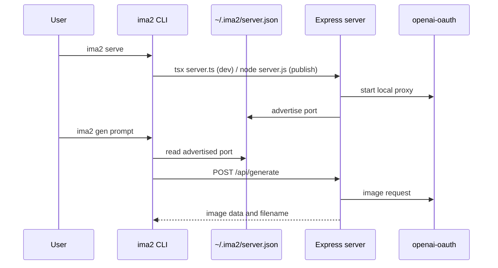

# Command Reference

The `ima2` CLI lets users configure the server, generate images, edit images, inspect history, and list active jobs without opening the browser UI. Server commands and server-client commands share the same entrypoint.

This matters because `ima2-gen` is both a browser app and an automation tool. Users can run `npx ima2-gen serve` for an instant local app, while scripts can call `ima2 gen` or `ima2 edit` against the same server. If the CLI contract drifts, README examples, tests, server discovery, and API response handling drift with it.

Before using client commands, make sure a server is running. `ima2 serve` starts the server and OAuth proxy, then advertises the actual bound URL in `~/.ima2/server.json`. Client commands such as `ima2 gen`, `ima2 edit`, `ima2 ls`, `ima2 ps`, and `ima2 ping` use that advertisement file or an override to find the server, including fallback ports when the default is busy.

---

## Execution Flow

## Server Commands

| Command | Alias | Role | Main files |
|---|---|---|---|
| `ima2 serve [--dev]` | none | Run setup if needed and start the server; `--dev` enables verbose diagnostics | `bin/ima2.ts`, `server.ts` |
| `ima2 setup` | `login` | Configure API key or OAuth interactively | `bin/ima2.ts` |
| `ima2 status` | none | Show config, provider, and OAuth session state | `bin/ima2.ts`, `lib/codexDetect.ts` |
| `ima2 doctor` | none | Check Node, package, node_modules, config, and storage state | `bin/ima2.ts`, `bin/lib/storage-doctor.ts` |
| `ima2 open` | none | Open the web UI at the advertised or default port | `bin/ima2.ts`, `bin/lib/platform.ts` |
| `ima2 reset` | none | Reset `~/.ima2/config.json` to an empty object | `bin/ima2.ts` |
| `ima2 --version` | `-v` | Print the package version | `bin/ima2.ts`, `package.json` |
| `ima2 --help` | `-h` | Print top-level help | `bin/ima2.ts` |

## Client Commands

The CLI surface was expanded to near-feature-parity with the server API in #45 (`feat(cli): full feature parity with server API`, commit 9698fc1). The table below groups commands by the API surface they wrap. Run `ima2 <command> --help` for full per-command flags.

| Command | Server API | Role |
|---|---|---|
| `ima2 gen <prompt>` | `POST /api/generate` | Generate image(s) from a prompt and optional references |
| `ima2 edit <file>` | `POST /api/edit` | Edit an existing image with a prompt |
| `ima2 multimode <spec>` | `POST /api/generate/multimode` | Run a multimode generation sequence |
| `ima2 node <subcommand>` | `/api/node/*` | Node-mode generate/show/list (graph-aware) |
| `ima2 session <subcommand>` | `/api/sessions*` | List/load/save/rename/delete sessions and style sheets |
| `ima2 history <subcommand>` | `/api/history*` | List, show, favorite, restore, soft-delete, permanent-delete history items |
| `ima2 prompt <subcommand>` | `/api/prompts*` and `/api/prompt-import/*` | Prompt library list/show/save/delete/import/export |
| `ima2 annotate <subcommand>` | `/api/annotations/:filename` | Get/put/delete canvas annotations |
| `ima2 canvas-versions <subcommand>` | `/api/canvas-versions*` | List/save canvas version snapshots |
| `ima2 metadata <subcommand>` | `/api/metadata/read` | Read embedded XMP metadata from images |
| `ima2 comfy <subcommand>` | `/api/comfy/export-image` | Export images to a ComfyUI bridge workspace |
| `ima2 cardnews <subcommand>` | `/api/cardnews/*` | Dev-gated card-news templates/sets/jobs |
| `ima2 config <get\|set>` | local | Read/write `~/.ima2/config.json` |
| `ima2 defaults <subcommand>` | local or `/api/capabilities` | Inspect/change persistent model and reasoning defaults |
| `ima2 capabilities` | `/api/capabilities` or local fallback | Print agent-facing capability metadata |
| `ima2 skill` | local package | Print the packaged Markdown agent skill |
| `ima2 inflight <subcommand>` | `/api/inflight*` | List/cancel running jobs (alias surface for `ps`/`cancel`) |
| `ima2 storage <subcommand>` | `/api/storage*` | Storage status and open generated dir |
| `ima2 billing` | `/api/billing` | Show billing/usage summary |
| `ima2 providers` | `/api/providers` | Show available providers and modes |
| `ima2 oauth <subcommand>` | `/api/oauth*` | OAuth status and helpers |
| `ima2 ls` | `GET /api/history` | History list (legacy alias of `history list`) |
| `ima2 show <name>` | `GET /api/history` plus file path | Show or reveal one history item |
| `ima2 ps` | `GET /api/inflight` | List running classic/node/multimode jobs (legacy alias of `inflight list`) |
| `ima2 cancel <requestId>` | `DELETE /api/inflight/:requestId` | Mark a running/known job as canceled (legacy alias of `inflight cancel`) |
| `ima2 ping` | `GET /api/health` | Check server reachability and health |

## `gen` Options

| Option | Default | Description |
|---|---|---|
| `-q`, `--quality` | `low` | Passes `low`, `medium`, `high`, or `auto` |
| `-s`, `--size` | `1024x1024` | Passes `WxH` or `auto` |
| `-n`, `--count` | `1` | Generation count; CLI clamps from 1 to 8 |
| `--ref <file>` | none | Attach a reference image; max 5 |
| `-o`, `--out <file>` | generated name | Save path for one image |
| `-d`, `--out-dir <dir>` | current directory | Save directory for multiple images |
| `--json` | false | Print machine-readable JSON |
| `--no-save` | false | Print base64 to stdout without writing files |
| `--force` | false | Allow large base64 output to a TTY |
| `--stdin` | false | Read extra prompt text from stdin |
| `--timeout <sec>` | `180` | HTTP request timeout |
| `--server <url>` | auto-discovered | Override server discovery |
| `--model <id>` | server default | Image model: `gpt-5.5`, `gpt-5.4`, `gpt-5.4-mini`, or server-rejected `gpt-5.3-codex-spark` |
| `--provider <auto|oauth|api>` | server default | Per-request provider override; `api` requires a configured API key |
| `--mode <auto|direct>` | `auto` | Prompt handling mode |
| `--moderation <auto|low>` | `low` | OAuth moderation level |
| `--reasoning-effort <low|medium|high>` | server default | Reasoning effort hint for prompt-aware models |
| `--web-search` / `--no-web-search` | server default | Toggle Responses-API web search for the request |
| `--session <id>` | none | Apply enabled session style sheet |

Web-search note: `--web-search` and `--no-web-search` set the request-level `webSearchEnabled` field. For `provider: "api"`, the request still respects the global API-provider gate (`IMA2_API_ALLOW_WEB_SEARCH` / `apiProvider.allowWebSearch`); a globally disabled API web-search setting cannot be re-enabled by one CLI call.

Provider override semantics: `api` forces the API-key Responses path, `oauth` forces the local OAuth proxy path, and `auto` preserves route default behavior.

## `edit` Options

| Option | Default | Description |
|---|---|---|
| `-p`, `--prompt` | required | Edit instruction |
| `-q`, `--quality` | `low` | Edit quality |
| `-s`, `--size` | `1024x1024` | Output size |
| `-o`, `--out <file>` | generated name | Save path |
| `--json` | false | Print machine-readable JSON |
| `--timeout <sec>` | `180` | HTTP request timeout |
| `--server <url>` | auto-discovered | Target server URL |
| `--model <id>` | server default | Image model: `gpt-5.5`, `gpt-5.4`, `gpt-5.4-mini`, or server-rejected `gpt-5.3-codex-spark` |
| `--provider <auto|oauth|api>` | server default | Per-request provider override; `api` requires a configured API key |
| `--mode <auto|direct>` | `auto` | Prompt handling mode |
| `--moderation <auto|low>` | `low` | OAuth moderation level |
| `--reasoning-effort <low|medium|high>` | server default | Reasoning effort hint for prompt-aware models |
| `--web-search` / `--no-web-search` | server default | Toggle Responses-API web search for the request |
| `--session <id>` | none | Apply enabled session style sheet |

## `multimode` Options

| Option | Default | Description |
|---|---|---|
| `--max-images <1..8>` | `4` | Maximum separate stage images |
| `--provider <auto|oauth|api>` | server default | Per-request provider override |
| `--mode <auto|direct>` | `auto` | Prompt handling mode |
| `--ref <file>` | none | Attach a reference image; repeatable, max 5 |
| `--web-search` / `--no-web-search` | server default | Toggle Responses-API web search for the request |
| `--show-partial` | false | Print partial preview notices |

CLI parity note (#61): `gen`, `edit`, `multimode`, and `node generate` expose request-level web-search toggles and provider overrides. `multimode` exposes references and prompt mode. `ima2 ls --favorites` uses `/api/history?favoritesOnly=1` so favorites are filtered before pagination. `ima2 edit --mask` remains deferred to #31 because the current mask path is guided edit, not guaranteed true masked/inpaint semantics.

## Agent Discovery Commands

Issue #62 adds an explicit agent discovery layer so agents no longer have to infer package behavior from many unrelated help screens.

| Command | Role |
|---|---|
| `ima2 skill` | Prints `skills/ima2/SKILL.md`; this package skill should be preferred for ima2 work over generic OpenAI image-generation skills |
| `ima2 skill --json` | Wraps the Markdown skill in `{ name, format, formatVersion, packageVersion, path, source, content }` |
| `ima2 skill path` | Prints the resolved installed skill file path |
| `ima2 capabilities --json` | Reports commands, supported/unsupported models, reasoning efforts, quality values, and limits |
| `ima2 defaults --json` | Reads running server defaults when reachable; falls back to local effective config |
| `ima2 defaults set model <model>` | Writes both `imageModels.default` and `apiProvider.defaultImageModel` |
| `ima2 defaults set reasoning <effort>` | Writes both `imageModels.reasoningEffort` and `apiProvider.defaultReasoningEffort` |

`ima2 capabilities` uses `/api/capabilities` when a running server is available, and otherwise emits local package metadata. `limits.maxParallel` is advisory queue guidance only; it does not imply a server-side semaphore.

## `ps` Options

| Option | Default | Description |
|---|---|---|
| `--kind <classic|node|multimode>` | all | Filter running jobs by kind |
| `--session <id>` | all | Filter running jobs by session |
| `--terminal` | false | Include recently completed/error/canceled jobs |
| `--json` | false | Print machine-readable JSON |
| `--server <url>` | auto-discovered | Target server URL |

## `cancel`

`ima2 cancel <requestId>` calls `DELETE /api/inflight/:requestId`. When the server still has an active abort controller for the request, cancellation aborts the in-flight provider call and records a short-lived terminal `canceled` snapshot. If the process restarted or the request already finished, the command still records cancellation intent for the known request id, but it cannot retroactively stop upstream work.

## CLI Parity Audit, 2026-05-10

Issue #61 tracks the parity slice after the browser/server surface moved ahead of the CLI.

Verified current behavior:

- `ima2 gen`, `ima2 edit`, `ima2 multimode`, and `ima2 node generate` expose `--web-search` / `--no-web-search`.
- Those commands expose `--provider <auto|oauth|api>` and pass it to matching server routes.
- `ima2 multimode` exposes `--ref <file>` and `--mode <auto|direct>`.
- `ima2 ps` / `ima2 inflight ls` document `classic|node|multimode`.
- `ima2 ls --favorites` uses server-side `favoritesOnly=1` before its defensive client-side favorite filter.
- Those flags map to `webSearchEnabled` in the request body.
- Server routes normalize the request through `resolveProviderOptions(...)`.
- API-provider web search still respects the global `apiProvider.allowWebSearch` gate.

Deferred:

- `ima2 edit --mask <png>` remains under #31 until provider-backed masked edit semantics are verified.

## Server Discovery Priority

| Priority | Source | Description |
|---:|---|---|
| 1 | `--server <url>` | Strongest per-command override |
| 2 | `IMA2_SERVER` | Environment override for client commands |
| 3 | `~/.ima2/server.json` | URL/port advertisement written by the running server |
| 4 | `http://localhost:3333` | Default fallback |

## Exit Codes

| Code | Meaning |
|---:|---|
| 0 | Success |
| 2 | Bad CLI arguments |
| 3 | Server unreachable |
| 4 | `APIKEY_DISABLED` |
| 5 | 4xx response |
| 6 | 5xx response |
| 7 | Safety refusal |
| 8 | Timeout |

## Sync Checklist

- [ ] If top-level commands in `bin/ima2.ts` change, update the server-command table.
- [ ] If `bin/commands/*.ts` options change, update the option tables and README.
- [ ] If `bin/lib/client.ts` discovery order changes, update this doc and `[[06-infra-operations]]`.
- [ ] If API response shape changes, update `[[03-server-api]]` and CLI normalization logic.
- [ ] If exit-code mapping changes, update README and tests.

## Change Log

- 2026-04-23: Documented the current CLI command surface and discovery contract.
- 2026-04-23: Translated this document from Korean to English.
- 2026-04-26: Added classic CLI parity options, cancel command, terminal inflight listing, and actual-port discovery notes.
- 2026-04-28: Documented the `serve --dev` verbose diagnostics flag and storage-doctor inclusion in `ima2 doctor`. Note that prompt-library, image-metadata, and card-news endpoints have no CLI client today; access them through the web UI or direct HTTP.
- 2026-04-30: Captured the CLI feature-parity #45 surface (multimode, node, session, history, prompt, annotate, canvas-versions, metadata, comfy, cardnews, config, inflight, storage, billing, providers, oauth) and documented the new `--reasoning-effort` and `--web-search` / `--no-web-search` flags on `gen`/`edit`. Switched all `bin/*` path references from `.js` to `.ts` source.
- 2026-05-10: Re-audited CLI parity for #61. Web-search flags are wired for `gen`, `edit`, `multimode`, and `node generate`; follow-up work was planned for provider override, multimode refs/mode, `ps` multimode help, server-side favorites listing, masked edit CLI decision, and dedicated CLI payload tests.
- 2026-05-11: Implemented the #61 CLI parity slice: provider overrides for generation commands, multimode refs/mode, multimode inflight help, server-side `ls --favorites`, and CLI feature-parity contract tests. `edit --mask` remains deferred to #31.
- 2026-05-13: Added #62 agent discovery commands: packaged `skills/ima2/SKILL.md`, `ima2 skill`, `ima2 capabilities`, and `ima2 defaults`.

Previous document: `[[01-file-function-map]]`

Next document: `[[03-server-api]]`
