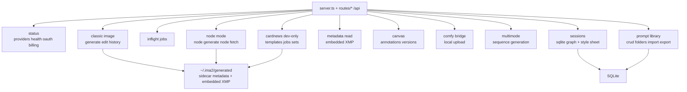

# Server API

`server.ts` is the runtime bootstrap for `ima2-gen`. The browser UI and CLI both call `/api/*` endpoints registered from `routes/*.ts`. The TypeScript migration is closed (#24); paired `server.js`/`routes/*.js` are committed runtime artifacts produced by the build, not hand-edited. The server starts the OAuth proxy, serves the built UI, wires route modules, stores generated image files under the configured generated directory, reconstructs history, and exposes graph sessions.

This document matters because the UI and CLI share the same server contract. For example, `/api/generate` returns a different shape for single-image and multi-image responses. `/api/history` supports both a flat list and session grouping. Node mode uses separate `/api/node/generate` and `/api/sessions/*` contracts. If those differences are not documented, clients can break quietly.

When changing an API, find the endpoint here first. Then check the CLI usage in `[[02-command-reference]]`, the browser client in `[[04-frontend-architecture]]`, and the graph workflow in `[[05-node-mode]]`.

---

## API Map

## Status And Provider Endpoints

| Method | Path | Response | Description |
|---|---|---|---|
| `GET` | `/api/providers` | `{ apiKey, oauth, oauthPort, apiKeyDisabled, apiKeySource, runtime }` | Reports available providers and runtime ports to the UI. `apiKeyDisabled` is a legacy compatibility field and is `false` in current API-provider builds. |
| `GET` | `/api/capabilities` | `{ ok, source, version, defaults, valid, limits, guidance }` | Agent-facing runtime defaults and capability metadata; uses allowlist projection only |
| `GET` | `/api/health` | `{ ok, version, provider, uptimeSec, activeJobs, pid, startedAt, runtime }` | Used by CLI discovery and health checks |
| `GET` | `/api/oauth/status` | `{ status, models?, runtime }` | Checks whether the OAuth proxy is ready and reports actual proxy URL/port |
| `GET` | `/api/billing` | `{ oauth, apiKeyValid, apiKeySource, credits?, costs? }` | Probes billing/model state when an API key exists |
| `GET` | `/api/storage/status` | `{ ok, data: { generatedDirLabel, generatedCount, legacyCandidatesScanned, legacySourcesFound, legacyFilesFound, state, messageKind, recoveryDocsPath, doctorCommand, overrides } }` | Summarizes gallery storage and legacy recovery state for UI support banners |
| `POST` | `/api/storage/open-generated-dir` | `{ ok }` | Opens only the configured generated image folder in the local OS file manager |

`/api/billing` reports `apiKeySource` as `"none"`, `"env"`, or `"config"`. API-key generation requires a configured key and returns `API_KEY_REQUIRED` before upstream when `provider: "api"` is requested without one.

The live generation/edit provider can be OAuth or API-key based. Both paths use the Responses API `image_generation` tool through a shared image adapter; only the endpoint/auth boundary differs.

Storage endpoints are local-support helpers. `/api/storage/open-generated-dir` never accepts a browser-supplied path; it opens `ctx.config.storage.generatedDir` only.

Runtime responses expose configured and actual ports separately. The backend can bind `3334+` when `3333` is occupied, and the OAuth proxy can report an actual fallback port when `10531` is occupied. Clients should follow the URL in `~/.ima2/server.json` or the `runtime.*.url` fields rather than rebuilding URLs from configured defaults.

`/api/capabilities` exists for agents and CLI discovery. It reports provider-specific defaults, supported versus unsupported image model ids, valid reasoning efforts, valid quality values, reference/image limits, and advisory parallel queue metadata. The endpoint must never serialize the full runtime config. It uses an allowlist projection and converts `Set` values to arrays so JSON clients receive stable arrays instead of `{}`.

## Classic Generate And Edit

| Method | Path | Body | Success response |
|---|---|---|---|
| `POST` | `/api/generate` | `{ prompt, quality?, size?, format?, moderation?, model?, provider?, n?, references?, sessionId?, clientNodeId?, requestId?, reasoningEffort?, webSearchEnabled? }` | For `n=1`: `{ image, elapsed, filename, requestId, usage, provider, webSearchCalls, quality, size, moderation, model }` |
| `POST` | `/api/generate` | same body | For `n>1`: `{ images, elapsed, count, requestId, usage, provider, webSearchCalls, quality, size, moderation }` |
| `POST` | `/api/edit` | `{ prompt, image, mask?, quality?, size?, moderation?, model?, provider?, sessionId?, requestId?, reasoningEffort?, webSearchEnabled? }` | `{ image, elapsed, filename, usage, provider, moderation, model, requestId }` |
| `POST` | `/api/generate/multimode` | `{ prompt, maxImages?, references?, quality?, size?, moderation?, model?, provider?, mode?, sessionId?, requestId?, reasoningEffort?, webSearchEnabled? }` | SSE events: `phase`, `partial`, `image`, `done`, `error` |

`/api/generate` accepts up to 5 `references`. `n` is clamped from 1 to 8. Result files are written to the configured generated directory, usually `~/.ima2/generated`, and sidecar JSON stores prompt, quality, size, format, moderation, model, provider, usage, and web search counts.

Image generation model selection is explicit. If omitted, the server defaults to `gpt-5.4-mini`. Supported image models are `gpt-5.4-mini`, `gpt-5.4`, and `gpt-5.5`. `gpt-5.3-codex-spark` can appear in OAuth model status, but it does not support the `image_generation` tool, so generation endpoints reject it with `IMAGE_MODEL_UNSUPPORTED` before calling OAuth.

For `provider: "api"`, missing options use `config.apiProvider` defaults: `gpt-5.4-mini`, `low` reasoning effort, `1024x1024`, and web search enabled. These defaults are overridable via `apiProvider.*` config or the `IMA2_API_IMAGE_MODEL_DEFAULT`, `IMA2_API_REASONING_EFFORT`, `IMA2_API_IMAGE_SIZE`, and `IMA2_API_ALLOW_WEB_SEARCH` env vars (see `06-infra-operations`). Validated request options still pass through. The API-key path uses `lib/responsesImageAdapter.ts` to mirror the OAuth Responses payload, including reasoning-effort, web-search, and reference-image plumbing — `tests/api-provider-parity.test.ts` (#49) locks the parity contract for generate/edit/multimode/node.

`webSearchEnabled` is a request-level toggle. `false` disables web-search tooling for that request. `true` asks for web search, but API-provider requests still respect the global `apiProvider.allowWebSearch` gate; a deployment that sets `IMA2_API_ALLOW_WEB_SEARCH=false` will not re-enable API web search for one request.

Multimode is SSE-only. The route now saves and sends each final image as it arrives instead of buffering the full sequence before sending any `image` event. If the provider times out after at least one image was saved, the route sends a `done` event with `status: "partial"` and HTTP status metadata in the payload. If no image was saved before timeout, the route sends an error. JSON/non-stream fallback images from the adapter are saved only for indexes not already emitted by the final-image callback.

Masked edits are sent as mask/selection guidance; callers should not treat them as pixel-perfect inpainting. The OAuth path additionally honours a feature flag, `config.oauth.maskedEditEnabled` (env: `IMA2_OAUTH_MASKED_EDIT_ENABLED`, default off) — when a mask is present and the flag is disabled, `lib/oauthProxy/generators.ts` rejects the request before calling upstream so masked edits stay opt-in until #31 ships in full. `tests/oauth-masked-edit-contract.test.js` covers the flag.

Prompt assembly for the OAuth path injects a short safety intent policy (`SAFETY_INTENT_POLICY` from `lib/promptSafetyPolicy.ts`) into the `lib/oauthProxy/prompts.ts` builder for generate/edit/multimode. The same constant is reused by the API-key Responses adapter so both providers send the same intent guardrails.

## History And Asset Lifecycle

| Method | Path | Query or body | Response |
|---|---|---|---|
| `GET` | `/api/history` | `limit`, `since`, `before`, `beforeFilename`, `sessionId`, `favoritesOnly` | `{ items, total, nextCursor }` |
| `GET` | `/api/history` | `groupBy=session` | `{ sessions, loose, total, nextCursor }` |
| `DELETE` | `/api/history/:filename` | none | `{ ok, trashId, filename, unlinkAt, sessionsTouched, nodesTouched }` |
| `DELETE` | `/api/history/:filename/permanent` | none | `{ ok, filename }` — bypasses soft-delete, removes the file (and any sidecar) immediately |
| `POST` | `/api/history/:filename/restore` | `{ trashId }` | `{ ok }` |
| `POST` | `/api/history/favorite` | `{ filename, favorite }` | `{ ok, favorite }` |
| `POST` | `/api/history/import-local` | raw body `image/png` \| `image/jpeg` \| `image/webp`; optional header `X-Ima2-Original-Filename` | `201 { item }` (GenerateItem with `kind: "imported"`) |

History is reconstructed from image files and sidecar JSON under the configured generated directory. The current implementation uses a process-local history index/cache and applies browser-scoped favorites as an overlay for `/api/history`. `favoritesOnly=1` filters before pagination so older favorites can be reached with cursor paging. `DELETE /api/history/:filename` is a soft-delete into the OS trash via `lib/systemTrash.ts` (`trash` dependency); `lib/assetLifecycle.ts` returns a `trashId` so the UI can offer undo through `POST /api/history/:filename/restore`. `DELETE /api/history/:filename/permanent` skips the trash and removes the file plus any sidecar immediately — used by the gallery's permanent-delete affordance.

`/api/history/import-local` accepts a single raw image body and writes it into `generated/` as `imported-<yyyymmddhhmmss>-<rand6>.<ext>` with embedded XMP metadata (`kind: "imported"`). Frontend uses this to drop external images directly onto the Canvas viewer area; the response item is appended to the in-memory history list and selected as the current image.

When `groupBy=session` is used, session groups include `title` and `label` when the session still exists in SQLite. The gallery should prefer the title and only fall back to the short server session id.

## Canvas, Metadata, And Local Integrations

| Method | Path | Body | Response |
|---|---|---|---|
| `GET` | `/api/annotations/:filename` | none | `{ annotations }` |
| `PUT` | `/api/annotations/:filename` | `{ annotations }` | `{ ok }` |
| `DELETE` | `/api/annotations/:filename` | none | `{ ok }` |
| `POST` | `/api/canvas-versions` | raw PNG payload + canvas metadata headers | `{ item }` |
| `PUT` | `/api/canvas-versions/:filename` | raw PNG payload + canvas metadata headers | `{ item }` |
| `POST` | `/api/metadata/read` | `{ image }` | `{ metadata, missing? }` |
| `POST` | `/api/comfy/export-image` | `{ filename, origin? }` | `{ ok, uploadedFilename }` |

Canvas annotation and canvas-version routes are internal editor persistence surfaces. Canvas versions are hidden from the normal Gallery and HistoryStrip visible domain; navigation should prefer source images and only display a matching canvas version inside Canvas Mode.

`/api/comfy/export-image` accepts a generated filename only, validates local-loopback ComfyUI origins, and uploads the selected image to ComfyUI without exposing arbitrary filesystem paths.

## Inflight Jobs

| Method | Path | Query | Response |
|---|---|---|---|
| `GET` | `/api/inflight` | `kind`, `sessionId` | `{ jobs }` |
| `GET` | `/api/inflight` | `kind`, `sessionId`, `includeTerminal=1` | `{ jobs, terminalJobs }` |
| `DELETE` | `/api/inflight/:requestId` | none | `{ requestId, active, aborted }` |

The inflight registry tracks classic, node, and multimode jobs. The default response is active-only so the UI never renders completed jobs as still running. `includeTerminal=1` is an opt-in debug surface that keeps recent completed/error/canceled jobs briefly for request tracing. Cancellation records a terminal `canceled` snapshot and aborts the upstream request when the active job still has a registered `AbortController`.

## Node Mode API

| Method | Path | Body or query | Response |
|---|---|---|---|
| `POST` | `/api/node/generate` | `{ parentNodeId?, prompt, quality?, size?, format?, moderation?, model?, references?, externalSrc?, contextMode?, searchMode?, sessionId?, clientNodeId?, requestId?, provider? }` | `{ nodeId, parentNodeId, requestId, image, filename, url, elapsed, usage, webSearchCalls, provider, moderation, model, refsCount, contextMode, searchMode }` |
| `GET` | `/api/node/:nodeId` | none | `{ nodeId, meta, url }` |

When `parentNodeId` is present, the server reads the stored parent image and uses the edit path. Node-local `references` are allowed on both root and child/edit nodes. For child/edit nodes, the parent image is sent first, then reference images, then the text prompt. `refsCount` is stored as numeric metadata only; reference image base64 is not written to sidecars. `externalSrc` is a controlled fallback for promoting an existing history asset into a node workflow.

Node context is explicit. `contextMode` defaults to `parent-plus-refs`, meaning immediate parent image plus explicit node-local references. `parent-only` drops explicit references. `ancestry` is reserved but currently rejected with `CONTEXT_MODE_UNSUPPORTED` so clients cannot accidentally assume full-chain context. Edit web search is explicit too: `searchMode` defaults to `off`; `on` enables the edit research prompt and OAuth web-search tool. Root generation can still use search through the normal generation path.

`/api/node/generate` also supports an SSE response when the client sends `Accept: text/event-stream`. In that mode validation still happens before headers are opened. After the stream opens, the server may emit `phase`, `partial`, `done`, and `error` events. Root generation opts into OAuth `partial_images: 2`; child/edit generation stays final-only for now. If an upstream stream error happens after headers are committed, the outer HTTP status may remain `200`; clients must read the SSE `error` event and node state. Clients must treat partial events as progressive previews only and use the `done` payload as the canonical saved node.

Upstream request/validation failures are normalized to `INVALID_REQUEST` while preserving raw provider diagnostics as `upstreamCode`, `upstreamType`, and `upstreamParam`. In SSE mode these fields travel inside the `error` event payload together with `status`.

Node sidecars include `requestId` as recovery metadata. `/api/history` exposes the same field so a reloaded graph can match completed assets by request id before falling back to `(sessionId, clientNodeId, createdAt)`.

## Session DB API

| Method | Path | Body or header | Response |
|---|---|---|---|
| `GET` | `/api/sessions` | none | `{ sessions }` |
| `POST` | `/api/sessions` | `{ title }` | `{ session }` |
| `GET` | `/api/sessions/:id` | none | `{ session }` |
| `PATCH` | `/api/sessions/:id` | `{ title }` | `{ ok: true }` |
| `DELETE` | `/api/sessions/:id` | none | `{ ok: true }` |
| `PUT` | `/api/sessions/:id/graph` | `If-Match` header, `{ nodes, edges }` | `{ ok, nodes, edges, graphVersion }` |
| `GET` | `/api/sessions/:id/style-sheet` | none | `{ ok, styleSheet, styleSheetEnabled, styleSheetGeneratedAt, styleSheetSourceFilename }` |
| `PUT` | `/api/sessions/:id/style-sheet` | `{ styleSheet, sourceFilename?, enabled? }` | `{ ok, styleSheet, styleSheetEnabled, styleSheetGeneratedAt, styleSheetSourceFilename }` |
| `PATCH` | `/api/sessions/:id/style-sheet/enabled` | `{ enabled }` | `{ ok, styleSheetEnabled }` |
| `POST` | `/api/sessions/:id/style-sheet/extract` | `{ filename }` | `{ ok, styleSheet, styleSheetGeneratedAt, styleSheetSourceFilename }` |

Graph saving uses optimistic concurrency. Missing `If-Match` returns `428`. Version mismatch returns an error payload with the current version.

Graph edges are the source of truth for node parentage. On save, the server filters dangling edges, derives each node's `data.parentServerNodeId` from the single incoming edge source node's current `data.serverNodeId`, and rejects multiple incoming parent edges with `409 GRAPH_PARENT_CONFLICT`. This keeps visual graph state and backend generation parent state aligned after reload.

`GRAPH_VERSION_CONFLICT` only means the client saved against a stale `If-Match` graph version. It is not proof that another browser tab edited the graph; a delayed debounce, recovered node save, or session switch flush can also surface the same response. The UI should therefore use source-neutral language such as "graph version changed" unless a separate tab identity protocol proves otherwise.

Graph saves may include observability headers: `X-Ima2-Graph-Save-Id`, `X-Ima2-Graph-Save-Reason`, and `X-Ima2-Tab-Id`. The server logs these values for `graph_save` and `graph_conflict` events but must not treat them as authorization or correctness inputs.

Style sheet endpoints persist a per-session reference style summary in SQLite. `/style-sheet/extract` calls the OAuth Responses API with `IMA2_STYLE_MODEL` to derive a short text style sheet from a single history image; the route enforces that the source image belongs to the same session. `enabled` is a separate toggle that determines whether the style sheet is injected into the next prompt; the actual injection uses up to `IMA2_STYLE_SHEET_MAX_PREFIX` characters and is performed at the route layer.

## Image Metadata API

| Method | Path | Body | Response |
|---|---|---|---|
| `POST` | `/api/metadata/read` | `{ image }` (data URL or base64 PNG, capped by `IMA2_MAX_METADATA_READ_B64_BYTES`) | `{ ok, metadata: { prompt?, quality?, size?, format?, moderation?, model?, provider?, references?, ... } }` or `{ ok: false, code: "NO_METADATA" }` |

Generated PNGs embed the same sidecar fields into XMP via `lib/imageMetadata.ts`. `routes/metadata.ts` parses an image base64 supplied by the UI and returns the embedded metadata so the user can drop a previously generated file back into the composer to restore prompt and parameters. The route never persists the uploaded image; it only reads embedded XMP.

## Prompt Library API

| Method | Path | Body or query | Response |
|---|---|---|---|
| `GET` | `/api/prompts` | `folderId?`, `favorite?`, `q?` | `{ ok, prompts }` |
| `POST` | `/api/prompts` | `{ title?, body, folderId?, tags?, favorite? }` | `{ ok, prompt }` |
| `GET` | `/api/prompts/:id` | none | `{ ok, prompt }` |
| `PATCH` | `/api/prompts/:id` | `{ title?, body?, folderId?, tags?, favorite? }` | `{ ok, prompt }` |
| `DELETE` | `/api/prompts/:id` | none | `{ ok }` |
| `POST` | `/api/prompts/:id/favorite` | `{ favorite }` | `{ ok, favorite }` |
| `POST` | `/api/prompts/import` | `{ prompts: [...] }` or NDJSON body | Existing bulk import route for local/export compatibility |
| `POST` | `/api/prompts/import/preview` | `{ source: { kind: "local", filename, text } }` or `{ source: { kind: "github", input } }` | `{ source, candidates, warnings }` preview for single `.md`, `.markdown`, or `.txt` sources |
| `POST` | `/api/prompts/import/commit` | `{ candidates, folderId? }` | `{ foldersCreated, promptsImported, duplicatesSkipped }` |
| `GET` | `/api/prompts/import/curated-sources` | none | `{ sources }` static curated and manual-review source registry |
| `POST` | `/api/prompts/import/curated-search` | `{ q?, sourceIds?, limit? }` | `{ results, sources, warnings }` from the file-based curated prompt index |
| `POST` | `/api/prompts/import/curated-refresh` | `{ sourceId }` | `{ source, indexedFiles, candidateCount, warnings }` for one curated source |
| `POST` | `/api/prompts/import/folder-files` | `{ source: { kind: "github-folder", input } }` | `{ source, files, warnings }` for supported files in one GitHub folder |
| `POST` | `/api/prompts/import/folder-preview` | `{ source: { kind: "github-folder", input }, paths }` | `{ source, files, candidates, warnings }` preview for selected listed folder files |
| `GET` | `/api/prompts/import/discovery` | `status?` | `{ candidates, warnings }` from the local discovery review queue |
| `POST` | `/api/prompts/import/discovery-search` | `{ q?, seeds?, limit? }` | `{ candidates, warnings, rateLimit? }` from GitHub repository discovery |
| `POST` | `/api/prompts/import/discovery-review` | `{ repo, status, reviewNotes?, allowedPaths?, defaultSearch? }` | `{ candidate, source?, warnings }` after approving or rejecting a discovery candidate |
| `GET` | `/api/prompts/export` | none | NDJSON stream of stored prompts |
| `GET` | `/api/prompts/folders` | none | `{ ok, folders }` |
| `POST` | `/api/prompts/folders` | `{ name }` | `{ ok, folder }` |
| `PATCH` | `/api/prompts/folders/:id` | `{ name }` | `{ ok, folder }` |
| `DELETE` | `/api/prompts/folders/:id` | none | `{ ok }` |

Prompts and folders are stored in SQLite alongside sessions; migrations live in `lib/db.ts`. The library supports favorite filtering, free-text search across title and body, folder grouping, and full-export round trips. Prompt rows are independent from history filenames so the same prompt body can be reused across sessions.

Prompt import PR1 is preview-first. `/api/prompts/import/preview` accepts either local text supplied by the browser or a GitHub file source and returns prompt candidates without saving. GitHub sources are limited to `github.com` and `raw.githubusercontent.com`, reject host spoofing, unsupported extensions, encoded slash/backslash, traversal, folder URLs, oversized files, and redirected final URLs that are not supported prompt files. `/api/prompts/import/commit` saves only selected candidates through the same SQLite prompt semantics as the existing import path and stores source metadata as tags only, such as `github`, `repo:owner/repo`, `ref:main`, `file:prompts.md`, and `ext:md`.

Prompt import PR2 adds curated indexed search without introducing a DB migration. Static sources live in `lib/promptImport/curatedSources.ts`; indexed source/candidate cache is written under `config.storage.promptImportIndexCacheFile`, usually `~/.ima2/prompt-import-index.json`, with atomic temp-file writes. Curated search is read-only: results remain commit-compatible prompt candidates with mandatory `text`, but they are never saved until the UI sends selected candidates to `/api/prompts/import/commit`. `gpt-image-2` model/task/size/quality hints and warnings are stored in candidate metadata for ranking and UI display, while attribution and license state persists through tags such as `source:<sourceId>`, `license:<spdx>`, `trust:<tier>`, and `attribution-required`.

Prompt import PR3 adds GitHub folder browse without recursive crawling or auto-import. `/api/prompts/import/folder-files` lists only supported `.md`, `.markdown`, and `.txt` files from a single GitHub Contents API directory. `/api/prompts/import/folder-preview` re-lists the same folder server-side and previews only selected paths that appear in that listing as supported `type: "file"` entries; client-supplied download URLs are never trusted. Slash-branch shorthand remains rejected with `AMBIGUOUS_GITHUB_REF`, and ambiguous `tree/feature/foo/...` URLs do not trigger a slash-branch resolver in PR3. Saving still goes through `/api/prompts/import/commit`.

Prompt import PR4 adds GitHub repository discovery as a manual-review workflow. Discovery search calls GitHub from the server only, optionally using `IMA2_GITHUB_TOKEN`, and never exposes the token to the browser. Results are stored in a file-backed review queue under `config.storage.promptImportDiscoveryRegistryFile`, usually `~/.ima2/prompt-import-discovery.json`. Discovery candidates are not prompt candidates and cannot be committed directly; the user must approve or reject them through `/api/prompts/import/discovery-review`. Approved reviewed sources are merged into curated source listings and can join indexed search only when they have validated `.md`, `.markdown`, or `.txt` `allowedPaths`; slash default branches and empty paths are listed with warnings but skipped from default search/indexing.

## Card-News API (dev-only)

The card-news routes are mounted only when `config.features.cardNews` is true, which currently requires `IMA2_CARD_NEWS=1` or `IMA2_DEV=1`. They are not part of the public publish surface.

| Method | Path | Body or query | Response |
|---|---|---|---|
| `GET` | `/api/cardnews/image-templates` | none | `{ ok, templates }` |
| `GET` | `/api/cardnews/image-templates/:templateId/preview` | none | `{ ok, preview }` or `404` |
| `GET` | `/api/cardnews/role-templates` | none | `{ ok, roles }` |
| `GET` | `/api/cardnews/sets` | none | `{ ok, sets }` |
| `GET` | `/api/cardnews/sets/:setId` | none | `{ ok, set }` |
| `GET` | `/api/cardnews/sets/:setId/manifest` | none | `{ ok, manifest }` |
| `POST` | `/api/cardnews/draft` | `{ topic, options? }` | `{ ok, draft }` |
| `POST` | `/api/cardnews/generate` | `{ draft, templateId, role?, options? }` | `{ ok, jobId }` |
| `POST` | `/api/cardnews/jobs` | `{ ... }` | `{ ok, job }` |
| `GET` | `/api/cardnews/jobs/:jobId` | none | `{ ok, job }` |
| `POST` | `/api/cardnews/jobs/:jobId/retry` | none | `{ ok, job }` |
| `POST` | `/api/cardnews/cards/:cardId/regenerate` | `{ ... }` | `{ ok, card }` |
| `POST` | `/api/cardnews/export` | `{ jobId, format? }` | `{ ok, export }` |

Implementation lives in `lib/cardNews*.ts`: `cardNewsTemplateStore`, `cardNewsRoleTemplateStore`, `cardNewsManifestStore`, `cardNewsJobStore`, `cardNewsPlanner`, `cardNewsPlannerClient`, `cardNewsPlannerPrompt`, `cardNewsPlannerSchema`, and `cardNewsGenerator`. Optional planner integration is gated by `IMA2_CARD_NEWS_PLANNER`, with model and timeout configured by `IMA2_CARD_NEWS_PLANNER_MODEL` and `IMA2_CARD_NEWS_PLANNER_TIMEOUT_MS` and an explicit `IMA2_CARD_NEWS_PLANNER_FALLBACK` switch. Generated card images and manifests share the same `~/.ima2/generated` directory as classic and node assets.

## Error States

| Case | Status | Code or message |
|---|---:|---|
| Missing prompt | 400 | `Prompt is required` |
| Invalid or too many references | 400 | `INVALID_REFS` or string error |
| Invalid moderation | 400 | `INVALID_MODERATION` or string error |
| Invalid image model | 400 | `INVALID_IMAGE_MODEL` |
| Unsupported OAuth model for image generation | 400 | `IMAGE_MODEL_UNSUPPORTED` |
| Upstream request/validation error | 400 | `INVALID_REQUEST` |
| Unsupported node context mode | 400 | `CONTEXT_MODE_UNSUPPORTED` |
| Multiple incoming parent edges | 409 | `GRAPH_PARENT_CONFLICT` |
| API-key provider requested without a configured key | 401 | `API_KEY_REQUIRED` |
| Safety refusal | 422 | `SAFETY_REFUSAL` |
| Moderation/content refusal | 422 or upstream mapped error | `MODERATION_REFUSED` |
| OAuth session expired | upstream mapped error | `AUTH_CHATGPT_EXPIRED` |
| Network/proxy failure | upstream mapped error | `NETWORK_FAILED` or `OAUTH_UNAVAILABLE` |
| Missing graph version header | 428 | `GRAPH_VERSION_REQUIRED` |
| Graph too large | 413 | `GRAPH_TOO_LARGE` |
| Missing node metadata | 404 | `NODE_NOT_FOUND` |
| Image without embedded metadata | 200 | `{ ok: false, code: "NO_METADATA" }` from `/api/metadata/read` |
| Card-news routes when feature flag is off | 404 | Routes are not mounted unless `config.features.cardNews` |

## Observability Contract

Server logs use compact structured lines such as `[node.request] requestId="..." quality="medium"`. Every `/api/*` request receives a sanitized `X-Request-Id` response header. If the client sends a safe `X-Request-Id` (`A-Z`, `a-z`, `0-9`, `.`, `_`, `:`, `-`, max 128 chars), the server echoes it; otherwise the server replaces it with `req_<uuid>`. Non-API static files and `/generated/*` assets are not mutated by the request logger.

Generation, edit, node, OAuth stream, inflight, history, and session graph saves should carry the same `requestId` where available. Classic and node generation routes fall back to `req.id` when the JSON body does not provide a `requestId`.

Logs must never include raw prompts, effective prompts, revised prompts, OAuth/API tokens, authorization headers, cookies, raw request bodies, reference data URLs, generated base64, or raw upstream response bodies. Use counts and sizes instead: `promptChars`, `refs`, `imageChars`, `durationMs`, `httpStatus`, and `errorCode`.

Node retry diagnostics include safe context such as `operation`, `clientNodeId`, `parentNodeId`, `errorEventType`, `errorEventCount`, and `upstreamCode`. They must not log prompt text or image payloads.

## Sync Checklist

- [ ] If an endpoint is added, update this doc and `ui/src/lib/api.ts`.
- [ ] If a CLI-called endpoint changes, update `[[02-command-reference]]`.
- [ ] If error shape is standardized, check all error tables and UI toast handling.
- [ ] If the session graph contract changes, update `[[05-node-mode]]`.
- [ ] If `server.ts` is split into route files, update line counts in `[[01-file-function-map]]`.

## Change Log

- 2026-04-23: Documented the current `server.ts` endpoint surface and response shapes.
- 2026-04-23: Translated this document from Korean to English.
- 2026-04-24: Added node SSE partial streaming, requestId sidecar/history recovery, observability, terminal inflight, and gallery session-title response notes.
- 2026-04-24: Added explicit image model selection contract for classic, edit, and node generation.
- 2026-04-24: Clarified source-neutral `GRAPH_VERSION_CONFLICT` semantics and graph save metadata headers.
- 2026-04-25: Updated server ownership after route decomposition and clarified generated-directory storage plus error-code UX contracts.
- 2026-04-25: Documented sanitized API request IDs and API-only request logging.
- 2026-04-25: Documented child/edit node references and SSE inner-error diagnostics.
- 2026-04-25: Documented node context/search modes and graph-edge-derived parent normalization.
- 2026-04-26: Documented runtime actual-port reporting and removed dev-only API details from the evergreen public API map.
- 2026-04-28: Added session style-sheet endpoints, `/api/history/favorite`, `/api/metadata/read`, prompt library CRUD/folders/import/export, and dev-gated card-news API surface for ima2-gen 1.1.5.
- 2026-04-30: Added `DELETE /api/history/:filename/permanent`, switched all `lib/*` and `routes/*` references to `.ts` source paths after the TypeScript migration close, and clarified that soft-delete now routes through `lib/systemTrash.ts` (OS trash) instead of `.trash/`.
- 2026-04-28: Added PR2 prompt import curated-source, curated-search, and curated-refresh API contracts plus file-cache and tag-based attribution notes.
- 2026-05-06: Documented API-key Responses parity for generate/edit/multimode/node (#49) via `lib/responsesImageAdapter.ts` and the `IMA2_API_*` env defaults; documented the `IMA2_OAUTH_MASKED_EDIT_ENABLED` feature flag and its `lib/oauthProxy/generators.ts` guard for #31; documented prompt safety intent policy injection from `lib/promptSafetyPolicy.ts` into `lib/oauthProxy/prompts.ts` and the API-key adapter.
- 2026-05-13: Added `/api/capabilities` as the agent-facing runtime metadata endpoint for #62.

Previous document: `[[02-command-reference]]`

Next document: `[[04-frontend-architecture]]`
