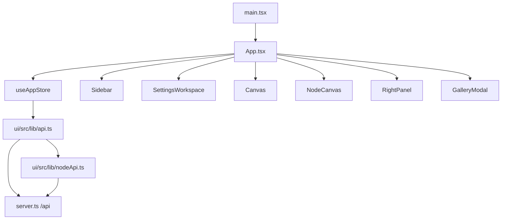

# Frontend Architecture

The current `ima2-gen` web UI is the React app under `ui/src/`. The server serves the built bundle under `ui/dist/`. The old single-file HTML UI remains as `public/index.html.legacy`, but it is not the active entrypoint.

This matters because README and older devlog entries still contain traces of the vanilla HTML UI. Actual UI work should target React components, the Zustand store, `ui/src/lib/api.ts` / `ui/src/lib/nodeApi.ts`, and `ui/src/index.css`. Fixing the legacy HTML file will not change the active app.

Start UI work at `App.tsx` to understand how classic canvas and node canvas diverge. General server calls are in `ui/src/lib/api.ts`; node generation JSON/SSE calls are in `ui/src/lib/nodeApi.ts` and re-exported through `api.ts`. State is centralized in `ui/src/store/useAppStore.ts`. For screen-level structure, start with `Sidebar`, `Canvas`, `NodeCanvas`, `RightPanel`, and `GalleryModal`.

Snapshot note, 2026-04-30: mobile UI has dedicated components (`MobileAppBar`, `MobileComposeSheet`, `MobileSettingsToggle`) and hooks (`useIsMobile`, `useVisualViewportInset`). Canvas Mode UI has been split out of a single component (`refactor(ui): split canvas mode workspace`, commit 11bc214) into `ui/src/components/canvas-mode/` (~3300 lines across 23 files), with `CanvasModeWorkspace.tsx` (498) as the shell, `CanvasToolbar.tsx` (468) for tools, and `useCanvasBackgroundCleanup.ts` (454) for the dual-mask cleanup flow. Background cleanup preview work has stale-render cancellation/debounce guards while final apply/export paths preserve natural image dimensions. Multimode sequence preview (`MultimodeSequencePreview`), web-search/reasoning-effort controls (`WebSearchToggle`, `ReasoningEffortSelect`), trash undo (`TrashUndoToast`), and history strip (`HistoryStrip` + layout toggle) are all part of the active component surface. There is no separate `ui/src/lib/imageMetadataClient.ts`; metadata restore calls live in `ui/src/lib/api.ts`.

Snapshot note, 2026-05-06: gallery now defaults to the current session with an "All Images" toggle (#42, commit bbf9b08). The store exposes `galleryScope: "current-session" | "all"`, `galleryDefaultScope`, and matching setters; opening the gallery resets `galleryScope` to `galleryDefaultScope` so the default is sticky across sessions. All `ima2.*` localStorage key names — including `ima2.galleryScope` and `ima2.galleryDefaultScope` — are now centralized in `ui/src/store/persistenceRegistry.ts` (#43, commit 246696d), preventing drift between hydration helpers and setters; settings/canvas persistence hardening (commit 5e3aed3) consumes the same registry. Error toasts now stack at the bottom-right with per-toast dismissal instead of replacing each other (commit 78cb6d4 + `tests/toast-stack-contract.test.js`); `Toast.tsx` is the renderer and the store keeps an array of error entries. Mobile compose/settings flows received UX polish (commits ad78853 / c812598) with an explicit mobile generate entry (`tests/mobile-generate-entry-contract.test.js`). Reasoning-effort controls are disabled for image-only models (commit 18b9123). `useAppStore.ts` grew to 3715 lines.

Snapshot note, 2026-05-30: **Agent Mode** shipped a dedicated React workspace under `ui/src/components/agent/` (`ui/src/lib/agentApi.ts`, `ui/src/hooks/useAgentWorkspaceLayout.ts`, `ui/src/lib/agentLayout.ts`, and `ui/src/styles/agent-workspace*.css`). It adds a session list, a turn/conversation view, a durable queue panel with cancel/retry, right-sidebar model/quality/form controls, per-session run state, and slash-command / `/question` handling, talking to the always-on `/api/agent/*` routes. Agent Mode has no CLI surface; it is web-UI only. Active run progress is derived from `queueBySession`/`runSummaryBySession` and displayed in a compact composer-adjacent status bar instead of a synthetic assistant chat bubble, so refreshes and session switches recover the spinner from durable queue state.

Snapshot note, 2026-06-27 (v2.0.4): store facade `useAppStore.ts` is now ~507 lines after splitting state into `store*Impl.ts` modules (`storeGenerationImpl`, `storeGalleryImpl`, `storeInflightImpl`, etc.). Global styles live in `ui/src/index.css` (~105 lines) after CSS modularization into feature-scoped files. New/updated UI surfaces include `GenerationRequestLogPanel` (dev log tab for `GET /api/generation-requests`), `ResultMetadataModal` (per-result metadata inspector), `settings/QuotaCard` (Grok billing bar + Switch Account), storyboard mode toggle in the composer, and video frame copy (First/Mid/Last). Node default `searchMode` is `"on"` when web search is enabled.

Snapshot note, 2026-06-29: Grok Video 1.5 uses canonical `grok-imagine-video-1.5` in UI state; persisted `grok-imagine-video-1.5-preview` values are migrated on load. `VideoControlsPanel` exposes `1080p` only for 1.5 image-to-video with one active image/frame source and clamps unsupported stored or transient 1080p selections back to 720p. Effective I2V detection covers direct references, provider URL references, node parent-video frame sources, and continue-from-video frame anchors so the UI matches the server-side `INVALID_VIDEO_RESOLUTION` contract.

---

## Render Flow

`App.tsx` hydrates history, loads sessions, reconciles inflight jobs, starts polling on mount, and syncs theme preference. If settings are open, it renders `SettingsWorkspace` in the center slot. Otherwise, if UI mode is `classic`, it renders `Canvas`; if node mode is enabled and UI mode is `node`, it renders `NodeCanvas`. Node mode is enabled in packaged builds by default and can be hidden only by building with `VITE_IMA2_NODE_MODE=0`. Before unload or visibility changes, it flushes the graph save beacon.

Settings are a workspace replacement, not a modal overlay. `SettingsButton` lives next to the `ima2-gen` title in the sidebar. The compact image model selector also lives in this header as a fast switcher, while Settings shows the same choice with full model names. `SettingsWorkspace` keeps the outer shell fixed so the header and `X` close button do not scroll away; only the section index and content pane scroll. Selecting an item jumps the center document to that section instead of replacing the content panel. `SettingsWorkspace` closes with `X` or Escape and returns to the previous canvas path without mutating generation state.

## Major Areas

| Area | Main files | Responsibility |
|---|---|---|
| App shell | `ui/src/App.tsx` | Initialization, storage sync, beforeunload save, canvas/settings switch |
| Left panel | `Sidebar.tsx`, `PromptComposer.tsx`, `SettingsButton.tsx` | Focused generation entry plus settings access |
| Center workspace | `Canvas.tsx`, `NodeCanvas.tsx`, `SettingsWorkspace.tsx`, `ImageNode.tsx`, `card-news/CardNewsWorkspace.tsx` | Classic image display, graph canvas, settings, or dev-only card-news workspace |
| Agent workspace | `components/agent/*`, `lib/agentApi.ts`, `hooks/useAgentWorkspaceLayout.ts` | Agent Mode conversational image workspace: sessions, turns, durable composer run status, durable queue panel, right-sidebar controls (`/api/agent/*`, no CLI) |
| Right panel | `RightPanel.tsx`, `SizePicker.tsx`, `CostEstimate.tsx`, `GenerationRequestLogPanel.tsx` | Quality, size, format, moderation, count; dev log tab for `GET /api/generation-requests` (#95) |
| History | `HistoryStrip.tsx`, `GalleryModal.tsx`, `ResultActions.tsx`, `ResultMetadataModal.tsx` | Saved image browsing, favorite, restore, drag-out, metadata-restore, and per-result metadata inspector (#108) |
| Status | `InFlightList.tsx`, `Toast.tsx`, `BillingBar.tsx`, `AccountSettings.tsx`, `settings/QuotaCard.tsx` | Pending jobs, notifications, billing/provider status, Grok quota bar + Switch Account |
| Error UX | `ErrorCard.tsx`, `ui/src/lib/errorCodes.ts`, `errorHandler.ts` | Code-based localized error cards and toast routing |
| Custom size | `SizePicker.tsx`, `CustomSizeConfirmModal.tsx`, `ui/src/lib/size.ts`, `customSizeSlots.ts` | Keyboard-safe custom size drafts, slot persistence, and generation-time adjustment confirmation |
| Prompt library | `PromptLibraryPanel.tsx`, `PromptLibraryRow.tsx`, `PromptDetailModal.tsx`, `SavePromptPopover.tsx`, `PromptImportDialog.tsx`, `PromptImportFolderSection.tsx`, `PromptImportDiscoverySection.tsx` | Right-panel/overlay prompt library for browsing, searching, favoriting, inserting, saving, preview-first imports, PR2 curated source search, PR3 GitHub folder file selection, and PR4 reviewed-source discovery |
| Image metadata restore | `MetadataRestoreDialog.tsx`, `ui/src/lib/api.ts` (`postMetadataRead`) | Drop a previously generated PNG into the composer to restore prompt and parameters from embedded XMP |
| Card-news (dev-only) | `ui/src/components/card-news/*`, `ui/src/store/cardNewsStore.ts`, `ui/src/lib/cardNewsApi.ts` | Topic→draft→template→generate→export flow, gated by `VITE_IMA2_CARD_NEWS=1` or `VITE_IMA2_DEV=1` |
| i18n | `ui/src/i18n/index.ts`, `ko.json`, `en.json` | Locale load/save and translation lookup |

## State Model

| State group | Location | Description |
|---|---|---|
| Generation options | `useAppStore.ts` | Provider, quality, size, format, moderation, image model, count |
| Prompt/reference | `useAppStore.ts` | Prompt, reference images, add/remove/clear helpers |
| Classic history | `useAppStore.ts` plus `/api/history` | Current image, history, gallery scope (`current-session` / `all`), gallery default scope, favorite toggle |
| Inflight | `useAppStore.ts` plus `/api/inflight` | localStorage-backed pending jobs and polling |
| Node graph | `useAppStore.ts` plus sessions API | Nodes, edges, graphVersion, session actions, style sheet |
| Prompt library | `useAppStore.ts` plus `/api/prompts/*` | Open/close, current folder, search query, favorite filter, in-flight loading |
| Metadata restore | `useAppStore.ts` plus `/api/metadata/read` | Pending dropped image, parsed metadata, restore confirmation flow |
| Card-news (dev-only) | `ui/src/store/cardNewsStore.ts` plus `/api/cardnews/*` | Topic/draft/template selection, manifest, jobs, regenerate/export state |
| Settings workspace | `useAppStore.ts` | `settingsOpen` and active settings section |
| UI preferences | `localStorage` via `ui/src/store/persistenceRegistry.ts` | Right panel state, UI mode, selected filename, locale, theme, custom-size slots, dev mode flag, gallery scope/default scope, settings persistence — all key names live in `persistenceRegistry.ts` (#43) |
| Error surface | `useAppStore.ts` plus `ErrorCard.tsx`, `Toast.tsx` | `errorCard` state for actionable errors; toasts are stacked at the bottom-right with per-toast dismissal (commit 78cb6d4) |

The image model preference is stored in `localStorage` as `ima2.imageModel`. Sidebar compact labels (`5.4m`, `5.4`, `5.5`) and Settings full labels (`GPT-5.4 Mini`, `GPT-5.4`, `GPT-5.5`) both read/write the same store field, so the next classic or node request sends the selected `model` instead of falling back to the default. The sidebar selector is intentionally tiny: the closed state shows only the compact label, opens a custom menu on click, and closes on outside click or Escape. The open menu renders through a `document.body` portal (fixed position, z-index 160) so the sidebar's `overflow:hidden` cannot clip it, with a `max-height`/scroll fallback and close-on-scroll/resize so the fixed menu never detaches from the trigger (#79).

Visible metadata should carry the selected model too. Current result metadata, hydrated history items, and ready node status labels use the server-returned or sidecar-restored `model` so UI debugging matches backend logs. The visible metadata uses compact aliases to preserve elapsed time: model aliases are `5.4m`/`5.4`/`5.5`, and quality aliases are `l`/`m`/`h`. Reasoning effort renders as `R:l`/`R:m`/`R:h`/`R:x` (none hidden) via `formatReasoningLabel` in `ui/src/lib/reasoning.ts`; the `R:` prefix avoids colliding with quality `m`. Per-image `elapsed` and `reasoningEffort` persist across history reload and session restore (#79).

`useAppStore.ts` is now a **507-line facade** over focused impl modules (`storeGenImpl.ts`, `storeNodeGenImpl.ts`, `storeVideoImpl.ts`, `storeInflightImpl.ts`, etc.). Cross-cutting state (classic, node, history, gallery scope, prompt library, metadata restore, multimode sequence, canvas annotations/versions, web-search and reasoning-effort settings, settings, stacked toasts) lives in those slices. The card-news store remains separated in `cardNewsStore.ts` (416 lines).

## API Client

| Function | Endpoint | Used by |
|---|---|---|
| `postGenerate` | `POST /api/generate` | Classic generation |
| `postEdit` | `POST /api/edit` | Edit flow |
| `getHistory` | `GET /api/history` | History strip and gallery |
| `getHistoryGrouped` | `GET /api/history?groupBy=session` | Session-grouped history |
| `deleteHistoryItem` | `DELETE /api/history/:filename` | Asset delete |
| `restoreHistoryItem` | `POST /api/history/:filename/restore` | Undo/restore |
| `setHistoryFavorite` | `POST /api/history/favorite` | Gallery favorite toggle |
| `getStorageStatus` | `GET /api/storage/status` | Gallery storage recovery notice |
| `openGeneratedDir` | `POST /api/storage/open-generated-dir` | Gallery "Open folder" action |
| `getInflight` | `GET /api/inflight` | Pending reconciliation |
| `postMetadataRead` | `POST /api/metadata/read` | Drag-and-drop metadata restore dialog |
| Prompt library helpers | `/api/prompts*` | List, create, update, delete, favorite, import, export, folders, prompt import preview/commit, curated sources/search/refresh, GitHub folder list/preview |
| Session style sheet helpers | `/api/sessions/:id/style-sheet*` | Get/save/enable/extract style sheet from a reference history image |
| `getGenerationRequestLog` | `GET /api/generation-requests` | Dev log panel (`ui/src/lib/api-log.ts`) |
| Card-news helpers | `/api/cardnews/*` (dev-only via `cardNewsApi.ts`) | Templates, role templates, sets, draft, generate, jobs, regenerate, export |
| `postNodeGenerate` | `POST /api/node/generate` | Node-mode generation, implemented in `nodeApi.ts` |
| `postNodeGenerateStream` | `POST /api/node/generate` with `Accept: text/event-stream` | Node-mode partial preview/error streaming, implemented in `nodeApi.ts` |
| Session helpers | `/api/sessions/*` | Graph session list/load/save |
| `getOAuthStatus` | `GET /api/oauth/status` | Provider readiness |
| `getBilling` | `GET /api/billing` | Billing bar and API status |

## Classic UI And Node UI

| Mode | Condition | Main component | State flow |
|---|---|---|---|
| Classic | Default UI | `Canvas.tsx` | Sends prompt to `/api/generate`, then updates current image/history |
| Node | Product feature enabled | `NodeCanvas.tsx` | Calls `/api/node/generate` per node, renders partial previews when streamed, and saves the graph to the session |
| Card-news | Dev-only, gated by `VITE_IMA2_CARD_NEWS=1` or `VITE_IMA2_DEV=1` | `card-news/CardNewsWorkspace.tsx` | Drives the dev-only topic→draft→template→generate→export flow against `/api/cardnews/*` and `cardNewsStore` |

Node mode uses `@xyflow/react`. Empty canvas creates a root node. Dragging an edge from an existing node can create a child node. Session loading displays a canvas overlay.

### SSE Multiplexing (Event Channel)

The web UI uses a singleton `EventSource` connection (`ui/src/lib/eventChannel.ts`) to `GET /api/events` for all generation progress. On `App.tsx` mount, `ensureConnected()` opens the channel. Generation flows (multimode, node, video) subscribe a handler by `requestId` before the POST, then send `{ async: true, requestId }` to receive an immediate `202`. Progress events (`phase`, `partial`, `done`, `error`) arrive on the shared channel and are routed to the matching handler.

Key modules:
- `ui/src/lib/eventChannel.ts` — singleton EventSource, exponential backoff reconnect, `subscribe()` / `armStreamTimeout()` / `ensureConnected()`, connection state callbacks
- `ui/src/lib/sseStreamError.ts` — `parseSseErrorPayload()` normalizes SSE error events into structured `{ code, message, status }` objects
- `ui/src/lib/api-generation.ts` — `postMultimodeGenerateStream()` and `postNodeGenerateStream()` use subscribe-before-fetch pattern
- `ui/src/store/storeNodeGenImpl.ts` — node generation state using async POST + eventChannel
- `ui/src/store/storeVideoImpl.ts` — video generation state with cancel-aware cleanup
- `ui/src/store/storeInflightImpl.ts` — shared inflight tracking with `activeFlightIds` Set

The monolithic `useAppStore` was split into focused `store*Impl.ts` modules to keep each under 500 lines. The main `useAppStore.ts` re-exports composed slices.

Node generation uses `postNodeGenerateStream()` which subscribes to the event channel, sends `{ async: true }`, and receives progress through the shared `GET /api/events` SSE. Partial images are stored only in transient `ImageNodeData.partialImageUrl`; they are deleted from the graph save payload. The final `done` payload replaces the preview with the canonical saved file URL. CLI clients that send `Accept: text/event-stream` instead of `async: true` still receive per-request SSE for backward compatibility. SSE `error` payloads preserve `status` so upstream validation failures can route to the same UI surface as JSON failures.

Node selection batch actions live on the canvas, not in Settings. `NodeCanvas` exposes a compact selection bar inside the React Flow area. Selection mode treats a normal node click as selecting the whole undirected connected component. Cmd/Ctrl modifies that selection: another component is added/removed, while a node inside the selected component can be toggled as an exception. Batch regeneration is sequential and in-place for selected nodes only; it does not use the single-node ready-state sibling branch.

Ready node actions are split in `ImageNode`: `Regenerate` replaces the current node in place, while `New variant` creates and generates into a sibling node. The store preserves this action choice through custom-size confirmation so a confirmed in-place regeneration cannot accidentally take the sibling path. Node layout helpers place new roots/children using actual existing node positions instead of raw edge counts, avoiding overlap after a middle child is deleted.

Node-local image references are allowed on child/edit nodes. The child composer sends references together with the parent image instead of blocking attachment. Reference drafts remain node-local and are stripped from saved session graph payloads, but they are persisted separately in browser `localStorage` under `ima2.nodeRefs.v1` by `ui/src/lib/nodeRefStorage.ts`. This avoids base64 bloat in SQLite while keeping node chips available across normal reloads on the same browser profile.

Node edges are the source of truth for parentage. `ui/src/lib/nodeGraph.ts` derives `parentServerNodeId` from the incoming visual edge and the source node's current `serverNodeId` whenever nodes or edges are loaded, changed, connected, disconnected, or saved. `ImageNode` exposes four-direction source and target handles, and `NodeCanvas` forwards React Flow `sourceHandle`/`targetHandle` values into the store so edges reload on the same directional anchors. The handle ids are persisted in session edge `data`; parent derivation still uses only `edge.source` and `edge.target`. Node edge removal is routed explicitly instead of relying on raw React Flow edge changes. When an edge is removed, `useAppStore.disconnectEdges()` removes the visual edge and clears or recomputes the target node's `parentServerNodeId`. Selection mode disables Delete/Backspace deletion so graph selection cannot accidentally remove edges or nodes.

Node generation sends an explicit context/search policy. The default request is `contextMode: "parent-plus-refs"` and `searchMode: "on"`, so a child edit uses the immediate parent image plus the node's explicit reference chips with web search enabled by default. Full ancestry is not silently inferred. If edit search becomes a product option, the UI must turn `searchMode` on intentionally.

Error handling is centralized. API helpers preserve `err.code` where the server sends `{ error: { code, message } }`; node helpers also preserve `err.status` from JSON or SSE error payloads. `handleError()` maps stable codes to either a toast or persistent `ErrorCard`. The card is reserved for actionable failures such as invalid request parameters, OAuth expiry, API-key authentication problems, moderation refusal, upstream 5xx, and network/proxy failure.

## Style And Layout

| File | Current signal | Caution |
|---|---|---|
| `ui/src/index.css` | ~105 lines (global tokens/imports; feature CSS colocated) | Large structural changes can easily create CSS drift across classic, node, canvas-mode, prompt-library, prompt-import dialog, gallery, mobile shell, and card-news surfaces |
| `ui/src/components/*.tsx` | ~17200 lines (excluding `card-news/` subtree) | Component class names and CSS are tightly coupled |
| `ui/src/store/useAppStore.ts` | ~507 lines (facade over `store*Impl.ts`) | Store shape changes must stay in sync with impl modules and localStorage migration paths |
| `ui/src/components/card-news/*.tsx` | Dev-only subtree | Do not touch from non-card-news work; gated behind `VITE_IMA2_CARD_NEWS=1` / `VITE_IMA2_DEV=1` |
| `ui/dist/` | Build output | Do not edit directly |
| `public/index.html.legacy` | Legacy artifact | Do not use it as the source for new active UI behavior |

## Change Checklist

- [ ] If a new API call is added, update `ui/src/lib/api.ts` or `ui/src/lib/nodeApi.ts` and `[[03-server-api]]`.
- [ ] If store shape changes, check classic, node, and localStorage migration paths.
- [ ] If node-mode UI changes, update `[[05-node-mode]]`.
- [ ] Record major CSS changes alongside component ownership.
- [ ] If a change references legacy HTML, re-check it against the active UI.

## Change Log

- 2026-04-23: Documented the active React UI architecture.
- 2026-04-23: Translated this document from Korean to English.
- 2026-04-24: Documented node SSE partial preview rendering and JSON fallback.
- 2026-04-24: Documented shared sidebar/settings image model selection.
- 2026-04-25: Documented error-card UX, custom-size confirmation, and storage gallery helpers.
- 2026-04-25: Documented node selection batch generation and canvas-level batch actions.
- 2026-04-25: Documented explicit node edge disconnect routing and parent metadata cleanup.
- 2026-04-25: Documented ready-node regenerate/new-variant split, position-based child layout, and child/edit node references.
- 2026-04-25: Documented graph-edge-derived node parentage, node ref local persistence, and explicit node context/search request policy.
- 2026-04-26: Removed dev-only workspace details from the evergreen frontend architecture reference.
- 2026-04-26: Confirmed node selection batch, edge disconnect, single-node regen/variation, and child node references are implemented and archived under `_fin/260426_*`.
- 2026-04-27: Documented four-direction node handles and edge handle-id persistence after 0.09.34.
- 2026-04-28: Added prompt library overlay, image-metadata restore dialog, session style-sheet helpers, dev-only card-news workspace and store, history favorite, and refreshed line counts (`useAppStore` 2739, `index.css` 4497, components 4046) for ima2-gen 1.1.5.
- 2026-04-28: Documented prompt import preview/commit API, dialog-first import UX, local/GitHub `.md`/`.markdown`/`.txt` support, and refreshed line counts (`useAppStore` 3374, `index.css` 5250, components 5263).
- 2026-04-28: Documented PR2 curated source search inside `PromptImportDialog`, including indexed search/refresh helpers and commit-compatible candidate flow.
- 2026-04-28: Documented PR3 GitHub folder browse through `PromptImportFolderSection`, selected-file preview, and folder list/preview API helpers.
- 2026-04-28: Documented PR4 GitHub discovery through `PromptImportDiscoverySection`; discovery candidates stay separate from prompt candidates and cannot be committed directly.
- 2026-04-30: Documented the Canvas Mode workspace split (`refactor(ui): split canvas mode workspace`, #11bc214) into `ui/src/components/canvas-mode/` (~3300 lines, 23 files), refreshed `useAppStore.ts` to 3555 and `index.css` to 5780, and called out multimode preview, web-search/reasoning-effort controls, trash undo, and the history strip as active surfaces.
- 2026-05-06: Added gallery scope state (#42 — `current-session` default with All Images toggle, sticky default), the `persistenceRegistry.ts` single source of truth for `ima2.*` localStorage keys (#43), error-toast stacking with per-toast dismissal (commit 78cb6d4), mobile compose/settings polish (commits ad78853 / c812598) plus the mobile generate entry contract, and the reasoning-effort disable for image-only models (commit 18b9123). Bumped `useAppStore.ts` to 3715.
- 2026-05-29: Added the `R:l`/`R:m`/`R:h`/`R:x` reasoning label (`formatReasoningLabel`, none hidden) to Classic/Canvas/Node result metadata, persisted `elapsed`/`reasoningEffort` across reload + session restore, and portaled the sidebar model dropdown to `document.body` (fixed, z-index 160, scroll-close, `max-height`) so it no longer clips (#79).
- 2026-05-30: Documented the Agent Mode workspace (`ui/src/components/agent/*`, `lib/agentApi.ts`, `hooks/useAgentWorkspaceLayout.ts`, `styles/agent-workspace*.css`) — session list, turn view, durable queue panel, right-sidebar controls, slash commands / `/question` — talking to the always-on `/api/agent/*` routes (no CLI). Re-grounding pass for ima2-gen 1.1.14.
- 2026-06-01: Recorded the Grok video UI contract: Classic "Continue here", gallery/history video drag, and Node parent-video generation attach the previous video's last frame and carry `videoContinuity` lineage; the video controls panel shows pending continuity context while Canvas shows selected-result lineage metadata.
- 2026-06-27: v2.0.4 snapshot — refreshed line counts (`useAppStore` ~507 facade, `index.css` ~105, components ~17200), documented `GenerationRequestLogPanel`, `ResultMetadataModal`, `QuotaCard`, storyboard mode, and video frame copy.
- 2026-06-29: Added the Grok Video 1.5 `1080p` UI contract: canonical model migration, conditional `VideoControlsPanel` enablement, 720p auto-clamp for unsupported states, and expanded active-source detection for provider URL and parent-video frame anchors.

Previous document: `[[03-server-api]]`

Next document: `[[05-node-mode]]`
