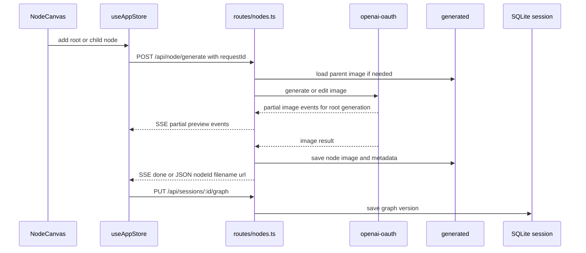

# Node Mode

Node mode extends `ima2-gen` from a single-image generator into a graph-based image workspace. Users can create a root image, branch from it, and generate or edit child images. The UI is based on `@xyflow/react`, while the server provides node-level generation and session graph persistence.

This mode matters because it is the likely center of future workflows. Classic UI revolves around one prompt and a list of image results. Node mode can represent lineage, retries, comparisons, and research-style branching as a graph. That connects API contracts, store state, session DB, and asset lifecycle.

To understand node mode, start with three files. `NodeCanvas.tsx` owns graph interaction. `ImageNode.tsx` renders the prompt, image, pending, stale, error, and node-local reference input state of each node. `routes/nodes.ts` owns `/api/node/generate`, while `routes/sessions.ts` and `lib/sessionStore.ts` persist graph state. After the TypeScript migration close (#24), treat `.ts` files as source of truth; the paired `.js` files in `lib/`, `routes/`, and `bin/` are committed runtime artifacts.

---

## Node Generation Flow



## Key Files

| File | Role |
|---|---|
| `ui/src/components/NodeCanvas.tsx` | React Flow wrapper, node/edge changes, directional handle routing, child-node gesture |
| `ui/src/components/ImageNode.tsx` | Node card UI, four-direction source/target handles, status display, image rendering |
| `ui/src/components/SessionPicker.tsx` | Session selection and creation UX |
| `ui/src/store/useAppStore.ts` | `graphNodes`, `graphEdges`, `graphVersion`, session actions |
| `ui/src/lib/graph.ts` | Client node IDs and initial-position helpers |
| `ui/src/lib/api.ts` | Shared API client and node API re-export surface |
| `ui/src/lib/nodeApi.ts` | Node generation JSON/SSE client |
| `routes/nodes.ts` | `/api/node/generate`, `/api/node/:nodeId` |
| `routes/sessions.ts` | `/api/sessions/*` |
| `lib/nodeStore.ts` | Node image and metadata storage |
| `lib/sessionStore.ts` | SQLite sessions, nodes, edges, graphVersion |
| `lib/assetLifecycle.ts` | Keeps node state coherent when assets are deleted |

## Node State Model

| State | Meaning | Expected UI behavior |
|---|---|---|
| `empty` | Node has no image yet | Prompt input or generation can start |
| `pending` | Generation request is running | Spinner and pending phase are shown |
| `reconciling` | UI is syncing with server inflight state after refresh | Temporary sync state is shown |
| `ready` | Image and metadata exist | Preview and child generation are available |
| `stale` | Saved graph and server asset state differ | Show warning or retry guidance |
| `asset-missing` | Graph exists but image file is gone | Offer recovery or cleanup guidance |
| `error` | Generation failed | Show error and retry entry |

## API Contract

| Endpoint | Role | Key fields |
|---|---|---|
| `POST /api/node/generate` | Generate/edit one node | `parentNodeId`, `prompt`, `quality`, `size`, `format`, `moderation`, `references`, `contextMode`, `searchMode`, `sessionId`, `clientNodeId`, `requestId`; response includes `refsCount`, `contextMode`, `searchMode` |
| `GET /api/node/:nodeId` | Fetch node metadata | `nodeId`, `meta`, `url` |
| `GET /api/sessions` | List sessions | `sessions` |
| `POST /api/sessions` | Create a session | `title` |
| `GET /api/sessions/:id` | Load a session and graph | `session` |
| `PUT /api/sessions/:id/graph` | Save graph snapshot | `If-Match`, `nodes`, `edges` |

`PUT /api/sessions/:id/graph` uses version-based saving. The client sends the current `graphVersion` in the `If-Match` header. The server returns the new `graphVersion` on success.

Visual edges are the canonical parent graph. `parentServerNodeId` is a derived generation cache, not a separate source of truth. On load, edge changes, node changes, connect, disconnect, and save, the UI derives a node's parent server id from its single incoming edge. `ImageNode` renders top/right/bottom/left source and target handles with unique React Flow handle ids. `NodeCanvas` forwards `sourceHandle` and `targetHandle` into `connectNodes()`, and session graph saves preserve those ids in edge `data` so reloads keep the same visual anchors. The server repeats parent normalization in `saveGraph()` and rejects multiple incoming parent edges with `GRAPH_PARENT_CONFLICT`.

## Streaming And Recovery

Root node generation requests use `postNodeGenerateStream()` and ask the server for `Accept: text/event-stream`. The server relays upstream partial images as `partial` events before the canonical `done` event. Child/edit nodes currently use the same route but remain final-only, because combining parent-edit semantics with extra progressive previews needs separate provider validation. SSE `error` events carry `status` and upstream diagnostics so client-side handling can distinguish invalid request parameters from moderation and network failures.

`ImageNode` renders `data.partialImageUrl` while a node is `pending` or `reconciling`. This value is transient UI state only. `sanitizeForSave()` strips it before session graph persistence so base64 previews never inflate SQLite payloads.

Each node request writes `requestId` into the node sidecar and `/api/history`. Recovery uses `pendingRequestId ?? recoveryRequestId` first, then falls back to `(sessionId, clientNodeId, createdAt)`. This avoids accidentally attaching an older retry result after reload or HMR. Active inflight jobs are persisted in SQLite so a server restart or UI reload can still expose enough metadata for the UI to reconcile instead of relying only on process memory.

Concurrent generate calls on the same `clientNodeId` are deduped by an in-flight lock (commit 73f228e + `tests/node-generation-lock-contract.test.js`): the second caller does not double-fire upstream — it observes the same in-flight job and reuses the result on completion. This protects against double-clicks on the node action bar and accidental keyboard-repeat triggers from producing duplicate sidecar/history rows.

Pending and reconciling cards use a transform-only rotating border glow. Reduced-motion users keep the static glow without rotation. The node action bar wraps onto a second line when a card is too narrow to fit all action buttons (commit ef1e60f) so primary actions stay reachable on mobile/zoomed-out canvases.

## Selection Batch Generation

Node mode supports canvas-level selection and batch generation. Selection mode uses graph context rather than left-panel settings:

```text
click node              -> select the whole undirected connected component
click another component -> replace selection
Cmd/Ctrl + component    -> add/remove that component
Cmd/Ctrl + selected node -> toggle that one node as an exception
```

Batch actions run sequentially. `Generate missing` skips selected nodes that already have a ready image. `Regenerate selected` replaces the image on the same client node and deliberately avoids the single-node sibling-regeneration path.

During a batch, the client keeps a `latestServerNodeIdByClientId` map. If node `1` is regenerated before selected child `2`, node `2` uses the fresh server node id as its `parentNodeId`. If an unselected direct child depends on a regenerated parent, it is marked `stale` and its `parentServerNodeId` is rewired to the new parent. Deeper unselected descendants are also marked `stale`, but only direct changed-parent children are rewired immediately.

`stale` therefore has two meanings in node mode: recovered graph/assets may differ, or an upstream node was regenerated while this node was intentionally left out of the batch. In both cases the preview may remain visible, but the node should be regenerated when the user wants it to match the latest upstream image.

Stopping a batch stops only the remaining local queue. The current `/api/node/generate` request is allowed to finish or fail; hard-aborting a running OAuth request is outside this phase.

## Single Node Regeneration

Ready nodes expose two separate actions. `Regenerate` replaces the current client node in place. `New variant` creates a sibling node and generates into that new node. Custom-size confirmation preserves this intent through separate `node-in-place` and `node-variation` continuation kinds.

## Edge Disconnect

Deleting an edge removes only the connection, not either node. The target node keeps its existing prompt and image preview, but future generation no longer uses the disconnected parent image.

```text
A ─────> B
B.parentServerNodeId = A.serverNodeId

delete edge

A       B
B.parentServerNodeId = null
```

New connections are blocked if the target already has a different incoming parent edge. If a target somehow still has another incoming edge, the target's `parentServerNodeId` is recomputed from the remaining source node's current `serverNodeId`. All nodes keep target handles available after disconnect, so a disconnected or independent node can be connected again without creating a new child node by mistake. Selection mode disables Delete/Backspace removal so graph selection and edge deletion do not collide.

## Conflict Reload Recovery

Session graph saves use `If-Match` graph versions. When the server returns `GRAPH_VERSION_CONFLICT`, the client reloads the latest graph and shows neutral copy: the graph version changed. The response does not prove another tab caused the change.

After the reload, node mode immediately runs history recovery. The matcher uses `pendingRequestId ?? recoveryRequestId` first, then falls back to `(sessionId, clientNodeId, createdAt)` so a completed node asset can be reattached even if the graph snapshot stored only the sanitized pending state.

Recovered nodes become `ready` with `imageUrl` from history. Transient `partialImageUrl` stays stripped from session graph saves. Node-local `referenceImages` are also stripped from SQLite graph payloads, but the browser stores them separately in `localStorage` so same-browser reloads preserve visible node reference chips. `refsCount` remains numeric metadata in sidecars/history.

## Parent And External Source Inputs

| Input | Server behavior | Used when |
|---|---|---|
| `parentNodeId` present | Load stored parent node image and use the edit path | Generating a child node |
| `parentNodeId` absent | Generate a new image from prompt and references | Generating a root node |
| `externalSrc` present | Read an existing asset from `generated/` | Promoting a history image into the graph |

## Reference Image Scope

Node mode separates visible node-local references from classic composer references.

| Reference state | Scope | Persistence | Behavior |
|---|---|---|---|
| Node-local `data.referenceImages` | One node composer | Browser-local persistence under `ima2.nodeRefs.v1`; stripped from SQLite graph save | Sent to `/api/node/generate`; root nodes use refs for generation, child/edit nodes send refs after the parent image |
| Classic `referenceImages` | Classic composer | In-memory classic draft | Parked/inactive in node mode and never sent by `generateNode()` |
| Session style sheet | Active session | Stored through style sheet APIs | May influence prompts as a style prefix, but is not a reference chip |

Child/edit nodes already have a parent image source. Extra node-local references are allowed and are sent to the edit path after the parent image and before the text prompt. They supplement the parent image; they do not replace it.

The default node context policy is `parent-plus-refs`: immediate parent image plus explicit node-local references. `parent-only` is available when references must be ignored. `ancestry` is reserved and currently rejected; node mode does not silently send the full upstream chain. Edit search is also explicit. `searchMode` defaults to `off`; `on` is the only mode that adds edit web search.

`duplicateBranchRoot()` seeds the source image into the duplicated root node's local draft references. It must not push into the classic global reference list.

`sanitizeForSave()` removes node-local reference data before `PUT /api/sessions/:id/graph` to avoid base64 bloat and oversized node data replacement. `ui/src/lib/nodeRefStorage.ts` handles browser-local persistence and prunes entries for deleted nodes after successful graph saves.

Node sidecar metadata and `/api/history` rows expose `refsCount`, a numeric count only. They never store the reference image base64 after generation succeeds.

## Difference From Classic Mode

| Topic | Classic | Node mode |
|---|---|---|
| Primary unit | Current image and history | Nodes and edges |
| Generation endpoint | `/api/generate` | `/api/node/generate` |
| Storage | Sidecar JSON and flat history | Node metadata and session graph |
| Restore path | `/api/history`, localStorage selected item | `/api/sessions/:id`, graphVersion |
| Pending display | In-flight list | Per-node status, streamed partial preview, animated border glow |

## Change Checklist

- [ ] If `ImageNodeData` shape changes, check session save, restore, and API types.
- [ ] If `/api/node/generate` response changes, update `ui/src/lib/nodeApi.ts`, the `api.ts` re-export if needed, and this doc.
- [ ] If graph save policy changes, check `If-Match` version behavior and tests.
- [x] Node selection and batch generation implemented 260426; reference `ui/src/lib/nodeSelection.ts`, `ui/src/lib/nodeBatch.ts`, and `tests/node-batch-contract.test.js`.
- [x] Edge disconnect implemented 260426; reference `NodeCanvas`, `useAppStore.disconnectEdges`, and `tests/node-edge-disconnect-contract.test.js`.
- [x] Four-direction node connection handles implemented 260427; reference `ImageNode`, `NodeCanvas`, `useAppStore.connectNodes`, and `tests/node-ui-contract.test.js`.
- [x] Single-node regeneration and variation implemented 260426; reference `ImageNode`, custom-size continuation routing, and `tests/node-regen-actions-contract.test.js`.
- [x] Node-local references on child/edit nodes implemented 260426; reference child/edit reference handling and `tests/node-child-refs-contract.test.js`.
- [ ] If asset delete/restore changes, review `asset-missing` state and history docs.
- [x] Node mode is part of the npm-published UI by default; update build/package rules in `[[06-infra-operations]]` if this gate changes.

## Change Log

- 2026-04-24: Documented node-local reference inputs, parked classic references, and the child/edit reference guard.
- 2026-04-24: Documented partial-image SSE streaming, requestId recovery, and pending-node glow.
- 2026-04-24: Added conflict reload recovery notes for neutral graph-version copy and requestId-first node repair.
- 2026-04-25: Added SQLite-backed inflight reliability note after 0.09.6 closeout.
- 2026-04-25: Documented edge-only disconnect behavior and parent metadata cleanup.
- 2026-04-25: Documented ready-node regenerate/new-variant split, layout slot behavior, and child/edit node references.
- 2026-04-23: Documented the implemented node canvas, node API, and session persistence structure.
- 2026-04-23: Translated this document from Korean to English.
- 2026-04-25: Documented graph-edge source-of-truth, node-local reference persistence, and explicit context/search modes.
- 2026-04-26: Marked node selection batch, edge disconnect, single-node regen/variation, and child node references as implemented in the change checklist after archival to `_fin/260426_*`.
- 2026-04-27: Documented four-direction React Flow handles, handle-id session persistence, and the reconnect fix after edge disconnect.
- 2026-04-28: Refreshed cross-references after the 1.1.5 prompt library, image metadata, and dev-only card-news additions; node-mode contracts in this document remain unchanged.
- 2026-04-30: Updated wording around the TypeScript migration close (#24); node-mode contracts in this document remain unchanged.
- 2026-05-06: Documented `/api/node/generate` concurrent-call dedupe (commit 73f228e + `tests/node-generation-lock-contract.test.js`) and node action-bar wrap on narrow cards (commit ef1e60f). Other node-mode contracts remain unchanged.

Previous document: `[[04-frontend-architecture]]`

Next document: `[[06-infra-operations]]`
