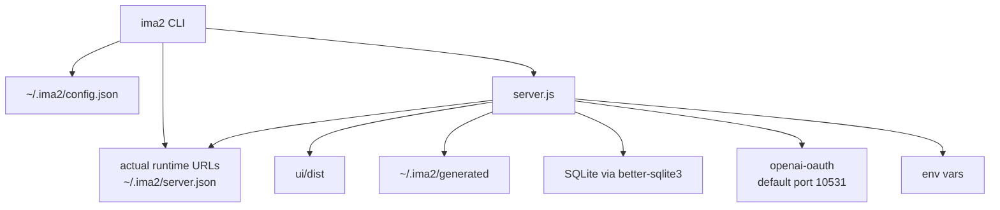

# Infrastructure And Operations

`ima2-gen` operates as an npm package, local Node server, OAuth proxy, SQLite-backed graph store, image file store, and React build artifact. Users see one CLI, but internally the server, UI bundle, local config, runtime port discovery, and runtime data move together.

This document matters because development mode and packaged mode take different paths. Developers run `npm run dev`, which builds the UI and launches the watched server. Users run `ima2 serve`, which checks for `ui/dist` and starts the server. Node mode is enabled in both paths by default. CLI clients read `~/.ima2/server.json` to find the running server. Config and generated data are split between the repo and the user's home directory.

For operations work, choose the layer first. Auth and provider changes touch config and the OAuth proxy. Release work touches `package.json`, `files`, and `prepublishOnly`. Test work touches `scripts/run-tests.mjs` and `tests/*.test.{js,ts,mjs,cjs,mts,cts}`. UI build work touches `ui/package.json` and `ui/dist`.

---

## Runtime Layout

## Package Contract

| Item | Current value |
|---|---|
| package name | `ima2-gen` |
| version | `1.1.10` |
| type | `module` |
| bin | `ima2` -> `./bin/ima2.js` |
| package engine | `node >=20` |
| publish files | `bin/`, `lib/`, `routes/`, `skills/`, `ui/dist/`, `docs/`, `assets/`, `assets/card-news/templates/`, `integrations/comfyui/ima2_gen_bridge/*`, `server.ts`, `server.js`, `config.ts`, `config.js`, `.env.example`, `README.md` |
| major dependencies | `express`, `openai`, `openai-oauth`, `better-sqlite3`, `dotenv`, `sharp`, `trash`, `ulid` |

README may still mention a different Node baseline. The operational baseline is the current `engines.node` field in `package.json`.

## Script Surface

| Script | Runs | Purpose |
|---|---|---|
| `npm start` | `node bin/ima2.js serve` | Start the server like a user would |
| `npm run dev` | `node scripts/dev.mjs` | Build UI, then run watched server |
| `npm run dev:server` | `tsx watch server.ts` | Watch the TypeScript server source directly |
| `npm run ui:install` | `cd ui && npm install` | Install UI dependencies |
| `npm run ui:dev` | `cd ui && npm run dev` | Vite dev server |
| `npm run ui:build` | `cd ui && npm run build` | TypeScript build and Vite build |
| `npm run build` | `npm run ui:build` | Build UI bundle before publish |
| `npm run build:server` | `tsc -p tsconfig.build.json` | Emit committed `*.js` runtime artifacts for `server`, `routes/`, `lib/`, `config` |
| `npm run build:cli` | `tsc -p tsconfig.bin.json && node scripts/fix-shebangs.mjs` | Emit committed CLI runtime artifacts for `bin/` and reinstate shebangs |
| `npm run typecheck` | `tsc -p tsconfig.json --noEmit` | Source-level type check for the migrated TypeScript surface |
| `npm run typecheck:tests` | `tsc -p tsconfig.tests.json --noEmit` | Type check for the `tests/` overlay (runs against the test-only tsconfig) |
| `npm run test:inventory` | `node scripts/classify-tests.mjs --check --fail-js-runtime` | Inventory gate: classifies `tests/*` and fails if a `.js` runtime test slips back in instead of `.ts` |
| `npm test` | `node scripts/run-tests.mjs` | Run `tests/*.test.{js,ts,mjs,cjs,mts,cts}` with `node:test` |
| `npm run setup` | `node bin/ima2.js setup` | Configure provider |
| `npm run lint:pkg` | package metadata check | Validate package fields and publish file list |
| `npm run test:package-install` | temp tarball install smoke | Installs packed package and checks `ima2 doctor`, `/api/health`, and `/api/storage/status` |
| `prepack` | `ui:build && build:server && build:cli` | Refresh all committed runtime artifacts (UI, server, CLI) before tarball |
| `prepublishOnly` | `typecheck && typecheck:tests && test:inventory && ui:build && build:server && build:cli && lint:pkg && test:package-install` | Full pre-publish gate: type checks (incl. `tests/` overlay), test-inventory gate, builds, package metadata lint, and tarball install smoke. Note: `npm test` is no longer in this chain — run it explicitly before publish. |

`release:*` scripts include npm publish and git push. Agents must not run them unless the user explicitly asks.

## Config And Data Locations

| Location | Role | Caution |
|---|---|---|
| `~/.ima2/config.json` | Provider config and possible API key location | May contain secrets; never paste values into docs |
| `~/.ima2/server.json` | Running server runtime advertisement | Used by CLI/Vite discovery; includes top-level backend URL plus nested backend/OAuth configured and actual ports |
| `image_gen/.ima2/config.json` | Legacy config location | New CLI prefers the home config |
| `~/.ima2/generated/` | Image files and sidecar metadata | Runtime output; survives npm global updates. Startup migration scans legacy package `generated/` folders across npm, npx, pnpm, Yarn, Bun, nvm/fnm, asdf/mise, Volta, and common macOS/Linux/Windows global layouts |
| `~/.ima2/generated/.trash/` | Legacy in-package soft-deleted assets folder | Soft-delete now uses the OS trash via the `trash` dep (`lib/systemTrash.ts`); this folder remains for legacy rows pending purge |
| SQLite DB | Session graph storage | Managed through `lib/db.ts` and `lib/sessionStore.ts` |
| `ui/dist/` | Active UI bundle served by server | Build output, not source |

`ima2 doctor` includes a Storage section with the current gallery path, legacy-source counts, and recovery-guide pointer. The browser gallery also calls `/api/storage/status` and can open the current generated folder through `/api/storage/open-generated-dir`; that endpoint accepts no arbitrary path.

## Environment Variables

| Variable | Default or meaning |
|---|---|
| `OPENAI_API_KEY` | May be used for billing probes and legacy provider config |
| `IMA2_PORT` / `PORT` | Server preferred port, default `3333`; falls back to next free port when occupied |
| `IMA2_HOST` | Server bind host, default `127.0.0.1` |
| `IMA2_OAUTH_PROXY_PORT` / `OAUTH_PORT` | OAuth proxy preferred port, default `10531`; the actual ready URL is captured when the proxy falls back |
| `IMA2_SERVER` | CLI target server URL override |
| `IMA2_CONFIG_DIR` | Used by tests to isolate config directory |
| `IMA2_ADVERTISE_FILE` | Overrides runtime discovery file path |
| `VITE_IMA2_API_TARGET` / `IMA2_DEV_API_TARGET` | Split Vite dev API proxy target override |
| `IMA2_IMAGE_MODEL_DEFAULT` | Server fallback image model, default `gpt-5.4-mini` |
| `IMA2_REASONING_EFFORT` | Server OAuth/default reasoning effort, default `medium` |
| `IMA2_API_IMAGE_MODEL_DEFAULT` | Default image model for `provider: "api"` (Responses path), default `gpt-5.4-mini` |
| `IMA2_API_REASONING_EFFORT` | Default reasoning effort for `provider: "api"`, default `low` |
| `IMA2_API_IMAGE_SIZE` | Default size for `provider: "api"`, default `1024x1024` |
| `IMA2_API_ALLOW_WEB_SEARCH` | Toggle web search for `provider: "api"`, default `true` |
| `IMA2_OAUTH_MASKED_EDIT_ENABLED` | Feature flag (#31) gating masked-edit requests on the OAuth path; default off — when off, `lib/oauthProxy/generators.ts` rejects requests carrying a mask before calling upstream |
| `IMA2_INFLIGHT_TTL_MS` | Active in-flight stale-job TTL, default `600000` |
| `IMA2_INFLIGHT_TERMINAL_TTL_MS` | Recent completed/error/canceled job debug retention, default `30000` |
| `VITE_IMA2_NODE_MODE` | UI build-time gate; set `0` only for a classic-only bundle |
| `IMA2_LOG_LEVEL` | Normal `ima2 serve` defaults to `warn`; `IMA2_DEV=1` defaults to `debug` unless env or config override is set |
| `IMA2_DEV` | Master dev gate; enables verbose logs and turns on `config.features.cardNews` |
| `IMA2_CARD_NEWS` | Server feature flag for the dev-only card-news API surface; either this or `IMA2_DEV=1` mounts `routes/cardNews.js` |
| `IMA2_CARD_NEWS_PLANNER` | Optional flag to enable LLM-backed card-news planning |
| `IMA2_CARD_NEWS_PLANNER_MODEL` | Model used when the card-news planner is enabled |
| `IMA2_CARD_NEWS_PLANNER_TIMEOUT_MS` | Card-news planner request timeout |
| `IMA2_CARD_NEWS_PLANNER_FALLBACK` | Switch for falling back to the deterministic planner when the LLM planner fails |
| `IMA2_GENERATED_DIR` / `IMA2_GENERATED_DIRNAME` | Override the generated images directory (absolute path or directory name under `~/.ima2`) |
| `IMA2_TRASH_DIR` / `IMA2_TRASH_DIRNAME` | Override the trash directory used by soft-delete |
| `IMA2_TRASH_TTL_MS` | Soft-delete retention before permanent purge |
| `IMA2_DB_PATH` | Override the SQLite database path |
| `IMA2_HISTORY_PAGE_SIZE` / `IMA2_HISTORY_MAX_PAGE` | History pagination tuning |
| `IMA2_BODY_LIMIT` | Express JSON body limit |
| `IMA2_MAX_REF_B64_BYTES` | Max base64 size per reference image |
| `IMA2_MAX_METADATA_READ_B64_BYTES` | Max base64 size accepted by `/api/metadata/read` |
| `IMA2_MAX_REF_COUNT` | Max number of reference images per request |
| `IMA2_MAX_PARALLEL` | Max concurrent generation jobs |
| `IMA2_GRAPH_MAX_NODES` / `IMA2_GRAPH_MAX_EDGES` | Session graph save guardrails |
| `IMA2_GENERATED_HEX_BYTES` / `IMA2_NODE_HEX_BYTES` | Filename randomness for classic and node assets |
| `IMA2_INFLIGHT_REAP_MS` | Inflight registry sweep interval |
| `IMA2_OAUTH_STATUS_TIMEOUT_MS` | `/api/oauth/status` upstream timeout |
| `IMA2_OAUTH_RESTART_DELAY_MS` | OAuth proxy restart cooldown |
| `IMA2_NO_OAUTH_PROXY` | Disable the embedded OAuth proxy |
| `IMA2_RESEARCH_SUFFIX` | Optional suffix appended when research mode is on |
| `IMA2_STYLE_SHEET_MAX_PREFIX` | Max characters of a session style sheet injected into the next prompt |
| `IMA2_STYLE_MODEL` | Model used by `/api/sessions/:id/style-sheet/extract` |
| `IMA2_STATIC_MAX_AGE` | Static asset Cache-Control max-age |
| `VITE_IMA2_DEV` | UI build-time dev flag; pairs with `VITE_IMA2_CARD_NEWS=1` to expose the dev-only card-news workspace in the bundle |

Generation and edit endpoints support both OAuth and API-key providers. `provider: "api"` calls the OpenAI Responses API with the hosted `image_generation` tool and requires `OPENAI_API_KEY` or the configured API key path.

Runtime port fallback is intentional. If a preferred backend or OAuth proxy port is occupied, the server records the actual bound URL in `~/.ima2/server.json` and health/status responses. CLI clients and split Vite dev proxy resolution should consume that actual URL instead of reconstructing `localhost:${configuredPort}`.

## Observability

The server emits safe structured log lines for route lifecycle, OAuth responses, stream image receipt, inflight phase changes, session graph saves, and gallery history grouping. Normal `ima2 serve` is intentionally quiet and defaults structured logs to `warn`. `npm run dev`, `ima2 serve --dev`, and `IMA2_DEV=1` default to `debug` unless `IMA2_LOG_LEVEL` or `~/.ima2/config.json` provides an explicit log level. `IMA2_LOG_LEVEL` supports `debug`, `info`, `warn`, `error`, and `silent`; invalid values fall back to `info`.

Every `/api/*` request gets a sanitized `X-Request-Id` header. Static UI files and `/generated/*` images are deliberately outside the request logger so gallery image serving does not create log noise or surprise headers. Correlate a UI request with `requestId` first, then follow the same id through `[http.request]`, `[generate.request]`, `[oauth.response]`, `[inflight.phase]`, `[oauth.image]`, `[generate.saved]`, `[http.response]`, and `[inflight.finish]`.

Logs intentionally use counts rather than sensitive values: `promptChars`, `refs`, `imageChars`, `durationMs`, and `errorCode`. Do not add raw prompts, style-sheet bodies, data URLs, generated base64, tokens, cookies, or raw upstream response bodies to logs.

## Development And Verification

| Task | Command | Expected result |
|---|---|---|
| Full test suite | `npm test` | `scripts/run-tests.mjs` runs `tests/*.test.{js,ts,mjs,cjs,mts,cts}` |
| UI build | `npm run build` | `ui/dist` is updated |
| Dev server | `npm run dev` | UI is built, then `tsx watch server.ts` starts with verbose diagnostics |
| Package sanity | `npm run lint:pkg` | Required `files[]`, `bin`, and version fields are checked |
| Package smoke | `npm pack --dry-run --json` | Verifies the publish manifest includes release-critical files |
| Package install smoke | `npm run test:package-install` | Installs the tarball in a temp project and checks `doctor`, `/api/health`, and `/api/storage/status` |
| CLI health | `ima2 ping` | Checks `/api/health` on the running server |

## Pre-Release Checklist

- [ ] Run `npm test`.
- [ ] Run `npm run build` to refresh `ui/dist`.
- [ ] Run `npm run lint:pkg` to verify the publish file list.
- [ ] Run `npm pack --dry-run --json` or rely on `tests/package-smoke.test.js` to confirm README, recovery docs, storage routes, doctor files, `skills/ima2/SKILL.md`, and `ui/dist/index.html` are included in the publish manifest.
- [ ] Run `npm run test:package-install` before publish when you want a full tarball install smoke. This is opt-in because it performs a real temp `npm install`.
- [ ] Check README and `structure/` docs for Node baseline, provider wording, and CLI table drift.
- [ ] Do not run release scripts automatically; they include push/publish behavior.

## Change Checklist

- [ ] If `package.json` scripts or engines change, update this doc.
- [ ] If config file locations change, update discovery flow in `[[02-command-reference]]`.
- [ ] If OAuth proxy startup changes, update `[[03-server-api]]` and provider docs.
- [ ] If `ui/dist` publish policy changes, update `[[04-frontend-architecture]]`.
- [ ] If tests are added, update the test map in `[[01-file-function-map]]`.

## Change Log

- 2026-04-23: Documented package, scripts, config, runtime data, and test/build operations.
- 2026-04-23: Translated this document from Korean to English.
- 2026-04-24: Added inflight terminal TTL and safe logging operations notes.
- 2026-04-25: Added npm package smoke guidance for release-critical file inclusion.
- 2026-04-25: Updated package metadata for version 1.1.0, `routes/`/`docs/` publish contract, and install-smoke script.
- 2026-04-25: Updated logging operations for dependency-free levels, request IDs, and API-only middleware.
- 2026-04-26: Documented actual runtime port fallback, CLI/Vite discovery, and image model default override.
- 2026-04-28: Bumped package metadata to ima2-gen 1.1.5, added `sharp` as a major dependency, recorded the full `prepublishOnly` chain, and expanded the environment variable surface to cover dev/card-news flags, generated/trash directory overrides, SQLite path, OAuth timeouts, style-sheet limits, body/reference/metadata limits, graph guardrails, and Vite dev flags.
- 2026-04-30: Bumped package metadata to ima2-gen 1.1.8 — added `trash` as a major dependency for OS-trash soft delete (`lib/systemTrash.ts`), expanded the publish files list with `assets/card-news/templates/`, `integrations/comfyui/ima2_gen_bridge/*`, and TypeScript-source pairs (`server.ts`, `config.ts`), introduced the `prepack` artifact-refresh chain, added `build:server`, `build:cli`, `typecheck` scripts, switched `dev:server` to `tsx watch server.ts`, and removed `npm test` from the `prepublishOnly` chain (run tests explicitly before publish).
- 2026-05-06: Bumped package metadata to ima2-gen 1.1.10. Added `npm run typecheck:tests` (`tsconfig.tests.json`) and `npm run test:inventory` (`scripts/classify-tests.mjs --check --fail-js-runtime`) as pre-publish gates and updated the `prepublishOnly` chain accordingly. Added env vars `IMA2_API_IMAGE_MODEL_DEFAULT`, `IMA2_API_REASONING_EFFORT`, `IMA2_API_IMAGE_SIZE`, `IMA2_API_ALLOW_WEB_SEARCH` (API-key Responses defaults, #49) and `IMA2_OAUTH_MASKED_EDIT_ENABLED` (#31 masked-edit feature flag). Noted the `lib/oauthProxy.ts` → `lib/oauthProxy/*` subtree split (#50) — no env-var or publish-file change.
- 2026-05-13: Added `skills/` to the package contract for #62 and documented `IMA2_REASONING_EFFORT` as the OAuth/default reasoning env override exposed by `ima2 defaults`.

Previous document: `[[05-node-mode]]`

Next document: `[[07-devlog-map]]`
