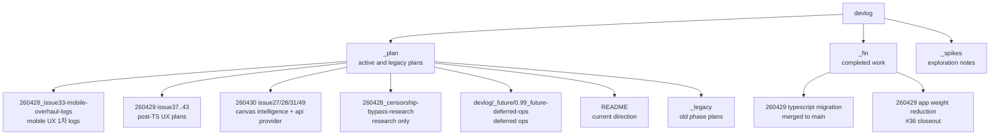

# Devlog Map

`image_gen/devlog` separates active plans, completed work, and exploratory notes. In the current working tree, `_plan` contains the active lane, `_fin` contains completed implementation and completed experiments, and `_spikes` contains older UX exploration notes. This document explains which devlog files are current references and which are only historical context.

This map matters because plans from multiple eras coexist. `_plan/README.md` is the current source of truth for active lanes; there is no current `devlog/_plan/unified-roadmap.md` file. Completed implementation records live under `_fin/`, including the old 0.09 stabilization work, card-news, prompt-library import, ComfyUI bridge, Canvas Mode core phases, and recent Gallery/Canvas navigation fixes. Structure docs should follow the current code and active roadmap rather than stale plan folders.

For planning work, read `_plan/README.md` first. As of 2026-05-13 the TypeScript migration gate is closed and archived; App Weight Reduction #36 is archived under `_fin/260429_app-weight-reduction`; CLI feature-parity #45 (commit 9698fc1) is shipped and follow-up CLI drift is implemented in #61. After the 2026-04-30 naming-standard pass, the active lane is centered on Canvas Mode follow-ons (`260429_issue46-blank-canvas-paint-to-ai/`), inflight reload reconcile (#47), prompt import search UX (#48), post-TS mobile/community UX plans (`260428_issue33-mobile-overhaul-logs/`, `260429_community-ux-split-triage/`, #37-#43), Canvas Intelligence issue subplans (`260430_issue27/28/31`), the `260428_censorship-bypass-research` reference, issue #59 first-node action, issue #60 multimode progress closeout, and issue #62 CLI skill/capability discovery.

---

## Devlog Structure

## Current Reference Docs

| Document | Status | How to use it |
|---|---|---|
| `devlog/_plan/README.md` | current | Active lane, completed moves, and next-work rules |
| `devlog/_plan/260426_card-news-smoke-qa-harness/` | research | Card News dev-only smoke/QA reference (no single issue). |
| `devlog/_plan/260428_censorship-bypass-research/` | research | Censorship/safety bypass research (no issue). |
| `devlog/_plan/260428_issue33-mobile-overhaul-logs/` | partial | Consolidated #33 1차 mobile overhaul logs (PHASE-45/46/47/48); follow-ups #37/#38. |
| `devlog/_plan/260429_community-ux-split-triage/` | triaged | #33/#34 split map into #37~#43 (no single issue). |
| `devlog/_plan/260429_issue37-mobile-settings-workspace/` | planned/post-TS | #37 mobile settings IA. |
| `devlog/_plan/260429_issue38-mobile-generate-flow/` | planned/post-TS | #38 mobile generation/compose flow. |
| `devlog/_plan/260429_issue39-gallery-delete-semantics/` | planned/post-TS | #39 soft/permanent delete semantics. |
| `devlog/_plan/260429_issue40-viewer-lightbox/` | planned/post-TS | #40 viewer lightbox. |
| `devlog/_plan/260429_issue41-generation-activity-log/` | planned/post-TS | #41 generation passive failure feedback/activity log. |
| `devlog/_plan/260429_issue42-gallery-current-session-default/` | shipped 2026-05-06 | #42 current-session Gallery default with All Images toggle (commit bbf9b08). |
| `devlog/_plan/260429_issue43-settings-persistence-audit/` | shipped 2026-05-06 | #43 persisted settings audit; landed `ui/src/store/persistenceRegistry.ts` (commit 246696d) and persistence harden (commit 5e3aed3). |
| `devlog/_plan/260429_issue46-blank-canvas-paint-to-ai/` | planned | #46 Canvas Mode blank canvas Paint-to-AI entry. |
| `devlog/_plan/260429_issue47-inflight-reload-reconcile/` | active | #47 inflight reload reconcile plan. |
| `devlog/_plan/260429_issue48-prompt-import-search-ux/` | planned | #48 prompt import search UX workspace improvements. |
| `devlog/_plan/260430_issue24-typescript-strict-cleanup/` | shipped via #50 | #24 TS strict-only cleanup; follow-up landed in 7367333 (split `lib/oauthProxy.ts` into `lib/oauthProxy/*`, added `lib/runtimeContext.ts` etc.). |
| `devlog/_plan/260430_issue27-canvas-svg-export/` | planned | #27 Canvas annotation SVG/vector export. |
| `devlog/_plan/260430_issue28-canvas-pptx-export/` | planned | #28 Canvas LayerDocument → PPTX reconstruction. |
| `devlog/_plan/260430_issue31-provider-masked-edit/` | groundwork shipped | #31 provider-backed masked edit; feature flag `IMA2_OAUTH_MASKED_EDIT_ENABLED` landed in commit c7e75c0 (off by default). |
| `devlog/_plan/260430_issue49-api-provider-responses/` | shipped 2026-05-06 | #49 `provider:"api"` Responses image_generation backend (commit b8205fe + `lib/responsesImageAdapter.ts`); parity locked by `tests/api-provider-parity.test.ts`. |
| `devlog/_plan/260503_error-toast-stack/` | shipped 2026-05-06 | Error toast stacking at the bottom-right with per-toast dismissal (commit 78cb6d4). |
| `devlog/_plan/260508_issue60-multimode-incremental-progress/` | shipped locally / awaiting upstream sync | #60 multimode incremental progress: individual final-image save/SSE events, multimode polling, partial timeout behavior. |
| `devlog/_fin/260510_issue61-cli-feature-parity-audit/` | shipped 2026-05-11 | #61 CLI parity slice: web-search flags verified, provider override, multimode refs/mode, `ps` multimode help, favorites pagination, masked-edit CLI deferral, and CLI payload tests. |
| `devlog/_plan/260513_issue62-cli-skill-capabilities/` | active | #62 CLI/package skill discovery: packaged `skills/ima2/SKILL.md`, `ima2 skill`, `ima2 capabilities`, and `ima2 defaults`. |
| `devlog/_plan/typescript-strict-and-runtime-migration/` | reference | TS strict + runtime migration plan tree (P00–P09). #50 (7367333) is the follow-up that landed P03/P04/P07. |
| `devlog/_future/0.99_future-deferred-ops/0.09.19-security-hardening/PRD.md` | deferred | Opt-in security hardening proposal |
| `devlog/_future/0.99_future-deferred-ops/0.09.20-containerization/PRD.md` | deferred | Docker/containerization proposal |
| `devlog/_fin/260428_0.09.42-/` | archived | 0.09.42 closeout. |
| `devlog/_fin/260428_0.09.43-/` | archived | 0.09.43 closeout. |
| `devlog/_fin/260428_0.09.49-/` | archived | 0.09.49 closeout. |
| `devlog/_fin/0.20-card-news/` | archived (slice) | Card News slice archive (smoke/QA reference at `_plan/260426_card-news-smoke-qa-harness/`). |
| `devlog/_fin/260428_0.23-prompt-library-/` | archived | Prompt library closeout. |
| `devlog/_fin/260428_1.1.5-windows-open-folder-fix/` | archived | Windows open-folder fix landed in 1.1.5. |
| `devlog/_fin/260429_typescript-migration/` | archived/observe | #24 functional TypeScript migration merged to `main`; remaining strict-only cleanup is issue observation tracking, not an active folder. |
| `devlog/_fin/260429_app-weight-reduction/` | archived | #36 app weight reduction closeout: package diet, frontend lazy split, Canvas Mode feature boundary, and Phase C runtime safeguards verified. |
| `devlog/_fin/260429_gallery_canvas_arrow_navigation_leak/` | archived | #35 Gallery/Canvas hidden canvasVersion navigation fix. |
| `devlog/_fin/260426_0.22-gallery-navigation-ux/` | archived | Gallery navigation UX closeout |
| `devlog/_fin/260427_0.09.33-upstream-validation-errors/` | archived | Upstream validation error normalization to `INVALID_REQUEST` with preserved diagnostics |

## Historical Or Reference Docs

| Path | Meaning | How to treat it |
|---|---|---|
| `devlog/_plan/_legacy/phase-*` | Old phase plans | Idea reference only, not active backlog |
| `devlog/_spikes/generate-ux-notes.md` | Generation-progress UX exploration | Only carry forward ideas absorbed into node mode |
| `devlog/_spikes/image-display-notes.md` | Result display exploration | Track only lightbox, compare, and mobile fallback ideas |
| `devlog/_spikes/260425_image_creator_skill/` | Image-creator skill spike | Exploration notes for prompt/template ergonomics; not a roadmap commitment |
| `devlog/_fin/260423_*`, `260424_*`, `260425_*`, `260426_*`, `260427_*` | Completed implementation and experiments | Archive and evidence for completed work |
| `devlog/_fin/260426_0.09.20-cli-backend-parity` | Completed CLI/backend parity closeout | Historical evidence; reopen new CLI slices separately if needed |
| deleted root-level `devlog/phase-*`, `devlog/0.09*`, `devlog/0.10*` tracked paths | Old locations | Use the current `_plan` or `_fin` locations instead |

## Roadmap Summary

| Cycle | Name | Current interpretation |
|---|---|---|
| 0.09.17 / 0.09.17.1 | Structured logging + serve/dev closeout | Archived 260426 |
| 0.09.18 | Metrics observability | Deleted; not needed for local-first CLI |
| 0.09.20 | CLI/backend parity | Archived 260426 |
| 0.09.20.1 | Safe classic CLI parity | Archived 260426 |
| 0.09.22 | Session conflict false reload | Archived 260425 |
| 0.09.23 | Global storage migration audit | Archived 260425 |
| 0.09.24 | Package smoke | Archived 260425 |
| 0.09.25-0.09.28 | Node selection / edge disconnect / regen-layout-diagnostics / child references | Archived 260426 |
| 0.09.29 | Node contract repair | Archived 260426 |
| 0.09.30 | OAuth proxy / runtime port fallback | Archived 260426 |
| 0.09.31 | GitHub Pages landing | Archived 260428 |
| 0.09.32 | Final release closeout | Archived under `_fin/0.09.32-final-release-closeout` |
| 0.09.33 | Upstream validation errors | Archived 260427 |
| 0.09.34 | Node connect regression | Archived 260428 |
| 0.09.35 | Safety refusal misclassification | Archived 260428 |
| 0.09.36 | Gallery double-sidebar rail | Archived 260428 |
| 0.09.37 | Generation controls custom plus | Archived 260428 |
| 0.09.38 | Image metadata embed/restore | Archived 260428 |
| 0.09.39 | Reference 4K refusal diagnostics | Archived 260428 |
| 0.09.40 | Multimode sequence generation | Archived 260428 |
| 0.09.41 | Censorship bypass research | Active research |
| 0.09.45-.48 | Mobile UI | Active partial; split into #37/#38 follow-ups |
| 260429 community UX split | #33/#34 triage | Active triage map for #37~#43 |
| 260429 issue37 | Mobile settings workspace | Planned post-TS |
| 260429 issue38 | Mobile generate flow | Planned post-TS |
| 260429 issue41 | Generation activity log | Planned post-TS |
| 260429 issue39 | Gallery delete semantics | Planned post-TS |
| 260429 issue40 | Viewer lightbox | Planned post-TS |
| 260429 issue43 | Settings persistence audit | Planned post-TS |
| 260429 issue42 | Gallery current-session default | Planned post-TS |
| 0.20 | Card-news | Archived under `_fin/0.20-card-news`; reopen narrower issues only |
| 0.21 | Custom size input | Archived 260425 |
| 0.22 | Gallery navigation UX | Archived 260426 |
| 0.23 | Prompt library | Archived 260428 |
| 0.25 | Canvas intelligence | Active planning with #31/#27/#28 subplans |
| 0.26 | App weight reduction | Archived 260429; default entry weight reduced and Canvas Mode runtime safeguards verified |
| TypeScript migration / #24 | Backend/CLI TypeScript source migration | Closed and archived; strict TypeScript gates are current code policy |
| CLI parity follow-up / #61 | CLI generation option parity | Shipped 2026-05-11; provider/multimode/reference/favorites parity added and masked edit remains deferred to #31 |
| CLI skill/capability discovery / #62 | Agent-facing CLI/package metadata | Active 2026-05-13; packaged skill, defaults, capabilities, and package include contract |
| 0.09.19 | Security hardening | Deferred to `0.99_future` |
| 0.09.20 (containerization) | Containerization | Deferred to `0.99_future` |
| 0.10 | Feature expansion | Preset and compare MVP after current build is green |
| 0.11 | Export polish | Future lane after 0.10 |
| 0.12 | Research mode | Backend support exists; frontend productization remains |
| 1.1.5 | Windows open-folder fix | Archived 260428 |

## Structure Docs Versus Devlog

| Category | Structure docs | Devlog |
|---|---|---|
| Purpose | Evergreen reference for current code structure | Plans, decisions, completed work |
| Update trigger | Code contracts change | Phase starts, phase completes, spike is archived |
| Style | Current-tense operational reference | Plans, reviews, experiments, retrospectives |
| Example | `03-server-api.md` | `_plan/backend-node-mode.md` |

Structure docs do not replace devlog. They normalize devlog decisions against the current code. If an older devlog contradicts current code, prefer current code and the active roadmap.

## Cleanup Checklist

- [ ] If `_plan/README.md` changes, update this roadmap summary.
- [ ] If a devlog folder moves to `_fin`, `_plan/_legacy`, or `_spikes`, update the reference tables.
- [ ] If a `server.js` split phase starts, update `[[01-file-function-map]]`, `[[03-server-api]]`, and `[[06-infra-operations]]`.
- [ ] If node-mode UX changes, update `[[04-frontend-architecture]]` and `[[05-node-mode]]`.
- [ ] If externally researched content is copied into structure docs, include direct `> Source:` links in the target doc.

## Change Log

- 2026-04-23: Documented the first devlog reference map.
- 2026-04-23: Updated the active lane after moving completed work into `_fin`.
- 2026-04-23: Translated this document from Korean to English.
- 2026-04-23: 0.09.4 implementation verified. Added `0.09.5-node-streaming` and `0.09.6-inflight-reliability` as queued follow-up tracks.
- 2026-04-24: Archived completed 0.09.11 through 0.09.14 work into `_fin/260424_*` and promoted 0.09.5 streaming as the next active target.
- 2026-04-24: Archived completed 0.09.5 node streaming into `_fin/260424_0.09.5-node-streaming` and promoted 0.09.6 inflight reliability as the active target.
- 2026-04-25: Updated active lane after archiving 0.09.4, 0.09.4.1, 0.09.6, 0.09.7.1, 0.09.8, 0.09.15, 0.09.16, 0.09.21, 0.09.23, and 0.09.24.
- 2026-04-25: Kept 0.09.17/0.09.18 active and moved 0.09.19/0.09.20 into `_plan/0.99_future`.
- 2026-04-25: Added new active `0.09.20-cli-backend-parity` rough plan; existing containerization 0.09.20 remains deferred under `0.99_future`.
- 2026-04-26: Refreshed `0.09.20-cli-backend-parity` into a concrete sliced plan after runtime fallback, storage recovery, sessions/style, history lifecycle, and node API changes.
- 2026-04-25: Added active `0.09.25-node-selection-batch` for node selection and batch generation.
- 2026-04-25: Marked 0.09.17 as dependency-free structured logging implementation work.
- 2026-04-25: Added active `0.09.26-edge-disconnect` for edge-only removal and parent metadata cleanup.
- 2026-04-25: Added active `0.09.27-node-regen-layout-diagnostics` and `0.09.28-child-node-references`.
- 2026-04-25: Added active `0.09.29-node-contract-repair` for node parent/ref/context/footer contract cleanup.
- 2026-04-26: Added queued `0.09.30-oauth-proxy-port-fallback` for backend/frontend/OAuth port binding and proxy error taxonomy.
- 2026-04-26: Marked `0.09.20.1` complete, reflected implemented runtime binding work, and removed dev-only lanes from the evergreen roadmap map.
- 2026-04-26: Added `0.09.17.1` serve/dev logging closeout and marked CLI parity archived under `_fin`.
- 2026-04-26: Archived `0.09.25`, `0.09.26`, `0.09.27`, and `0.09.28` node-mode work to `_fin/260426_*` after implementation verification. Removed active entries from the roadmap map.
- 2026-04-26: Archived `0.09.17`, `0.09.17.1`, `0.09.29`, and `0.09.30` to `_fin/260426_*`. Deleted `0.09.18-metrics-observability` from `_plan`. Updated roadmap summary and reference tables.
- 2026-04-28: Refreshed the active lane to span `0.09.31`-`0.09.41`, the `0.20-card-news` and `0.23-prompt-library` feature tracks, and the `1.1.5-windows-open-folder-fix` patch lane. Added `_fin/260426_0.22-gallery-navigation-ux`, `_fin/260427_0.09.33-upstream-validation-errors`, and `_spikes/260425_image_creator_skill` to the reference tables. Updated the devlog structure diagram and roadmap summary for ima2-gen 1.1.5.
- 2026-04-29: Refreshed active lane from actual `_plan` folders. Removed stale `unified-roadmap.md` references, marked completed 0.09.31-.40, 0.20, 0.23, 1.1.5 lanes archived, and added active mobile UX, Canvas Intelligence, App Weight Reduction, and TypeScript migration tracks.
- 2026-04-29: Added Oracle browser `gpt-5-pro` post-TypeScript roadmap split. Created post-TS plan entries for #37-#43 and Canvas Intelligence subplans for #31/#27/#28, while leaving TypeScript migration untouched as the current gate.
- 2026-04-29: Moved TypeScript migration to `_fin/260429_typescript-migration` after merge to `main`; the then-open #24 observation note was later superseded and #24 is now closed. `0.26-app-weight-reduction` stayed active until the later #36 post-TS verification closeout.
- 2026-04-29: Archived `0.26-app-weight-reduction` into `_fin/260429_app-weight-reduction` after Phase C closeout verification. Next post-TS active implementation lane is #37 mobile settings workspace.
- 2026-04-30: Refreshed the active lane to match the working tree — added `0.20-card-news`, `0.24-canvas-mode`, `260429_blank_canvas_paint_to_ai`, `260429_canvas_continue_prompt_block`, `260429_prompt_import_search_ux`, `260429_issue45-cli-feature-parity`, and `260429_issue47-inflight-reload-reconcile`. Recorded the new `_fin` archives for `260428_0.09.42-`, `260428_0.09.43-`, `260428_0.09.49-`, `260428_0.20-card-news-`, `260428_0.23-prompt-library-`, and `260428_1.1.5-windows-open-folder-fix`. CLI feature-parity #45 (commit 9698fc1) is shipped; Canvas Mode workspace split (#11bc214) lives under the active `0.24-canvas-mode/` plan.
- 2026-04-30 (naming-standard pass): renamed `_plan/` folders to the `YYMMDD_issue<NN>-<slug>` / `YYMMDD_<slug>` standard. `0.09.41-censorship-bypass` → `260428_censorship-bypass-research`. `0.20-card-news` → `260426_card-news-smoke-qa-harness`. `0.99_future` moved out to `devlog/_future/0.99_future-deferred-ops/`. The four `260428_0.09.45..0.09.48-*` folders consolidated into `260428_issue33-mobile-overhaul-logs/` (PHASE-NN subdocs). `260429_blank_canvas_paint_to_ai` → `260429_issue46-blank-canvas-paint-to-ai`. `260429_community_ux_split` → `260429_community-ux-split-triage`. New issues #48 and #49 filed for `260429_issue48-prompt-import-search-ux` and `260430_issue49-api-provider-responses` respectively.
- 2026-05-06: Added `_plan/260503_error-toast-stack/` (shipped 2026-05-06, commit 78cb6d4). Marked #42 (`260429_issue42-gallery-current-session-default`), #43 (`260429_issue43-settings-persistence-audit`), and #49 (`260430_issue49-api-provider-responses`) as shipped, and #31 (`260430_issue31-provider-masked-edit`) as groundwork-shipped behind the `IMA2_OAUTH_MASKED_EDIT_ENABLED` flag. Noted that `_plan/260430_issue24-typescript-strict-cleanup/` shipped via PR #50 (commit 7367333) — split `lib/oauthProxy.ts` into `lib/oauthProxy/*` and added `lib/runtimeContext.ts` / `lib/responsesImageAdapter.ts` / `lib/providerOptions.ts` / `lib/errInfo.ts`. v1.1.9 (commit 6e82357) and v1.1.10 (commit 8855ef0) released.
- 2026-05-10: Added `_plan/260510_issue61-cli-feature-parity-audit/` after auditing CLI web-search and current server/UI parity. #61 was opened for implementation. Updated #24 wording to closed/current rather than observation tracking.
- 2026-05-11: Archived `_fin/260510_issue61-cli-feature-parity-audit/` after implementing CLI provider overrides, multimode refs/mode, multimode inflight help, server-side favorites listing, and CLI payload tests.
- 2026-05-13: Added active `_plan/260513_issue62-cli-skill-capabilities/` for packaged agent skill and CLI capability/default discovery.

Previous document: `[[06-infra-operations]]`

Next document: none
